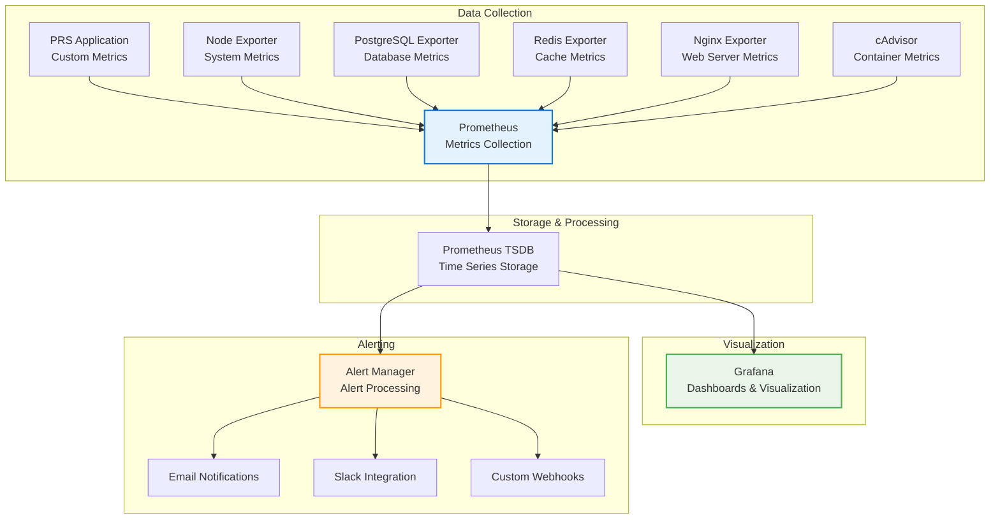

# Monitoring Configuration

## Overview

This guide covers the complete configuration of monitoring, alerting, and observability for the PRS on-premises deployment using Prometheus, Grafana, and custom monitoring solutions.

## Monitoring Architecture



## Prometheus Configuration

### Main Configuration File

```yaml
# config/prometheus/prometheus.yml
global:
  scrape_interval: 15s
  evaluation_interval: 15s
  external_labels:
    cluster: 'prs-onprem'
    environment: 'production'
    datacenter: 'primary'

rule_files:
  - "alerts/*.yml"
  - "recording_rules/*.yml"

scrape_configs:
  # Prometheus self-monitoring
  - job_name: 'prometheus'
    static_configs:
      - targets: ['localhost:9090']
    scrape_interval: 30s
    metrics_path: /metrics

  # System metrics
  - job_name: 'node-exporter'
    static_configs:
      - targets: ['node-exporter:9100']
    scrape_interval: 30s
    relabel_configs:
      - source_labels: [__address__]
        target_label: instance
        replacement: 'prs-server'

  # PostgreSQL metrics
  - job_name: 'postgres-exporter'
    static_configs:
      - targets: ['postgres-exporter:9187']
    scrape_interval: 30s
    relabel_configs:
      - source_labels: [__address__]
        target_label: database
        replacement: 'prs-production'

  # Redis metrics
  - job_name: 'redis-exporter'
    static_configs:
      - targets: ['redis-exporter:9121']
    scrape_interval: 30s

  # Nginx metrics
  - job_name: 'nginx-exporter'
    static_configs:
      - targets: ['nginx-exporter:9113']
    scrape_interval: 30s

  # PRS Backend application
  - job_name: 'prs-backend'
    static_configs:
      - targets: ['backend:4000']
    metrics_path: '/metrics'
    scrape_interval: 15s
    scrape_timeout: 10s

  # Docker container metrics
  - job_name: 'cadvisor'
    static_configs:
      - targets: ['cadvisor:8080']
    scrape_interval: 30s
    metrics_path: /metrics

  # Custom application metrics
  - job_name: 'prs-custom-metrics'
    file_sd_configs:
      - files:
          - '/etc/prometheus/targets/*.json'
    scrape_interval: 30s

alerting:
  alertmanagers:
    - static_configs:
        - targets:
          - alertmanager:9093
      timeout: 10s
      api_version: v2

# Storage configuration
storage:
  tsdb:
    path: /prometheus/data
    retention.time: 90d
    retention.size: 50GB
    wal-compression: true
```

### Recording Rules

```yaml
# config/prometheus/recording_rules/prs_rules.yml
groups:
  - name: prs_application_rules
    interval: 30s
    rules:
      # HTTP request metrics
      - record: prs:http_request_duration_seconds:rate5m
        expr: rate(http_request_duration_seconds_sum[5m]) / rate(http_request_duration_seconds_count[5m])
        labels:
          job: prs-backend

      - record: prs:http_requests_per_second:rate5m
        expr: rate(http_requests_total[5m])
        labels:
          job: prs-backend

      - record: prs:http_error_rate:rate5m
        expr: rate(http_requests_total{status=~"5.."}[5m]) / rate(http_requests_total[5m])
        labels:
          job: prs-backend

      # Database metrics
      - record: prs:database_connections:active
        expr: pg_stat_database_numbackends{datname="prs_production"}

      - record: prs:database_cache_hit_ratio
        expr: |
          (
            pg_stat_database_blks_hit{datname="prs_production"} /
            (pg_stat_database_blks_hit{datname="prs_production"} + pg_stat_database_blks_read{datname="prs_production"})
          )

      - record: prs:database_transaction_rate:rate5m
        expr: rate(pg_stat_database_xact_commit{datname="prs_production"}[5m])

  - name: prs_system_rules
    interval: 30s
    rules:
      # System resource metrics
      - record: prs:cpu_usage_percent
        expr: 100 - (avg(rate(node_cpu_seconds_total{mode="idle"}[5m])) * 100)

      - record: prs:memory_usage_percent
        expr: |
          (
            (node_memory_MemTotal_bytes - node_memory_MemAvailable_bytes) /
            node_memory_MemTotal_bytes
          ) * 100

      - record: prs:disk_usage_percent
        expr: |
          (
            (node_filesystem_size_bytes - node_filesystem_avail_bytes) /
            node_filesystem_size_bytes
          ) * 100

      # Storage tier metrics
      - record: prs:ssd_usage_percent
        expr: |
          (
            (node_filesystem_size_bytes{mountpoint="/mnt/hdd"} - node_filesystem_avail_bytes{mountpoint="/mnt/hdd"}) /
            node_filesystem_size_bytes{mountpoint="/mnt/hdd"}
          ) * 100

      - record: prs:hdd_usage_percent
        expr: |
          (
            (node_filesystem_size_bytes{mountpoint="/mnt/hdd"} - node_filesystem_avail_bytes{mountpoint="/mnt/hdd"}) /
            node_filesystem_size_bytes{mountpoint="/mnt/hdd"}
          ) * 100

  - name: prs_business_rules
    interval: 60s
    rules:
      # Business metrics
      - record: prs:active_users:count
        expr: count(increase(http_requests_total{endpoint="/api/auth/login"}[1h]))

      - record: prs:requisitions_created:rate1h
        expr: rate(prs_requisitions_created_total[1h])

      - record: prs:purchase_orders_generated:rate1h
        expr: rate(prs_purchase_orders_generated_total[1h])

      - record: prs:file_uploads:rate1h
        expr: rate(prs_file_uploads_total[1h])
```

### Alert Rules

```yaml
# config/prometheus/alerts/prs_alerts.yml
groups:
  - name: prs_critical_alerts
    rules:
      # Service availability
      - alert: ServiceDown
        expr: up == 0
        for: 1m
        labels:
          severity: critical
          team: infrastructure
        annotations:
          summary: "Service {{ $labels.job }} is down"
          description: "Service {{ $labels.job }} on {{ $labels.instance }} has been down for more than 1 minute"
          runbook_url: "https://docs.prs.local/troubleshooting/service-down"

      # High error rate
      - alert: HighErrorRate
        expr: prs:http_error_rate:rate5m > 0.05
        for: 5m
        labels:
          severity: critical
          team: application
        annotations:
          summary: "High error rate detected"
          description: "Error rate is {{ $value | humanizePercentage }} for the last 5 minutes"
          runbook_url: "https://docs.prs.local/troubleshooting/high-error-rate"

      # Database issues
      - alert: DatabaseConnectionsHigh
        expr: prs:database_connections:active > 120
        for: 2m
        labels:
          severity: warning
          team: database
        annotations:
          summary: "High database connections"
          description: "Database has {{ $value }} active connections (threshold: 120)"

      - alert: DatabaseCacheHitRatioLow
        expr: prs:database_cache_hit_ratio < 0.95
        for: 5m
        labels:
          severity: warning
          team: database
        annotations:
          summary: "Low database cache hit ratio"
          description: "Cache hit ratio is {{ $value | humanizePercentage }} (threshold: 95%)"

  - name: prs_storage_alerts
    rules:
      # SSD storage alerts
      - alert: SSDStorageHigh
        expr: prs:ssd_usage_percent > 85
        for: 1m
        labels:
          severity: warning
          team: infrastructure
        annotations:
          summary: "SSD storage usage high"
          description: "SSD usage is {{ $value | humanizePercentage }} (threshold: 85%)"

      - alert: SSDStorageCritical
        expr: prs:ssd_usage_percent > 90
        for: 1m
        labels:
          severity: critical
          team: infrastructure
        annotations:
          summary: "SSD storage usage critical"
          description: "SSD usage is {{ $value | humanizePercentage }} (threshold: 90%)"

      # HDD storage alerts
      - alert: HDDStorageHigh
        expr: prs:hdd_usage_percent > 80
        for: 5m
        labels:
          severity: warning
          team: infrastructure
        annotations:
          summary: "HDD storage usage high"
          description: "HDD usage is {{ $value | humanizePercentage }} (threshold: 80%)"

  - name: prs_performance_alerts
    rules:
      # System performance
      - alert: HighCPUUsage
        expr: prs:cpu_usage_percent > 80
        for: 5m
        labels:
          severity: warning
          team: infrastructure
        annotations:
          summary: "High CPU usage"
          description: "CPU usage is {{ $value | humanizePercentage }} for the last 5 minutes"

      - alert: HighMemoryUsage
        expr: prs:memory_usage_percent > 85
        for: 5m
        labels:
          severity: warning
          team: infrastructure
        annotations:
          summary: "High memory usage"
          description: "Memory usage is {{ $value | humanizePercentage }}"

      # Application performance
      - alert: SlowResponseTime
        expr: prs:http_request_duration_seconds:rate5m > 1.0
        for: 5m
        labels:
          severity: warning
          team: application
        annotations:
          summary: "Slow response times"
          description: "Average response time is {{ $value }}s for the last 5 minutes"

      - alert: LowThroughput
        expr: prs:http_requests_per_second:rate5m < 1
        for: 10m
        labels:
          severity: info
          team: application
        annotations:
          summary: "Low application throughput"
          description: "Request rate is {{ $value }} requests/second"
```

## Grafana Configuration

### Dashboard Configuration

```json
{
  "dashboard": {
    "id": null,
    "title": "PRS System Overview",
    "tags": ["prs", "overview"],
    "timezone": "browser",
    "refresh": "30s",
    "time": {
      "from": "now-1h",
      "to": "now"
    },
    "panels": [
      {
        "id": 1,
        "title": "System Health",
        "type": "stat",
        "targets": [
          {
            "expr": "up",
            "legendFormat": "{{ job }}"
          }
        ],
        "fieldConfig": {
          "defaults": {
            "color": {
              "mode": "thresholds"
            },
            "thresholds": {
              "steps": [
                {"color": "red", "value": 0},
                {"color": "green", "value": 1}
              ]
            }
          }
        }
      },
      {
        "id": 2,
        "title": "Request Rate",
        "type": "graph",
        "targets": [
          {
            "expr": "prs:http_requests_per_second:rate5m",
            "legendFormat": "Requests/sec"
          }
        ]
      },
      {
        "id": 3,
        "title": "Response Time",
        "type": "graph",
        "targets": [
          {
            "expr": "prs:http_request_duration_seconds:rate5m",
            "legendFormat": "Avg Response Time"
          }
        ]
      },
      {
        "id": 4,
        "title": "Error Rate",
        "type": "graph",
        "targets": [
          {
            "expr": "prs:http_error_rate:rate5m * 100",
            "legendFormat": "Error Rate %"
          }
        ]
      },
      {
        "id": 5,
        "title": "CPU Usage",
        "type": "graph",
        "targets": [
          {
            "expr": "prs:cpu_usage_percent",
            "legendFormat": "CPU Usage %"
          }
        ]
      },
      {
        "id": 6,
        "title": "Memory Usage",
        "type": "graph",
        "targets": [
          {
            "expr": "prs:memory_usage_percent",
            "legendFormat": "Memory Usage %"
          }
        ]
      },
      {
        "id": 7,
        "title": "Storage Usage",
        "type": "graph",
        "targets": [
          {
            "expr": "prs:ssd_usage_percent",
            "legendFormat": "HDD Usage %"
          },
          {
            "expr": "prs:hdd_usage_percent",
            "legendFormat": "HDD Usage %"
          }
        ]
      },
      {
        "id": 8,
        "title": "Database Connections",
        "type": "graph",
        "targets": [
          {
            "expr": "prs:database_connections:active",
            "legendFormat": "Active Connections"
          }
        ]
      }
    ]
  }
}
```

### Data Source Configuration

```yaml
# config/grafana/provisioning/datasources/prometheus.yml
apiVersion: 1

datasources:
  - name: Prometheus
    type: prometheus
    access: proxy
    url: http://prometheus:9090
    isDefault: true
    editable: true
    jsonData:
      timeInterval: "15s"
      queryTimeout: "60s"
      httpMethod: "POST"
    secureJsonData:
      httpHeaderValue1: "Bearer ${PROMETHEUS_API_TOKEN}"
```

### Dashboard Provisioning

```yaml
# config/grafana/provisioning/dashboards/prs.yml
apiVersion: 1

providers:
  - name: 'PRS Dashboards'
    orgId: 1
    folder: 'PRS'
    type: file
    disableDeletion: false
    updateIntervalSeconds: 10
    allowUiUpdates: true
    options:
      path: /etc/grafana/provisioning/dashboards/prs
```

## Alert Manager Configuration

### Main Configuration

```yaml
# config/alertmanager/alertmanager.yml
global:
  smtp_smarthost: 'smtp.your-domain.com:587'
  smtp_from: 'alerts@your-domain.com'
  smtp_auth_username: 'alerts@your-domain.com'
  smtp_auth_password: '${SMTP_PASSWORD}'
  smtp_require_tls: true

route:
  group_by: ['alertname', 'cluster', 'service']
  group_wait: 10s
  group_interval: 10s
  repeat_interval: 12h
  receiver: 'default'
  routes:
    - match:
        severity: critical
      receiver: 'critical-alerts'
      group_wait: 5s
      repeat_interval: 5m
    - match:
        severity: warning
      receiver: 'warning-alerts'
      repeat_interval: 1h
    - match:
        team: database
      receiver: 'database-team'
    - match:
        team: application
      receiver: 'application-team'

receivers:
  - name: 'default'
    webhook_configs:
      - url: 'http://webhook-service:5001/alerts'
        send_resolved: true

  - name: 'critical-alerts'
    email_configs:
      - to: 'admin@your-domain.com'
        subject: 'CRITICAL: PRS Alert - {{ .GroupLabels.alertname }}'
        body: |
          {{ range .Alerts }}
          Alert: {{ .Annotations.summary }}
          Description: {{ .Annotations.description }}
          Severity: {{ .Labels.severity }}
          Instance: {{ .Labels.instance }}
          Time: {{ .StartsAt }}
          {{ end }}
        headers:
          Priority: 'high'
    slack_configs:
      - api_url: '${SLACK_WEBHOOK_URL}'
        channel: '#prs-critical-alerts'
        title: 'CRITICAL: PRS Alert'
        text: '{{ range .Alerts }}{{ .Annotations.summary }}{{ end }}'
        color: 'danger'

  - name: 'warning-alerts'
    email_configs:
      - to: 'team@your-domain.com'
        subject: 'WARNING: PRS Alert - {{ .GroupLabels.alertname }}'
        body: |
          {{ range .Alerts }}
          Alert: {{ .Annotations.summary }}
          Description: {{ .Annotations.description }}
          Severity: {{ .Labels.severity }}
          Instance: {{ .Labels.instance }}
          Time: {{ .StartsAt }}
          {{ end }}

  - name: 'database-team'
    email_configs:
      - to: 'dba@your-domain.com'
        subject: 'Database Alert: {{ .GroupLabels.alertname }}'
        body: |
          Database Alert Details:
          {{ range .Alerts }}
          Alert: {{ .Annotations.summary }}
          Description: {{ .Annotations.description }}
          Database: {{ .Labels.database }}
          Instance: {{ .Labels.instance }}
          Runbook: {{ .Annotations.runbook_url }}
          {{ end }}

  - name: 'application-team'
    email_configs:
      - to: 'developers@your-domain.com'
        subject: 'Application Alert: {{ .GroupLabels.alertname }}'
        body: |
          Application Alert Details:
          {{ range .Alerts }}
          Alert: {{ .Annotations.summary }}
          Description: {{ .Annotations.description }}
          Service: {{ .Labels.job }}
          Instance: {{ .Labels.instance }}
          Runbook: {{ .Annotations.runbook_url }}
          {{ end }}

inhibit_rules:
  - source_match:
      severity: 'critical'
    target_match:
      severity: 'warning'
    equal: ['alertname', 'instance']

templates:
  - '/etc/alertmanager/templates/*.tmpl'
```

## Custom Metrics

### Application Metrics

```javascript
// Backend application metrics (Node.js)
const prometheus = require('prom-client');

// Create custom metrics
const httpRequestDuration = new prometheus.Histogram({
  name: 'http_request_duration_seconds',
  help: 'Duration of HTTP requests in seconds',
  labelNames: ['method', 'route', 'status_code'],
  buckets: [0.1, 0.3, 0.5, 0.7, 1, 3, 5, 7, 10]
});

const httpRequestsTotal = new prometheus.Counter({
  name: 'http_requests_total',
  help: 'Total number of HTTP requests',
  labelNames: ['method', 'route', 'status_code']
});

const activeConnections = new prometheus.Gauge({
  name: 'active_connections',
  help: 'Number of active connections'
});

const databaseQueryDuration = new prometheus.Histogram({
  name: 'database_query_duration_seconds',
  help: 'Duration of database queries in seconds',
  labelNames: ['query_type', 'table'],
  buckets: [0.01, 0.05, 0.1, 0.3, 0.5, 1, 3, 5]
});

// Business metrics
const requisitionsCreated = new prometheus.Counter({
  name: 'prs_requisitions_created_total',
  help: 'Total number of requisitions created'
});

const purchaseOrdersGenerated = new prometheus.Counter({
  name: 'prs_purchase_orders_generated_total',
  help: 'Total number of purchase orders generated'
});

const fileUploads = new prometheus.Counter({
  name: 'prs_file_uploads_total',
  help: 'Total number of file uploads',
  labelNames: ['file_type', 'size_category']
});

// Middleware to collect metrics
const metricsMiddleware = (req, res, next) => {
  const start = Date.now();

  res.on('finish', () => {
    const duration = (Date.now() - start) / 1000;
    const route = req.route ? req.route.path : req.path;

    httpRequestDuration
      .labels(req.method, route, res.statusCode)
      .observe(duration);

    httpRequestsTotal
      .labels(req.method, route, res.statusCode)
      .inc();
  });

  next();
};

// Metrics endpoint
app.get('/metrics', (req, res) => {
  res.set('Content-Type', prometheus.register.contentType);
  res.end(prometheus.register.metrics());
});
```

### System Metrics Collection

```bash
#!/bin/bash
# Custom metrics collection script

METRICS_FILE="/var/lib/node_exporter/textfile_collector/prs_custom.prom"

# Collect custom application metrics
collect_app_metrics() {
    # Active user sessions
    ACTIVE_SESSIONS=$(docker exec prs-onprem-redis redis-cli -a "$REDIS_PASSWORD" eval "return #redis.call('keys', 'session:*')" 0)
    echo "prs_active_sessions_total $ACTIVE_SESSIONS" >> "$METRICS_FILE"

    # Queue lengths
    QUEUE_LENGTH=$(docker exec prs-onprem-redis redis-cli -a "$REDIS_PASSWORD" llen "queue:default")
    echo "prs_queue_length{queue=\"default\"} $QUEUE_LENGTH" >> "$METRICS_FILE"

    # File upload storage
    UPLOAD_SIZE=$(du -sb /mnt/hdd/uploads | cut -f1)
    echo "prs_upload_storage_bytes $UPLOAD_SIZE" >> "$METRICS_FILE"
}

# Collect database metrics
collect_db_metrics() {
    # Table sizes
    docker exec prs-onprem-postgres-timescale psql -U prs_admin -d prs_production -t -c "
    SELECT
        'prs_table_size_bytes{table=\"' || tablename || '\"} ' || pg_total_relation_size(schemaname||'.'||tablename)
    FROM pg_tables
    WHERE schemaname = 'public';
    " >> "$METRICS_FILE"

    # TimescaleDB chunk metrics
    docker exec prs-onprem-postgres-timescale psql -U prs_admin -d prs_production -t -c "
    SELECT
        'prs_timescaledb_chunks{hypertable=\"' || hypertable_name || '\",storage=\"HDD\"} ' || COUNT(*)
    FROM timescaledb_information.chunks
    GROUP BY hypertable_name;
    " >> "$METRICS_FILE"
}

# Main execution
main() {
    > "$METRICS_FILE"
    collect_app_metrics
    collect_db_metrics
}

main "$@"
```

---

!!! success "Monitoring Configured"
    Your PRS deployment now has comprehensive monitoring with real-time dashboards, automated alerts, and custom metrics collection.

!!! tip "Dashboard Customization"
    Customize Grafana dashboards based on your specific monitoring needs and business requirements.

!!! warning "Alert Tuning"
    Regularly review and tune alert thresholds to reduce false positives while maintaining effective monitoring coverage.
