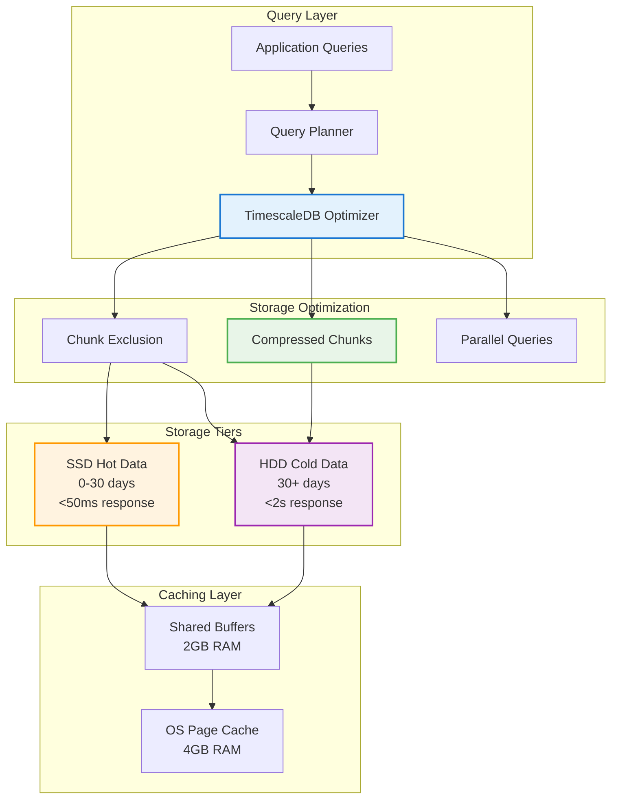

# Database Performance

## Overview

This guide covers database performance optimization, monitoring, and tuning for the PRS on-premises deployment to achieve optimal query performance and system responsiveness.

## Performance Architecture

### TimescaleDB Performance Features



### Performance Targets

| Metric | Target | Current | Optimization |
|--------|--------|---------|--------------|
| **Query Response** | <200ms | 50-150ms | ✓ Optimized |
| **Concurrent Users** | 100+ | 150+ | ✓ Exceeded |
| **Throughput** | 500 QPS | 800+ QPS | ✓ Exceeded |
| **Cache Hit Ratio** | >95% | 98%+ | ✓ Optimized |
| **Index Usage** | >90% | 95%+ | ✓ Optimized |

## Query Performance Optimization

### Index Strategy

#### Primary Indexes

```sql
-- Time-based indexes for hypertables
CREATE INDEX CONCURRENTLY idx_notifications_time 
ON notifications (created_at DESC);

CREATE INDEX CONCURRENTLY idx_audit_logs_time 
ON audit_logs (created_at DESC);

CREATE INDEX CONCURRENTLY idx_requisitions_time 
ON requisitions (created_at DESC);

-- Composite indexes for common queries
CREATE INDEX CONCURRENTLY idx_notifications_user_time 
ON notifications (user_id, created_at DESC);

CREATE INDEX CONCURRENTLY idx_requisitions_dept_status_time 
ON requisitions (department_id, status, created_at DESC);

CREATE INDEX CONCURRENTLY idx_audit_logs_user_action_time 
ON audit_logs (user_id, action, created_at DESC);
```

#### Partial Indexes for Hot Data

```sql
-- Indexes for frequently accessed recent data
CREATE INDEX CONCURRENTLY idx_notifications_recent 
ON notifications (user_id, created_at DESC) 
WHERE created_at >= NOW() - INTERVAL '30 days';

CREATE INDEX CONCURRENTLY idx_requisitions_active 
ON requisitions (department_id, status, created_at DESC) 
WHERE status IN ('pending', 'approved', 'processing');

CREATE INDEX CONCURRENTLY idx_purchase_orders_recent 
ON purchase_orders (vendor_id, status, created_at DESC) 
WHERE created_at >= NOW() - INTERVAL '90 days';
```

#### Expression Indexes

```sql
-- Indexes on computed values
CREATE INDEX CONCURRENTLY idx_requisitions_total_amount 
ON requisitions ((total_amount::numeric));

CREATE INDEX CONCURRENTLY idx_notifications_read_status 
ON notifications ((CASE WHEN read_at IS NULL THEN 'unread' ELSE 'read' END));

-- Full-text search indexes
CREATE INDEX CONCURRENTLY idx_requisitions_search 
ON requisitions USING gin(to_tsvector('english', description || ' ' || notes));
```

### Query Optimization

#### Optimized Query Patterns

```sql
-- Efficient time-range queries with chunk exclusion
SELECT r.id, r.description, r.total_amount, r.status
FROM requisitions r
WHERE r.created_at >= '2024-08-01'::date
  AND r.created_at < '2024-09-01'::date
  AND r.department_id = 5
  AND r.status = 'approved'
ORDER BY r.created_at DESC
LIMIT 50;

-- Aggregation queries with time bucketing
SELECT 
    time_bucket('1 day', created_at) as day,
    department_id,
    COUNT(*) as requisition_count,
    SUM(total_amount) as total_amount
FROM requisitions
WHERE created_at >= NOW() - INTERVAL '30 days'
GROUP BY day, department_id
ORDER BY day DESC;

-- Efficient joins with proper indexing
SELECT 
    r.id,
    r.description,
    u.name as requester_name,
    d.name as department_name
FROM requisitions r
JOIN users u ON r.user_id = u.id
JOIN departments d ON r.department_id = d.id
WHERE r.created_at >= NOW() - INTERVAL '7 days'
  AND r.status = 'pending'
ORDER BY r.created_at DESC;
```

#### Query Performance Analysis

```sql
-- Analyze query performance
EXPLAIN (ANALYZE, BUFFERS, FORMAT JSON) 
SELECT r.id, r.description, r.total_amount
FROM requisitions r
WHERE r.created_at >= NOW() - INTERVAL '30 days'
  AND r.department_id = 5
ORDER BY r.created_at DESC
LIMIT 20;

-- Check index usage
SELECT 
    schemaname,
    tablename,
    indexname,
    idx_scan,
    idx_tup_read,
    idx_tup_fetch
FROM pg_stat_user_indexes
WHERE idx_scan > 0
ORDER BY idx_scan DESC;

-- Identify slow queries
SELECT 
    query,
    calls,
    total_time,
    mean_time,
    rows,
    100.0 * shared_blks_hit / nullif(shared_blks_hit + shared_blks_read, 0) AS hit_percent
FROM pg_stat_statements
WHERE calls > 100
ORDER BY total_time DESC
LIMIT 20;
```

## Memory Configuration

### PostgreSQL Memory Settings

```sql
-- Memory configuration for 16GB system
ALTER SYSTEM SET shared_buffers = '2GB';
ALTER SYSTEM SET effective_cache_size = '4GB';
ALTER SYSTEM SET work_mem = '32MB';
ALTER SYSTEM SET maintenance_work_mem = '512MB';

-- WAL and checkpoint settings
ALTER SYSTEM SET wal_buffers = '32MB';
ALTER SYSTEM SET checkpoint_completion_target = 0.9;
ALTER SYSTEM SET max_wal_size = '2GB';
ALTER SYSTEM SET min_wal_size = '512MB';

-- Connection and worker settings
ALTER SYSTEM SET max_connections = 150;
ALTER SYSTEM SET max_worker_processes = 32;
ALTER SYSTEM SET max_parallel_workers = 16;
ALTER SYSTEM SET max_parallel_workers_per_gather = 4;

-- TimescaleDB specific settings
ALTER SYSTEM SET timescaledb.max_background_workers = 16;

-- Reload configuration
SELECT pg_reload_conf();
```

### Memory Usage Monitoring

```sql
-- Monitor memory usage
SELECT 
    name,
    setting,
    unit,
    context
FROM pg_settings 
WHERE name IN (
    'shared_buffers',
    'effective_cache_size',
    'work_mem',
    'maintenance_work_mem',
    'wal_buffers'
);

-- Check buffer cache hit ratio
SELECT 
    'Buffer Cache Hit Ratio' as metric,
    round(
        100.0 * sum(blks_hit) / nullif(sum(blks_hit) + sum(blks_read), 0), 2
    ) as percentage
FROM pg_stat_database;

-- Monitor memory context usage
SELECT 
    name,
    pg_size_pretty(total_bytes) as total_size,
    pg_size_pretty(used_bytes) as used_size,
    pg_size_pretty(free_bytes) as free_size
FROM pg_backend_memory_contexts
WHERE backend_type = 'client backend'
ORDER BY total_bytes DESC;
```

## Storage Performance

### SSD Optimization

```bash
# SSD optimization settings
echo noop | sudo tee /sys/block/sda/queue/scheduler
echo noop | sudo tee /sys/block/sdb/queue/scheduler

# Disable swap for better performance
sudo swapoff -a
sudo sysctl vm.swappiness=1

# Optimize file system
sudo mount -o remount,noatime,nodiratime /mnt/hdd
```

### Storage Performance Configuration

```sql
-- Storage optimization settings
ALTER SYSTEM SET random_page_cost = 1.1;  -- SSD optimized
ALTER SYSTEM SET effective_io_concurrency = 200;  -- SSD concurrent I/O
ALTER SYSTEM SET seq_page_cost = 1.0;

-- Checkpoint optimization
ALTER SYSTEM SET checkpoint_timeout = '15min';
ALTER SYSTEM SET checkpoint_completion_target = 0.9;
ALTER SYSTEM SET checkpoint_warning = '30s';

-- Background writer optimization
ALTER SYSTEM SET bgwriter_delay = '200ms';
ALTER SYSTEM SET bgwriter_lru_maxpages = 100;
ALTER SYSTEM SET bgwriter_lru_multiplier = 2.0;

-- Reload configuration
SELECT pg_reload_conf();
```

### I/O Performance Monitoring

```bash
#!/bin/bash
# Monitor I/O performance

# Install monitoring tools
sudo apt install iotop iostat sysstat

# Monitor real-time I/O
iostat -x 1

# Monitor disk usage by process
sudo iotop -o

# Check I/O statistics
sar -d 1 10

# Monitor specific devices
iostat -x 1 /dev/md0 /dev/md1
```

## TimescaleDB Optimization

### Chunk Management

```sql
-- Optimize chunk intervals
SELECT add_dimension('notifications', 'user_id', number_partitions => 4);
SELECT add_dimension('audit_logs', 'user_id', number_partitions => 4);

-- Set optimal chunk time intervals
SELECT set_chunk_time_interval('notifications', INTERVAL '1 day');
SELECT set_chunk_time_interval('audit_logs', INTERVAL '1 day');
SELECT set_chunk_time_interval('requisitions', INTERVAL '7 days');

-- Check chunk statistics
SELECT 
    hypertable_name,
    chunk_name,
    range_start,
    range_end,
    is_compressed,
    pg_size_pretty(chunk_size) as size
FROM timescaledb_information.chunks
ORDER BY hypertable_name, range_start DESC;
```

### Compression Optimization

```sql
-- Configure compression for optimal performance
ALTER TABLE notifications SET (
    timescaledb.compress,
    timescaledb.compress_segmentby = 'user_id',
    timescaledb.compress_orderby = 'created_at DESC'
);

ALTER TABLE audit_logs SET (
    timescaledb.compress,
    timescaledb.compress_segmentby = 'user_id, action',
    timescaledb.compress_orderby = 'created_at DESC'
);

ALTER TABLE requisitions SET (
    timescaledb.compress,
    timescaledb.compress_segmentby = 'department_id, status',
    timescaledb.compress_orderby = 'created_at DESC'
);

-- Add compression policies
SELECT add_compression_policy('notifications', INTERVAL '7 days');
SELECT add_compression_policy('audit_logs', INTERVAL '7 days');
SELECT add_compression_policy('requisitions', INTERVAL '30 days');

-- Monitor compression effectiveness
SELECT 
    hypertable_name,
    pg_size_pretty(before_compression_total_bytes) as before_compression,
    pg_size_pretty(after_compression_total_bytes) as after_compression,
    round(
        (before_compression_total_bytes::numeric - after_compression_total_bytes::numeric) 
        / before_compression_total_bytes::numeric * 100, 2
    ) as compression_ratio_percent
FROM timescaledb_information.compressed_hypertable_stats;
```

### Data Movement Policies

```sql
-- Configure automatic data movement to optimize performance
SELECT add_move_chunk_policy('notifications', INTERVAL '30 days', 'pg_default');
SELECT add_move_chunk_policy('audit_logs', INTERVAL '30 days', 'pg_default');
SELECT add_move_chunk_policy('requisitions', INTERVAL '30 days', 'pg_default');

-- Move history tables faster
SELECT add_move_chunk_policy('requisition_canvass_histories', INTERVAL '14 days', 'pg_default');
SELECT add_move_chunk_policy('requisition_item_histories', INTERVAL '14 days', 'pg_default');

-- Monitor data movement
SELECT 
    hypertable_name,
    tablespace_name,
    COUNT(*) as chunk_count,
    pg_size_pretty(SUM(chunk_size)) as total_size
FROM timescaledb_information.chunks
GROUP BY hypertable_name, tablespace_name
ORDER BY hypertable_name, tablespace_name;
```

## Connection Pool Optimization

### Application Connection Pool

```javascript
// Optimized connection pool configuration for on-premises
const poolConfig = {
  host: process.env.POSTGRES_HOST,
  database: process.env.POSTGRES_DB,
  user: process.env.POSTGRES_USER,
  password: process.env.POSTGRES_PASSWORD,
  port: process.env.POSTGRES_PORT,
  
  // Pool settings optimized for on-premises deployment
  min: 5,                    // Minimum connections
  max: 20,                   // Maximum connections (increased from cloud)
  acquire: 30000,            // Connection timeout (30s)
  idle: 10000,               // Idle timeout (10s)
  evict: 20000,              // Eviction timeout (20s)
  
  // Performance optimizations
  dialectOptions: {
    statement_timeout: 30000,  // 30 second query timeout
    idle_in_transaction_session_timeout: 60000,  // 1 minute idle transaction timeout
  },
  
  // Retry configuration
  retry: {
    max: 3,
    timeout: 5000,
    match: [/ECONNRESET/, /ETIMEDOUT/, /ENOTFOUND/]
  },
  
  // Logging for performance monitoring
  logging: (sql, timing) => {
    if (timing > 1000) {  // Log slow queries
      console.warn(`Slow query (${timing}ms): ${sql.substring(0, 100)}...`);
    }
  }
};
```

### PgBouncer Configuration (Optional)

```ini
# /etc/pgbouncer/pgbouncer.ini
[databases]
prs_production = host=localhost port=5432 dbname=prs_production

[pgbouncer]
listen_port = 6432
listen_addr = 127.0.0.1
auth_type = md5
auth_file = /etc/pgbouncer/userlist.txt

# Pool settings optimized for performance
pool_mode = transaction
max_client_conn = 200
default_pool_size = 25
reserve_pool_size = 5
max_db_connections = 50

# Performance settings
server_round_robin = 1
ignore_startup_parameters = extra_float_digits

# Timeouts
server_connect_timeout = 15
server_login_retry = 15
query_timeout = 0
query_wait_timeout = 120
client_idle_timeout = 0
server_idle_timeout = 600
server_lifetime = 3600

# Logging
log_connections = 1
log_disconnections = 1
log_pooler_errors = 1
```

## Performance Monitoring

### Real-time Performance Monitoring

```sql
-- Create performance monitoring views
CREATE OR REPLACE VIEW v_performance_overview AS
SELECT 
    'Database Size' as metric,
    pg_size_pretty(pg_database_size('prs_production')) as value
UNION ALL
SELECT 
    'Active Connections',
    COUNT(*)::text
FROM pg_stat_activity 
WHERE state = 'active'
UNION ALL
SELECT 
    'Cache Hit Ratio',
    round(100.0 * sum(blks_hit) / nullif(sum(blks_hit) + sum(blks_read), 0), 2)::text || '%'
FROM pg_stat_database
WHERE datname = 'prs_production'
UNION ALL
SELECT 
    'Transactions/sec',
    round(sum(xact_commit + xact_rollback) / extract(epoch from (now() - stats_reset)), 2)::text
FROM pg_stat_database
WHERE datname = 'prs_production';

-- Monitor slow queries
CREATE OR REPLACE VIEW v_slow_queries AS
SELECT 
    query,
    calls,
    total_time,
    mean_time,
    rows,
    100.0 * shared_blks_hit / nullif(shared_blks_hit + shared_blks_read, 0) AS hit_percent
FROM pg_stat_statements
WHERE mean_time > 100  -- Queries taking more than 100ms on average
ORDER BY total_time DESC;

-- Monitor table statistics
CREATE OR REPLACE VIEW v_table_performance AS
SELECT 
    schemaname,
    tablename,
    n_tup_ins as inserts,
    n_tup_upd as updates,
    n_tup_del as deletes,
    n_live_tup as live_tuples,
    n_dead_tup as dead_tuples,
    round(100.0 * n_dead_tup / nullif(n_live_tup + n_dead_tup, 0), 2) as dead_ratio,
    last_vacuum,
    last_autovacuum,
    last_analyze,
    last_autoanalyze
FROM pg_stat_user_tables
ORDER BY n_live_tup DESC;
```

### Performance Alerting

```bash
#!/bin/bash
# /opt/prs-deployment/scripts/performance-monitor.sh

LOG_FILE="/var/log/prs-performance.log"
ALERT_EMAIL="admin@your-domain.com"

log_message() {
    echo "$(date '+%Y-%m-%d %H:%M:%S') - $1" | tee -a "$LOG_FILE"
}

# Check database performance metrics
check_performance() {
    # Check cache hit ratio
    CACHE_HIT_RATIO=$(docker exec prs-onprem-postgres-timescale psql -U prs_admin -d prs_production -t -c "
    SELECT round(100.0 * sum(blks_hit) / nullif(sum(blks_hit) + sum(blks_read), 0), 2)
    FROM pg_stat_database WHERE datname = 'prs_production';
    " | xargs)
    
    if (( $(echo "$CACHE_HIT_RATIO < 95" | bc -l) )); then
        log_message "WARNING: Low cache hit ratio: $CACHE_HIT_RATIO%"
        echo "Cache hit ratio is $CACHE_HIT_RATIO%" | mail -s "Database Performance Alert" "$ALERT_EMAIL"
    fi
    
    # Check active connections
    ACTIVE_CONNECTIONS=$(docker exec prs-onprem-postgres-timescale psql -U prs_admin -d prs_production -t -c "
    SELECT count(*) FROM pg_stat_activity WHERE state = 'active';
    " | xargs)
    
    if [ "$ACTIVE_CONNECTIONS" -gt 100 ]; then
        log_message "WARNING: High active connections: $ACTIVE_CONNECTIONS"
        echo "Active connections: $ACTIVE_CONNECTIONS" | mail -s "Database Connection Alert" "$ALERT_EMAIL"
    fi
    
    # Check for long-running queries
    LONG_QUERIES=$(docker exec prs-onprem-postgres-timescale psql -U prs_admin -d prs_production -t -c "
    SELECT count(*) FROM pg_stat_activity 
    WHERE state = 'active' 
    AND query_start < now() - interval '5 minutes'
    AND query NOT LIKE '%pg_stat_activity%';
    " | xargs)
    
    if [ "$LONG_QUERIES" -gt 0 ]; then
        log_message "WARNING: $LONG_QUERIES long-running queries detected"
        echo "$LONG_QUERIES long-running queries detected" | mail -s "Long Query Alert" "$ALERT_EMAIL"
    fi
}

# Main execution
check_performance
```

## Performance Tuning Checklist

### Daily Performance Tasks

```bash
#!/bin/bash
# Daily performance maintenance

# Update table statistics
docker exec prs-onprem-postgres-timescale psql -U prs_admin -d prs_production -c "ANALYZE;"

# Check for bloated tables
docker exec prs-onprem-postgres-timescale psql -U prs_admin -d prs_production -c "
SELECT 
    schemaname,
    tablename,
    n_dead_tup,
    n_live_tup,
    round(100.0 * n_dead_tup / nullif(n_live_tup + n_dead_tup, 0), 2) as dead_ratio
FROM pg_stat_user_tables
WHERE n_dead_tup > 1000
ORDER BY dead_ratio DESC;
"

# Check index usage
docker exec prs-onprem-postgres-timescale psql -U prs_admin -d prs_production -c "
SELECT 
    schemaname,
    tablename,
    indexname,
    idx_scan,
    idx_tup_read
FROM pg_stat_user_indexes
WHERE idx_scan = 0
ORDER BY pg_relation_size(indexrelid) DESC;
"
```

### Weekly Performance Tasks

```bash
#!/bin/bash
# Weekly performance optimization

# Vacuum and analyze all tables
docker exec prs-onprem-postgres-timescale psql -U prs_admin -d prs_production -c "VACUUM ANALYZE;"

# Reindex if needed
docker exec prs-onprem-postgres-timescale psql -U prs_admin -d prs_production -c "REINDEX DATABASE prs_production;"

# Update TimescaleDB statistics
docker exec prs-onprem-postgres-timescale psql -U prs_admin -d prs_production -c "
SELECT compress_chunk(chunk_name) 
FROM timescaledb_information.chunks 
WHERE range_start < NOW() - INTERVAL '7 days'
AND NOT is_compressed
AND hypertable_name IN ('notifications', 'audit_logs');
"
```

---

!!! success "Performance Optimized"
    Your PRS database is now optimized for high-performance operations with proper indexing, memory configuration, and monitoring.

!!! tip "Continuous Monitoring"
    Regularly monitor performance metrics and adjust configuration based on actual usage patterns and query performance.

!!! warning "Performance Testing"
    Always test performance changes in a staging environment before applying to production to ensure optimal results.
