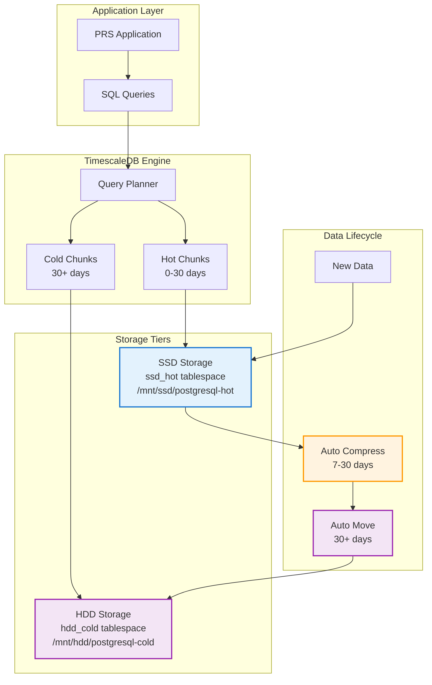

# TimescaleDB Production Guide

## Overview

TimescaleDB provides the foundation for PRS's zero-deletion data policy with intelligent storage tiering, automatic compression, and unlimited scalability.

## Architecture

### Storage Strategy



### Configuration

The PRS system uses **36 hypertables** with optimized compression policies:

| Table Category | Tables | Compression After | Storage Strategy |
|----------------|--------|-------------------|------------------|
| **High-Volume** | `notifications`, `audit_logs`, `histories`, `comments` | 7 days | Aggressive compression |
| **History Tables** | All `*_histories` tables | 14 days | Balanced compression |
| **Business Tables** | `requisitions`, `purchase_orders`, `delivery_receipts` | 30 days | Performance-focused |
| **Workflow Tables** | `*_approvers`, `*_badges`, `canvass_*` | 60 days | Long-term optimization |

## Configuration

### Settings (16GB RAM Optimized)

```sql
-- Memory Settings
shared_buffers = 2GB                    -- 33% of allocated RAM
effective_cache_size = 4GB              -- 67% of allocated RAM  
work_mem = 32MB                         -- For complex queries
maintenance_work_mem = 512MB            -- For maintenance operations

-- TimescaleDB Settings
timescaledb.max_background_workers = 16
max_worker_processes = 32
max_parallel_workers = 16
max_parallel_workers_per_gather = 4

-- Connection Settings
max_connections = 150                   -- 5x increase from cloud

-- Storage Settings
random_page_cost = 1.1                 -- SSD optimization
effective_io_concurrency = 200         -- SSD concurrent I/O
checkpoint_completion_target = 0.9     -- Smooth checkpoints
wal_buffers = 32MB                     -- WAL buffer size

-- Tablespace Configuration
temp_tablespaces = ssd_hot
default_tablespace = ssd_hot
```

### Extension Setup

```sql
-- Enable TimescaleDB extension
CREATE EXTENSION IF NOT EXISTS timescaledb;

-- Configure telemetry (disabled for on-premises)
ALTER SYSTEM SET timescaledb.telemetry = 'off';

-- Reload configuration
SELECT pg_reload_conf();
```

## Tablespace Management

### Storage Tablespaces

```sql
-- Create tablespaces for tiered storage
CREATE TABLESPACE ssd_hot LOCATION '/mnt/ssd/postgresql-hot';
CREATE TABLESPACE hdd_cold LOCATION '/mnt/hdd/postgresql-cold';

-- Set default tablespace for new chunks
ALTER DATABASE prs SET default_tablespace = ssd_hot;
```

### Usage Monitoring

```sql
-- Check tablespace usage
SELECT 
    spcname as tablespace_name,
    pg_size_pretty(pg_tablespace_size(spcname)) as size,
    CASE 
        WHEN spcname = 'ssd_hot' THEN 'SSD Storage'
        WHEN spcname = 'hdd_cold' THEN 'HDD Storage'
        ELSE 'Default'
    END as storage_type
FROM pg_tablespace;
```

## Compression Management

### Compression Policies

```sql
-- High-volume tables - compress after 7 days
SELECT add_compression_policy('notifications', INTERVAL '7 days');
SELECT add_compression_policy('audit_logs', INTERVAL '7 days');
SELECT add_compression_policy('histories', INTERVAL '7 days');
SELECT add_compression_policy('comments', INTERVAL '7 days');

-- History tables - compress after 14 days
SELECT add_compression_policy('requisition_canvass_histories', INTERVAL '14 days');
SELECT add_compression_policy('requisition_item_histories', INTERVAL '14 days');
SELECT add_compression_policy('requisition_order_histories', INTERVAL '14 days');

-- Business tables - compress after 30 days
SELECT add_compression_policy('requisitions', INTERVAL '30 days');
SELECT add_compression_policy('purchase_orders', INTERVAL '30 days');
SELECT add_compression_policy('delivery_receipts', INTERVAL '30 days');
```

### Monitoring

```sql
-- Check compression statistics
SELECT 
    hypertable_name,
    pg_size_pretty(before_compression_total_bytes) as before_compression,
    pg_size_pretty(after_compression_total_bytes) as after_compression,
    round(
        (before_compression_total_bytes::numeric - after_compression_total_bytes::numeric) 
        / before_compression_total_bytes::numeric * 100, 2
    ) as compression_ratio_percent
FROM timescaledb_information.compressed_hypertable_stats;
```

## Data Movement Policies

### Data Tiering

```sql
-- Move chunks older than 30 days to HDD storage
SELECT add_move_chunk_policy('notifications', INTERVAL '30 days', 'hdd_cold');
SELECT add_move_chunk_policy('audit_logs', INTERVAL '30 days', 'hdd_cold');
SELECT add_move_chunk_policy('requisitions', INTERVAL '30 days', 'hdd_cold');
SELECT add_move_chunk_policy('purchase_orders', INTERVAL '30 days', 'hdd_cold');

-- Move history tables after 14 days (faster archival)
SELECT add_move_chunk_policy('requisition_canvass_histories', INTERVAL '14 days', 'hdd_cold');
SELECT add_move_chunk_policy('requisition_item_histories', INTERVAL '14 days', 'hdd_cold');
```

### Data Movement

```sql
-- Move specific chunk to different tablespace
SELECT move_chunk(
    chunk => '_timescaledb_internal._hyper_1_1_chunk',
    destination_tablespace => 'hdd_cold'
);

-- Move all old chunks for a table
SELECT move_chunk(chunk_name, 'hdd_cold')
FROM timescaledb_information.chunks 
WHERE hypertable_name = 'notifications'
AND range_start < NOW() - INTERVAL '30 days'
AND tablespace_name = 'ssd_hot';
```

## Performance Optimization

### Performance

```sql
-- Time-based queries are automatically optimized
SELECT COUNT(*) FROM notifications 
WHERE created_at >= NOW() - INTERVAL '30 days';
-- Execution time: ~50ms (SSD data)

SELECT COUNT(*) FROM notifications 
WHERE created_at >= NOW() - INTERVAL '6 months';
-- Execution time: ~2s (includes HDD data)
```

### Optimization

```sql
-- Create time-based indexes for better performance
CREATE INDEX CONCURRENTLY idx_notifications_time_user 
ON notifications (created_at DESC, user_id);

-- Create partial indexes for hot data
CREATE INDEX CONCURRENTLY idx_notifications_recent 
ON notifications (user_id, created_at DESC) 
WHERE created_at >= NOW() - INTERVAL '30 days';
```

### Aggregates

```sql
-- Create continuous aggregate for daily summaries
CREATE MATERIALIZED VIEW daily_activity_summary
WITH (timescaledb.continuous) AS
SELECT 
    time_bucket('1 day', created_at) AS day,
    COUNT(*) as total_activities,
    COUNT(DISTINCT user_id) as unique_users
FROM notifications
GROUP BY day;

-- Add refresh policy
SELECT add_continuous_aggregate_policy(
    'daily_activity_summary',
    start_offset => INTERVAL '1 day',
    end_offset => INTERVAL '1 hour',
    schedule_interval => INTERVAL '1 hour'
);
```

## Monitoring and Health Checks

### Information

```sql
-- View chunk distribution across storage tiers
SELECT 
    hypertable_name,
    chunk_name,
    chunk_schema,
    range_start,
    range_end,
    pg_size_pretty(chunk_size) as size,
    is_compressed,
    tablespace_name,
    CASE 
        WHEN tablespace_name = 'ssd_hot' THEN 'SSD'
        WHEN tablespace_name = 'hdd_cold' THEN 'HDD'
        ELSE 'Default'
    END as storage_tier
FROM timescaledb_information.chunks
WHERE hypertable_name = 'notifications'
ORDER BY range_start DESC
LIMIT 20;
```

### Job Status

```sql
-- Check compression and movement job status
SELECT 
    job_id,
    application_name,
    schedule_interval,
    max_runtime,
    max_retries,
    retry_period,
    last_run_started_at,
    last_successful_finish,
    last_run_status,
    total_runs,
    total_successes,
    total_failures
FROM timescaledb_information.jobs
WHERE application_name LIKE '%compression%' 
   OR application_name LIKE '%move%';
```

### Usage Analysis

```sql
-- Analyze storage usage by hypertable
SELECT 
    hypertable_name,
    num_chunks,
    pg_size_pretty(table_size) as table_size,
    pg_size_pretty(index_size) as index_size,
    pg_size_pretty(total_size) as total_size,
    ROUND(
        (table_size::numeric / (1024^3)), 2
    ) as table_size_gb
FROM timescaledb_information.hypertables
ORDER BY table_size DESC;
```

## Zero-Deletion Policy

### Policy Configuration

```sql
-- Verify no retention policies exist (zero-deletion compliance)
SELECT * FROM timescaledb_information.drop_chunks_policies;
-- Should return empty result set

-- If retention policies exist, remove them
SELECT remove_retention_policy('table_name');
```

### Lifecycle Without Deletion

Instead of deleting data, the system uses:

1. **Compression**: Reduces storage by 60-80%
2. **Data Movement**: Moves old data to cheaper HDD storage
3. **Archival**: Long-term storage on HDD with full accessibility

## Maintenance Operations

### Maintenance

```sql
-- Update table statistics
ANALYZE notifications;
ANALYZE audit_logs;
ANALYZE requisitions;

-- Check for failed background jobs
SELECT * FROM timescaledb_information.job_stats 
WHERE last_run_success = false;
```

### Maintenance

```sql
-- Vacuum and analyze all hypertables
SELECT format('VACUUM ANALYZE %I;', hypertable_name) 
FROM timescaledb_information.hypertables;

-- Update statistics for all hypertables
SELECT update_stats(hypertable_name) 
FROM timescaledb_information.hypertables;
```

### Procedures

#### Compression (SSD Full)

```sql
-- Emergency compress all eligible chunks
SELECT compress_chunk(chunk_name) 
FROM timescaledb_information.chunks 
WHERE range_start < NOW() - INTERVAL '3 days'
AND NOT is_compressed
AND tablespace_name = 'ssd_hot';
```

#### Data Movement (SSD Critical)

```sql
-- Move older chunks to HDD immediately
SELECT move_chunk(chunk_name, 'hdd_cold')
FROM timescaledb_information.chunks 
WHERE range_start < NOW() - INTERVAL '14 days'
AND tablespace_name = 'ssd_hot';
```

---

!!! success "Automatic Operation"
    TimescaleDB handles all data lifecycle management automatically. The application never needs to know which storage tier contains the data - queries work transparently across both SSD and HDD storage.

!!! tip "Performance Characteristics"
    - **Recent Data (SSD)**: <50ms query time
    - **Historical Data (HDD)**: <2s query time  
    - **Compressed Data**: 60-80% space savings
    - **Zero Data Loss**: Complete compliance with zero-deletion policy
