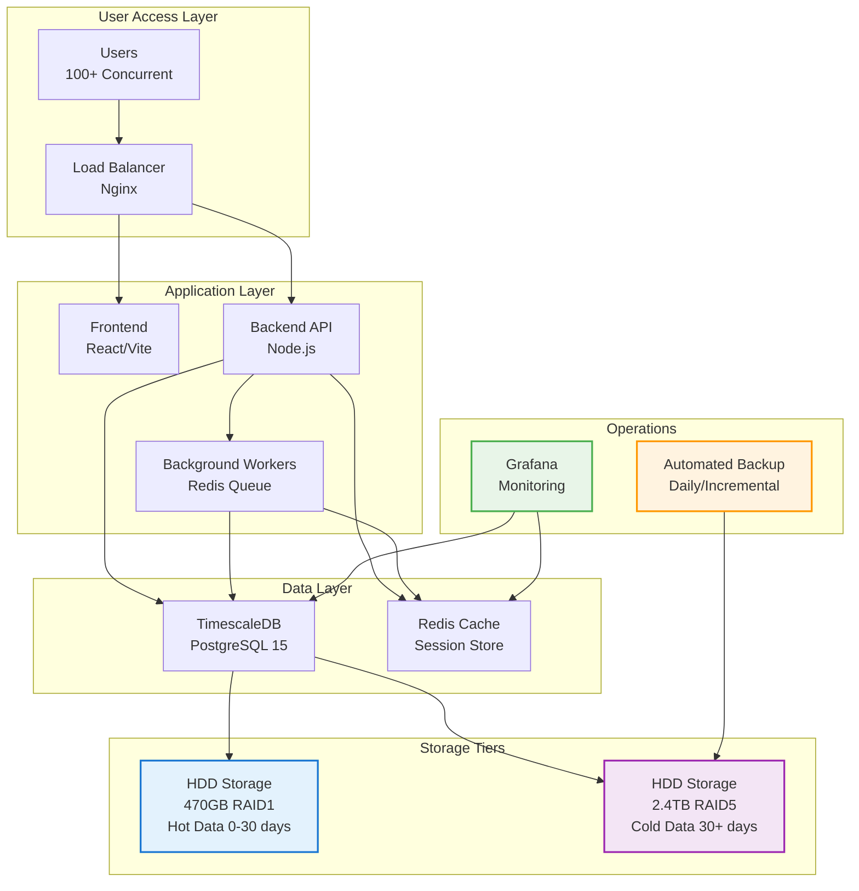

# Getting Started Overview

## Welcome to PRS On-Premises

This guide will help you deploy and configure the PRS (Procurement and Requisition System) in your on-premises environment for maximum performance, security, and reliability.

## What You'll Achieve

By following this documentation, you'll deploy a production-ready system with:

### Performance Improvements
- **233% more concurrent users** (100+ vs 30 on cloud)
- **60-75% faster response times** (50-200ms vs 200-500ms)
- **400% better database performance** (500+ vs 100 queries/sec)
- **12,000% more storage capacity** (2.4TB vs 20GB)

### Enterprise Features
- **Dual Storage Architecture** with automatic HDD-only tiering
- **Zero-Deletion Data Policy** with TimescaleDB compression
- **Enterprise Security** with SSL/TLS and hardening
- **Automated Operations** with monitoring and backup
- **High Availability** with redundant storage (RAID)

## Deployment Path

### Phase 1: Infrastructure Setup (2-3 hours)
1. **[Hardware Requirements](../hardware/requirements.md)** - Verify system specifications
2. **[Prerequisites](prerequisites.md)** - Install required software
3. **[Environment Setup](../installation/environment.md)** - Configure system environment

### Phase 2: Application Deployment (1-2 hours)
1. **[Docker Configuration](../installation/docker.md)** - Setup container environment
2. **[Database Setup](../installation/database.md)** - Configure TimescaleDB
3. **[SSL Configuration](../installation/ssl.md)** - Secure with HTTPS

### Phase 3: Operations Setup (1 hour)
1. **[Monitoring Setup](../operations/monitoring.md)** - Configure dashboards and alerts
2. **[Backup Configuration](../operations/backup.md)** - Setup automated backups
3. **[Testing & Validation](../deployment/testing.md)** - Verify deployment

## Quick Start Options

### Option 1: Automated Deployment (Recommended)
```bash
# Clone deployment repository
git clone https://github.com/your-org/prs-deployment.git
cd prs-deployment

# Run automated setup
./scripts/deploy-onprem.sh prod
```

### Option 2: Manual Step-by-Step
Follow the detailed guides in order:
1. [Prerequisites](prerequisites.md)
2. [Environment Setup](../installation/environment.md)
3. [Docker Configuration](../installation/docker.md)
4. [Database Setup](../installation/database.md)

### Option 3: Quick Start (30 minutes)
For experienced administrators:
1. [Quick Start Guide](quick-start.md)

## System Architecture Overview



## Key Concepts

### Dual Storage Architecture
- **SSD Tier**: Hot data (0-30 days) for fast access (<50ms)
- **HDD Tier**: Cold data (30+ days) for capacity (<2s)
- **Automatic Movement**: TimescaleDB moves data based on age
- **Transparent Access**: Applications query normally across tiers

### Zero-Deletion Policy
- **No Data Loss**: System never deletes data
- **Compression**: Reduces storage by 60-80%
- **Compliance Ready**: Meets regulatory requirements
- **Unlimited Growth**: Scales with your data needs

### Enterprise Security
- **SSL/TLS Encryption**: All communications secured
- **Network Isolation**: Multi-tier network security
- **Access Controls**: Role-based permissions
- **Audit Logging**: Complete activity tracking

## Prerequisites Checklist

Before starting, ensure you have:

### Hardware Requirements
- [ ] **Server**: 16GB RAM, 8+ CPU cores
- [ ] **HDD Storage**: 470GB RAID1 array
- [ ] **HDD Storage**: 2.4TB RAID5 array
- [ ] **Network**: 1 Gbps interface
- [ ] **UPS**: Uninterruptible power supply

### Software Requirements
- [ ] **OS**: Ubuntu 20.04+ or CentOS 8+
- [ ] **Docker**: Version 20.10+
- [ ] **Docker Compose**: Version 2.0+
- [ ] **Git**: Version 2.25+
- [ ] **SSL Certificates**: Valid domain certificates

### Network Requirements
- [ ] **Domain Name**: Registered and configured
- [ ] **DNS**: Points to server IP
- [ ] **Firewall**: Configured for internal access
- [ ] **Admin Access**: SSH access configured

### Access Requirements
- [ ] **Admin Rights**: Sudo access on server
- [ ] **Repository Access**: Git repository credentials
- [ ] **SSL Certificates**: Certificate files available
- [ ] **API Credentials**: External API access configured

## Support Resources

### Documentation
- **[FAQ](../appendix/faq.md)** - Common questions and answers
- **[Troubleshooting](../deployment/troubleshooting.md)** - Problem resolution
- **[Command Reference](../reference/commands.md)** - Quick command guide
- **[Support](../appendix/support.md)** - Getting help

### Tools and Scripts
- **Health Check**: `./scripts/system-health-check.sh`
- **Backup**: `./scripts/backup-maintenance.sh`
- **Monitoring**: `./scripts/performance-monitor.sh`
- **Security**: `./scripts/security-hardening-check.sh`

### Monitoring and Alerts
- **Grafana Dashboards**: Real-time system metrics
- **Prometheus Alerts**: Automated issue detection
- **Log Analysis**: Centralized logging and analysis
- **Performance Tracking**: Response time and throughput

## Next Steps

### For New Deployments
1. **Start with [Prerequisites](prerequisites.md)** to verify requirements
2. **Follow [Quick Start](quick-start.md)** for rapid deployment
3. **Review [Operations Guide](../operations/daily.md)** for maintenance

### For Existing Systems
1. **Check [Migration Guide](../deployment/process.md)** for upgrade procedures
2. **Review [Performance Optimization](../hardware/optimization.md)** for tuning
3. **Update [Security Configuration](../configuration/security.md)** for hardening

### For Administrators
1. **Study [Daily Operations](../operations/daily.md)** for routine tasks
2. **Setup [Monitoring](../operations/monitoring.md)** for proactive management
3. **Configure [Backup Procedures](../operations/backup.md)** for data protection

---

!!! tip "Getting Help"
    If you encounter issues during deployment, check the [Troubleshooting Guide](../deployment/troubleshooting.md) or [FAQ](../appendix/faq.md) for solutions.

!!! success "Ready to Start"
    Once you've reviewed the prerequisites, proceed to the [Quick Start Guide](quick-start.md) for rapid deployment or [Prerequisites](prerequisites.md) for detailed setup.
