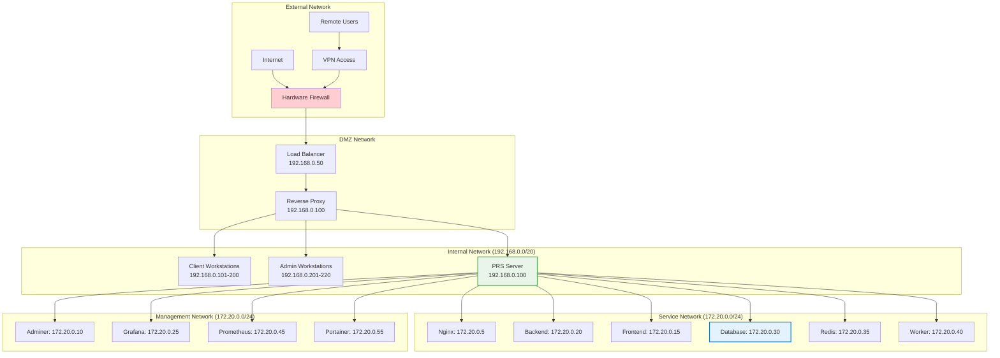

# Network Setup

## Network Architecture

The PRS on-premises deployment uses a multi-tier network architecture designed for security, performance, and scalability.

## Network Topology



## Network Configuration

### Segments

| Network | CIDR | Purpose | VLAN | Access |
|---------|------|---------|------|---------|
| **External** | Public IPs | Internet access | - | Public |
| **DMZ** | 192.168.0.0/24 | Public services | 10 | Restricted |
| **Internal** | 192.168.0.0/20 | Client access | 20 | Internal |
| **Service** | 172.20.0.0/24 | Container network | - | Isolated |
| **Management** | 172.21.0.0/24 | Admin interfaces | 30 | Admin only |

### Address Allocation

#### Infrastructure

| Service | IP Address | Port | Access Level |
|---------|------------|------|--------------|
| **PRS Server** | 192.168.0.100 | Multiple | Internal |
| **Load Balancer** | 192.168.0.50 | 80, 443 | Public |
| **DNS Server** | 192.168.0.10 | 53 | Internal |
| **NTP Server** | 192.168.0.11 | 123 | Internal |

#### Services

| Service | Container IP | Host Port | Purpose |
|---------|--------------|-----------|---------|
| **Nginx** | 172.20.0.5 | 80, 443 | Reverse proxy |
| **Frontend** | 172.20.0.15 | 3000 | React application |
| **Backend** | 172.20.0.20 | 4000 | API server |
| **Database** | 172.20.0.30 | 5432 | PostgreSQL |
| **Redis** | 172.20.0.35 | 6379 | Cache server |
| **Worker** | 172.20.0.40 | - | Background jobs |

#### Services

| Service | Container IP | Host Port | Purpose |
|---------|--------------|-----------|---------|
| **Adminer** | 172.20.0.10 | 8080 | Database admin |
| **Grafana** | 172.20.0.25 | 3001 | Monitoring |
| **Prometheus** | 172.20.0.45 | 9090 | Metrics |
| **Portainer** | 172.20.0.55 | 9000 | Container admin |

## Network Interface Configuration

### Interface Configuration

```bash
# /etc/netplan/01-network-config.yaml
network:
  version: 2
  renderer: networkd
  ethernets:
    enp0s3:
      addresses:
        - 192.168.0.100/20
      gateway4: 192.168.0.1
      nameservers:
        addresses:
          - 192.168.0.10
          - 8.8.8.8
        search:
          - company.local
      dhcp4: false
      dhcp6: false
```

### Network Configuration

```bash
# Apply netplan configuration
sudo netplan apply

# Verify configuration
ip addr show
ip route show
```

### Performance Tuning

```bash
# TCP buffer optimization
echo 'net.core.rmem_max = 16777216' | sudo tee -a /etc/sysctl.conf
echo 'net.core.wmem_max = 16777216' | sudo tee -a /etc/sysctl.conf
echo 'net.ipv4.tcp_rmem = 4096 87380 16777216' | sudo tee -a /etc/sysctl.conf
echo 'net.ipv4.tcp_wmem = 4096 65536 16777216' | sudo tee -a /etc/sysctl.conf

# Connection tracking optimization
echo 'net.netfilter.nf_conntrack_max = 262144' | sudo tee -a /etc/sysctl.conf
echo 'net.netfilter.nf_conntrack_tcp_timeout_established = 1200' | sudo tee -a /etc/sysctl.conf

# Apply changes
sudo sysctl -p
```

## Firewall Configuration

### Firewall Rules

```bash
# Reset firewall
sudo ufw --force reset

# Default policies
sudo ufw default deny incoming
sudo ufw default allow outgoing

# SSH access (admin only)
sudo ufw allow from 192.168.0.201/24 to any port 22

# HTTP/HTTPS access (internal network)
sudo ufw allow from 192.168.0.0/20 to any port 80
sudo ufw allow from 192.168.0.0/20 to any port 443

# Management interfaces (admin only)
sudo ufw allow from 192.168.0.201/24 to any port 8080  # Adminer
sudo ufw allow from 192.168.0.201/24 to any port 3001  # Grafana
sudo ufw allow from 192.168.0.201/24 to any port 9000  # Portainer
sudo ufw allow from 192.168.0.201/24 to any port 9090  # Prometheus

# Enable firewall
sudo ufw --force enable

# Check status
sudo ufw status verbose
```

### Firewall Rules

```bash
# Rate limiting for HTTP
sudo ufw limit 80/tcp
sudo ufw limit 443/tcp

# Block common attack patterns
sudo ufw deny from 192.168.0.0/20 to any port 22 comment 'Block SSH from clients'
sudo ufw deny from 172.20.0.0/24 to any port 22 comment 'Block SSH from containers'

# Allow Docker network
sudo ufw allow in on docker0
sudo ufw allow in on br-*
```

## DNS Configuration

### DNS Setup

```bash
# /etc/systemd/resolved.conf
[Resolve]
DNS=192.168.0.10 8.8.8.8
FallbackDNS=1.1.1.1 8.8.4.4
Domains=company.local
DNSSEC=yes
DNSOverTLS=opportunistic
Cache=yes
```

### Records

```bash
# Internal DNS records (bind9 format)
$ORIGIN company.local.
$TTL 86400

@       IN  SOA     ns1.company.local. admin.company.local. (
                    2024082201  ; Serial
                    3600        ; Refresh
                    1800        ; Retry
                    604800      ; Expire
                    86400       ; Minimum TTL
)

; Name servers
@       IN  NS      ns1.company.local.

; A records
ns1     IN  A       192.168.0.10
prs     IN  A       192.168.0.100
admin   IN  A       192.168.0.100
grafana IN  A       192.168.0.100

; CNAME records
www     IN  CNAME   prs
api     IN  CNAME   prs
```

## Load Balancing

### Load Balancer Configuration

```nginx
# /etc/nginx/sites-available/prs-lb
upstream prs_backend {
    least_conn;
    server 192.168.0.100:80 max_fails=3 fail_timeout=30s;
    # Add more servers for horizontal scaling
    # server 192.168.0.101:80 max_fails=3 fail_timeout=30s;
}

server {
    listen 80;
    listen 443 ssl http2;
    server_name prs.company.local;

    # SSL configuration
    ssl_certificate /etc/ssl/certs/prs.crt;
    ssl_certificate_key /etc/ssl/private/prs.key;

    # Security headers
    add_header X-Frame-Options DENY;
    add_header X-Content-Type-Options nosniff;
    add_header X-XSS-Protection "1; mode=block";

    location / {
        proxy_pass http://prs_backend;
        proxy_set_header Host $host;
        proxy_set_header X-Real-IP $remote_addr;
        proxy_set_header X-Forwarded-For $proxy_add_x_forwarded_for;
        proxy_set_header X-Forwarded-Proto $scheme;
        
        # Connection settings
        proxy_connect_timeout 30s;
        proxy_send_timeout 30s;
        proxy_read_timeout 30s;
    }

    # Health check endpoint
    location /health {
        access_log off;
        return 200 "healthy\n";
        add_header Content-Type text/plain;
    }
}
```

## Network Monitoring

### Monitoring

```bash
# Install monitoring tools
sudo apt install iftop nethogs nload

# Monitor interface bandwidth
sudo iftop -i enp0s3

# Monitor per-process network usage
sudo nethogs enp0s3

# Real-time network load
nload enp0s3
```

### Monitoring

```bash
# Monitor active connections
ss -tuln

# Monitor connection states
ss -s

# Monitor Docker network
docker network ls
docker network inspect prs_onprem_network
```

### Testing

```bash
# Network throughput test
iperf3 -s  # On server
iperf3 -c 192.168.0.100 -t 60 -P 4  # On client

# Latency test
ping -c 100 192.168.0.100

# DNS resolution test
dig @192.168.0.10 prs.company.local
```

## Network Troubleshooting

### Issues

#### Problems

```bash
# Check interface status
ip link show

# Check routing table
ip route show

# Check DNS resolution
nslookup prs.company.local
dig prs.company.local

# Test connectivity
ping 192.168.0.100
telnet 192.168.0.100 80
```

#### Issues

```bash
# Check network statistics
cat /proc/net/dev

# Check for packet drops
netstat -i

# Check network errors
dmesg | grep -i network

# Monitor network queues
tc -s qdisc show dev enp0s3
```

#### Network Issues

```bash
# Check Docker networks
docker network ls

# Inspect network configuration
docker network inspect prs_onprem_network

# Check container connectivity
docker exec prs-onprem-backend ping prs-onprem-postgres-timescale

# Restart Docker networking
sudo systemctl restart docker
```

## Network Security

### Hardening

```bash
# Disable unused network services
sudo systemctl disable avahi-daemon
sudo systemctl disable cups-browsed

# Enable SYN flood protection
echo 'net.ipv4.tcp_syncookies = 1' | sudo tee -a /etc/sysctl.conf

# Disable IP forwarding (if not needed)
echo 'net.ipv4.ip_forward = 0' | sudo tee -a /etc/sysctl.conf

# Disable IPv6 (if not used)
echo 'net.ipv6.conf.all.disable_ipv6 = 1' | sudo tee -a /etc/sysctl.conf
```

### Detection

```bash
# Install and configure fail2ban
sudo apt install fail2ban

# Configure fail2ban for SSH
sudo tee /etc/fail2ban/jail.local << EOF
[DEFAULT]
bantime = 3600
findtime = 600
maxretry = 3

[sshd]
enabled = true
port = ssh
filter = sshd
logpath = /var/log/auth.log
maxretry = 3
bantime = 3600
EOF

# Start fail2ban
sudo systemctl enable fail2ban
sudo systemctl start fail2ban
```

## Network Capacity Planning

### Utilization

| Metric | Current | Capacity | Utilization |
|--------|---------|----------|-------------|
| **Bandwidth** | 200 Mbps | 1 Gbps | 20% |
| **Connections** | 500 | 65536 | <1% |
| **DNS Queries** | 1000/min | 10000/min | 10% |
| **Firewall Rules** | 50 | 1000 | 5% |

### Considerations

#### Scaling

```bash
# Add additional PRS servers
# Update load balancer configuration
upstream prs_backend {
    least_conn;
    server 192.168.0.100:80 max_fails=3 fail_timeout=30s;
    server 192.168.0.101:80 max_fails=3 fail_timeout=30s;
    server 192.168.0.102:80 max_fails=3 fail_timeout=30s;
}
```

#### Upgrades

- **10 Gbps Interface**: For high-throughput requirements
- **Link Aggregation**: Bond multiple 1 Gbps interfaces
- **VLAN Segmentation**: Separate traffic types
- **QoS Implementation**: Prioritize critical traffic

---

!!! tip "Network Performance"
    The network is optimized for low latency and high throughput to support 100+ concurrent users with sub-200ms response times.

!!! warning "Security First"
    All network access is controlled through firewall rules and proper network segmentation to ensure security.
