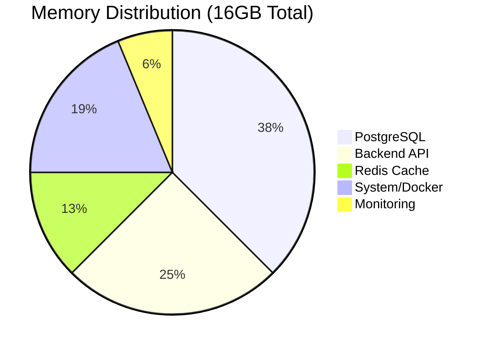

# Performance Optimization

## Overview

This guide covers comprehensive performance optimization for the PRS on-premises deployment, targeting 100+ concurrent users with sub-200ms response times.

## Memory Optimization

### Memory Allocation



### Configuration

#### Memory Settings

```sql
-- Memory configuration for 6GB allocation
shared_buffers = 2GB                    -- 33% of allocated RAM
effective_cache_size = 4GB              -- 67% of allocated RAM
work_mem = 32MB                         -- Per-query working memory
maintenance_work_mem = 512MB            -- Maintenance operations
wal_buffers = 32MB                      -- WAL buffer size

-- Connection and worker settings
max_connections = 150                   -- 5x increase from cloud
max_worker_processes = 32               -- Utilize all CPU cores
max_parallel_workers = 16               -- Parallel query execution
max_parallel_workers_per_gather = 4    -- Per-query parallelism
```

#### API Memory Settings

```javascript
// Node.js memory optimization
process.env.NODE_OPTIONS = '--max-old-space-size=2048 --max-semi-space-size=128';

// Connection pool optimization
const poolConfig = {
  min: 5,                              // Minimum connections
  max: 20,                             // Maximum connections (vs 3 on cloud)
  acquire: 30000,                      // Connection timeout
  idle: 10000,                         // Idle timeout
  evict: 20000                         // Eviction timeout
};
```

#### Memory Configuration

```bash
# Redis memory settings (2GB allocation)
maxmemory 2gb
maxmemory-policy allkeys-lru
maxmemory-samples 5

# Persistence settings
save 900 1
save 300 10
save 60 10000
appendonly yes
appendfsync everysec
```

### Monitoring

```bash
# Monitor memory usage
free -h
cat /proc/meminfo

# Monitor per-process memory
ps aux --sort=-%mem | head -20

# Monitor Docker container memory
docker stats --no-stream

# Check for memory leaks
valgrind --tool=memcheck --leak-check=full node app.js
```

## CPU Optimization

### Configuration

| Setting | Value | Purpose |
|---------|-------|---------|
| **CPU Cores** | 4+ physical | Parallel processing |
| **CPU Governor** | performance | Maximum performance |
| **CPU Affinity** | Balanced | Distribute load |
| **NUMA** | Enabled | Memory locality |

### Performance Tuning

```bash
# Set CPU governor to performance
echo performance | sudo tee /sys/devices/system/cpu/cpu*/cpufreq/scaling_governor

# Disable CPU frequency scaling
echo 1 | sudo tee /sys/devices/system/cpu/intel_pstate/no_turbo

# Set CPU affinity for critical processes
taskset -cp 0,1 $(pgrep postgres)
taskset -cp 2,3 $(pgrep node)
```

### Priority Optimization

```bash
# Set process priorities
sudo renice -10 $(pgrep postgres)      # Higher priority for database
sudo renice -5 $(pgrep node)           # Higher priority for backend
sudo renice 5 $(pgrep prometheus)      # Lower priority for monitoring
```

## Storage Performance

### Optimization

```bash
# Enable TRIM for SSD longevity
sudo fstrim -v /mnt/ssd

# Set optimal I/O scheduler
echo noop | sudo tee /sys/block/sda/queue/scheduler

# Optimize read-ahead
echo 256 | sudo tee /sys/block/sda/queue/read_ahead_kb

# Set queue depth
echo 32 | sudo tee /sys/block/sda/queue/nr_requests
```

### Optimization

```bash
# Set deadline scheduler for HDD
echo deadline | sudo tee /sys/block/md1/queue/scheduler

# Optimize for sequential access
echo 8192 | sudo tee /sys/block/md1/queue/read_ahead_kb

# Enable write-back caching (with UPS)
hdparm -W1 /dev/md1
```

### Optimization

```bash
# Mount options for performance
# SSD mount options
/dev/md0 /mnt/ssd ext4 defaults,noatime,discard,barrier=0 0 2

# HDD mount options
/dev/md1 /mnt/hdd ext4 defaults,noatime,data=writeback 0 2

# Optimize ext4 parameters
tune2fs -o journal_data_writeback /dev/md0
tune2fs -O ^has_journal /dev/md0  # Remove journal for SSD (risky)
```

## Network Performance

### Tuning

```bash
# TCP buffer optimization
net.core.rmem_max = 16777216
net.core.wmem_max = 16777216
net.ipv4.tcp_rmem = 4096 87380 16777216
net.ipv4.tcp_wmem = 4096 65536 16777216

# Connection optimization
net.core.somaxconn = 65536
net.core.netdev_max_backlog = 5000
net.ipv4.tcp_max_syn_backlog = 8192

# TCP congestion control
net.ipv4.tcp_congestion_control = bbr
net.core.default_qdisc = fq
```

### Performance

```nginx
# Nginx optimization
worker_processes auto;
worker_connections 4096;
worker_rlimit_nofile 65536;

# Enable sendfile and TCP optimizations
sendfile on;
tcp_nopush on;
tcp_nodelay on;

# Gzip compression
gzip on;
gzip_vary on;
gzip_min_length 1024;
gzip_types text/plain text/css application/json application/javascript;

# Caching
location ~* \.(jpg|jpeg|png|gif|ico|css|js)$ {
    expires 1y;
    add_header Cache-Control "public, immutable";
}
```

## Database Performance

### Optimization

```sql
-- Storage optimization
random_page_cost = 1.1                 -- SSD optimization
effective_io_concurrency = 200         -- SSD concurrent I/O
seq_page_cost = 1.0                    -- Sequential scan cost

-- Checkpoint optimization
checkpoint_completion_target = 0.9     -- Smooth checkpoints
checkpoint_timeout = 15min             -- Checkpoint frequency
max_wal_size = 2GB                     -- WAL size limit
min_wal_size = 512MB                   -- Minimum WAL size

-- Query optimization
default_statistics_target = 100        -- Statistics detail
constraint_exclusion = partition       -- Partition pruning
```

### Optimization

```sql
-- TimescaleDB specific settings
timescaledb.max_background_workers = 16
shared_preload_libraries = 'timescaledb'

-- Compression optimization
ALTER TABLE notifications SET (
    timescaledb.compress,
    timescaledb.compress_segmentby = 'user_id',
    timescaledb.compress_orderby = 'created_at DESC'
);

-- Chunk interval optimization
SELECT set_chunk_time_interval('notifications', INTERVAL '1 day');
SELECT set_chunk_time_interval('audit_logs', INTERVAL '1 day');
```

### Optimization

```sql
-- Time-based indexes
CREATE INDEX CONCURRENTLY idx_notifications_time 
ON notifications (created_at DESC);

-- Composite indexes for common queries
CREATE INDEX CONCURRENTLY idx_notifications_user_time 
ON notifications (user_id, created_at DESC);

-- Partial indexes for hot data
CREATE INDEX CONCURRENTLY idx_notifications_recent 
ON notifications (user_id, created_at DESC) 
WHERE created_at >= NOW() - INTERVAL '30 days';
```

## Application Performance

### API Optimization

```javascript
// Connection pooling
const pool = new Pool({
  host: process.env.POSTGRES_HOST,
  database: process.env.POSTGRES_DB,
  user: process.env.POSTGRES_USER,
  password: process.env.POSTGRES_PASSWORD,
  port: process.env.POSTGRES_PORT,
  max: 20,                    // Maximum pool size
  min: 5,                     // Minimum pool size
  idleTimeoutMillis: 10000,   // Idle timeout
  connectionTimeoutMillis: 30000, // Connection timeout
});

// Query optimization
const query = `
  SELECT * FROM notifications 
  WHERE user_id = $1 AND created_at >= $2 
  ORDER BY created_at DESC 
  LIMIT $3
`;

// Caching strategy
const redis = new Redis({
  host: process.env.REDIS_HOST,
  port: process.env.REDIS_PORT,
  password: process.env.REDIS_PASSWORD,
  retryDelayOnFailover: 100,
  maxRetriesPerRequest: 3,
});
```

### Optimization

```javascript
// Vite build optimization
export default defineConfig({
  build: {
    target: 'es2015',
    minify: 'terser',
    terserOptions: {
      compress: {
        drop_console: true,
        drop_debugger: true,
      },
    },
    rollupOptions: {
      output: {
        manualChunks: {
          vendor: ['react', 'react-dom'],
          utils: ['lodash', 'moment'],
        },
      },
    },
  },
  server: {
    hmr: {
      overlay: false,
    },
  },
});
```

## Performance Monitoring

### Performance Indicators

| Metric | Target | Warning | Critical |
|--------|--------|---------|----------|
| **Response Time** | <200ms | >500ms | >1000ms |
| **Throughput** | 1000 req/s | <500 req/s | <100 req/s |
| **CPU Usage** | <60% | >70% | >85% |
| **Memory Usage** | <75% | >80% | >90% |
| **Disk I/O** | <80% | >85% | >95% |

### Testing

```bash
# Load testing with Apache Bench
ab -n 10000 -c 100 https://your-domain.com/

# API performance testing
ab -n 5000 -c 50 https://your-domain.com/api/health

# Database performance testing
pgbench -i -s 100 prs_production
pgbench -c 10 -j 2 -t 1000 prs_production
```

### Monitoring

```bash
# System performance monitoring
htop
iotop
nethogs

# Database performance monitoring
SELECT * FROM pg_stat_activity WHERE state = 'active';
SELECT * FROM pg_stat_statements ORDER BY total_time DESC LIMIT 10;

# Application performance monitoring
docker stats
docker logs prs-onprem-backend | grep "response time"
```

## Performance Tuning Checklist

### Level

- [ ] **CPU Governor**: Set to performance mode
- [ ] **Memory**: Optimize allocation per service
- [ ] **Storage**: Configure optimal I/O schedulers
- [ ] **Network**: Tune TCP buffers and congestion control
- [ ] **Kernel**: Apply performance-oriented kernel parameters

### Level

- [ ] **Memory**: Configure shared_buffers and work_mem
- [ ] **Connections**: Optimize max_connections and pooling
- [ ] **Storage**: Set random_page_cost for SSD
- [ ] **Indexes**: Create optimal indexes for queries
- [ ] **Statistics**: Update table statistics regularly

### Level

- [ ] **Connection Pooling**: Configure optimal pool sizes
- [ ] **Caching**: Implement Redis caching strategy
- [ ] **Queries**: Optimize database queries
- [ ] **Assets**: Enable compression and caching
- [ ] **Monitoring**: Implement performance monitoring

### Level

- [ ] **Resource Limits**: Set appropriate CPU/memory limits
- [ ] **Health Checks**: Configure proper health checks
- [ ] **Logging**: Optimize logging levels
- [ ] **Networking**: Use optimal network drivers
- [ ] **Volumes**: Use appropriate volume drivers

## Performance Troubleshooting

### Performance Issues

#### CPU Usage

```bash
# Identify CPU-intensive processes
top -o %CPU
ps aux --sort=-%cpu | head -20

# Check for CPU throttling
dmesg | grep -i "cpu.*throttl"

# Monitor CPU frequency
watch -n 1 cat /proc/cpuinfo | grep MHz
```

#### Issues

```bash
# Check for memory leaks
ps aux --sort=-%mem | head -20
cat /proc/meminfo | grep -E "(MemFree|MemAvailable|Buffers|Cached)"

# Check swap usage
swapon -s
cat /proc/swaps
```

#### Bottlenecks

```bash
# Monitor I/O wait
iostat -x 1

# Check for I/O bottlenecks
iotop -a

# Monitor disk queue depth
cat /sys/block/sda/queue/nr_requests
```

#### Issues

```bash
# Monitor network utilization
iftop -i eth0

# Check for packet drops
netstat -i

# Monitor connection states
ss -s
```

---

!!! success "Performance Target"
    With proper optimization, the system should achieve <200ms response times for 95% of requests with 100+ concurrent users.

!!! tip "Continuous Optimization"
    Performance optimization is an ongoing process. Regular monitoring and tuning ensure optimal system performance.
