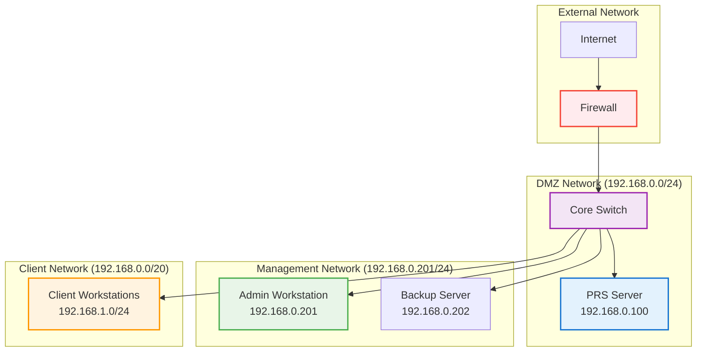

# Hardware Requirements

## Overview

This guide specifies the complete hardware requirements for the PRS on-premises deployment, optimized for 100+ concurrent users with enterprise-grade performance and reliability.

## Minimum System Requirements

### Server Specifications

| Component | Minimum | Recommended | Enterprise |
|-----------|---------|-------------|------------|
| **CPU** | 4 cores @ 2.4GHz | 8 cores @ 3.0GHz | 16 cores @ 3.2GHz |
| **RAM** | 16 GB DDR4 | 32 GB DDR4 | 64 GB DDR4 |
| **HDD Storage** | 2 TB Single Drive | 4 TB RAID1 | 8 TB RAID1 |
| **Network** | 1 Gbps | 1 Gbps | 10 Gbps |
| **Power** | 650W UPS | 1000W UPS | 1500W UPS |

### Performance Targets

| Metric | Target | With Recommended | With Enterprise |
|--------|--------|------------------|-----------------|
| **Concurrent Users** | 100+ | 200+ | 500+ |
| **Response Time** | <200ms | <100ms | <50ms |
| **Database Queries/sec** | 500+ | 1000+ | 2000+ |
| **File Upload Speed** | 50 MB/s | 100 MB/s | 200 MB/s |
| **Backup Speed** | 100 MB/s | 200 MB/s | 500 MB/s |

## Detailed Hardware Specifications

### CPU Requirements

#### Minimum Configuration
- **Cores**: 4 physical cores (8 threads)
- **Clock Speed**: 2.4 GHz base frequency
- **Architecture**: x86_64 (Intel/AMD)
- **Features**: Virtualization support (VT-x/AMD-V)

#### Recommended Configuration
- **Cores**: 8 physical cores (16 threads)
- **Clock Speed**: 3.0 GHz base frequency
- **Cache**: 16 MB L3 cache minimum
- **Examples**: Intel Xeon E-2288G, AMD EPYC 7302P

#### Enterprise Configuration
- **Cores**: 16+ physical cores (32+ threads)
- **Clock Speed**: 3.2+ GHz base frequency
- **Cache**: 32+ MB L3 cache
- **Examples**: Intel Xeon Gold 6248R, AMD EPYC 7543

### Memory Requirements

#### Memory Configuration
```
Total RAM: 16 GB (Minimum) / 32 GB (Recommended)
├── System OS: 2 GB
├── Docker Engine: 1 GB
├── PostgreSQL: 6 GB (allocated)
│   ├── Shared Buffers: 2 GB
│   ├── Effective Cache: 4 GB
├── Redis Cache: 2 GB
├── Application: 4 GB
│   ├── Backend API: 2 GB
│   ├── Frontend: 1 GB
│   ├── Workers: 1 GB
└── System Buffer: 1 GB
```

#### Memory Specifications
- **Type**: DDR4-2400 or higher
- **Configuration**: ECC memory recommended
- **Channels**: Dual-channel minimum
- **Expandability**: Support for future upgrades

### Storage Requirements

#### HDD Storage (Simplified Single-Tier)

**Purpose**: Cost-effective, high-capacity storage for all data types

| Configuration | Capacity | RAID Level | Performance |
|---------------|----------|------------|-------------|
| **Minimum** | 2 TB | Single Drive | 150 IOPS |
| **Recommended** | 4 TB | RAID1 | 200 IOPS |
| **Enterprise** | 8 TB | RAID1 | 300+ IOPS |

**HDD Specifications**:
- **Interface**: SATA III (6 Gbps)
- **Speed**: 7200 RPM minimum
- **Cache**: 128 MB or higher
- **Type**: Enterprise/NAS drives (for reliability)
- **Examples**: WD Red Pro, Seagate IronWolf Pro, WD Black

**HDD Usage Breakdown**:
```
Total HDD: 2 TB (Minimum Configuration)
├── PostgreSQL Data: 800 GB
├── Redis Data: 100 GB
├── Application Uploads: 500 GB
├── System Logs: 200 GB
├── Nginx Cache: 50 GB
├── Monitoring Data: 100 GB
├── Database Backups: 200 GB
└── Free Space (20%): 50 GB
```

**Benefits of HDD-Only Configuration**:
- **Simplified Management**: Single storage tier to manage
- **Lower Cost**: Significantly cheaper per GB than SSD
- **High Capacity**: Easily accommodate large datasets
- **Adequate Performance**: Suitable for most business workloads
- **Easy Expansion**: Simple to add more capacity

### Network Requirements

#### Network Interface
- **Speed**: 1 Gbps minimum (10 Gbps recommended)
- **Type**: Ethernet (RJ45 or SFP+)
- **Redundancy**: Dual NICs for high availability
- **Features**: Jumbo frame support (9000 MTU)

#### Network Architecture


#### Bandwidth Requirements
- **Internal Traffic**: 100 Mbps per 10 concurrent users
- **Database Replication**: 50 Mbps sustained
- **Backup Traffic**: 200 Mbps during backup windows
- **Monitoring Traffic**: 10 Mbps continuous

### Power and Cooling

#### Power Requirements

**Server Power Consumption**:
- **Idle**: 150-200W
- **Normal Load**: 300-400W
- **Peak Load**: 500-600W
- **UPS Capacity**: 1000W minimum (30 minutes runtime)

**UPS Specifications**:
- **Type**: Online/Double-conversion UPS
- **Capacity**: 1000VA minimum (1500VA recommended)
- **Runtime**: 30 minutes at full load
- **Features**: Network monitoring, automatic shutdown
- **Examples**: APC Smart-UPS, Eaton 5P

#### Cooling Requirements
- **Operating Temperature**: 18-27°C (64-80°F)
- **Humidity**: 20-80% RH (non-condensing)
- **Airflow**: Front-to-back cooling
- **Redundancy**: Redundant cooling fans

### Storage Configuration

#### Single Drive Configuration (Budget Option)
```bash
# Format single drive
sudo mkfs.ext4 /dev/sda1

# Create mount point
sudo mkdir -p /mnt/hdd

# Mount with optimal options
sudo mount -o defaults,noatime /dev/sda1 /mnt/hdd

# Add to fstab
echo "/dev/sda1 /mnt/hdd ext4 defaults,noatime 0 2" | sudo tee -a /etc/fstab
```

#### HDD RAID1 Configuration (Recommended)
```bash
# Create RAID1 for HDD drives (2 drives for redundancy)
sudo mdadm --create /dev/md0 --level=1 --raid-devices=2 /dev/sda /dev/sdb

# Format and mount
sudo mkfs.ext4 /dev/md0
sudo mkdir -p /mnt/hdd
sudo mount /dev/md0 /mnt/hdd

# Add to fstab
echo "/dev/md0 /mnt/hdd ext4 defaults,noatime 0 2" | sudo tee -a /etc/fstab
```

## Hardware Validation

### Pre-Installation Testing

#### CPU Performance Test
```bash
# Install stress testing tools
sudo apt install stress-ng sysbench

# CPU stress test (run for 10 minutes)
stress-ng --cpu $(nproc) --timeout 600s --metrics-brief

# CPU benchmark
sysbench cpu --cpu-max-prime=20000 --threads=$(nproc) run
```

#### Memory Testing
```bash
# Memory stress test
stress-ng --vm 4 --vm-bytes 75% --timeout 300s --metrics-brief

# Memory benchmark
sysbench memory --memory-total-size=10G --threads=4 run
```

#### Storage Performance Testing
```bash
# Install fio for storage testing
sudo apt install fio

# HDD performance test (random I/O)
sudo fio --name=hdd-random-test --filename=/mnt/hdd/test --size=10G --rw=randwrite --bs=4k --numjobs=2 --time_based --runtime=300

# HDD performance test (sequential I/O)
sudo fio --name=hdd-sequential-test --filename=/mnt/hdd/test --size=10G --rw=write --bs=64k --numjobs=1 --time_based --runtime=300

# Expected HDD performance:
# Random 4K writes: 100-200 IOPS
# Sequential 64K writes: 100-150 MB/s
```

#### Network Performance Testing
```bash
# Install network testing tools
sudo apt install iperf3 netperf

# Network throughput test (requires iperf3 server)
iperf3 -c target-server -t 60 -P 4

# Network latency test
ping -c 100 target-server
```

### RAID Health Monitoring

#### RAID Status Check
```bash
# Check RAID status
cat /proc/mdstat

# Detailed RAID information
sudo mdadm --detail /dev/md0
sudo mdadm --detail /dev/md1

# Monitor RAID health
sudo mdadm --monitor --scan --daemonise
```

#### Disk Health Monitoring
```bash
# Install smartmontools
sudo apt install smartmontools

# Check disk health
sudo smartctl -a /dev/sda
sudo smartctl -a /dev/sdb
sudo smartctl -a /dev/sdc

# Enable automatic monitoring
sudo systemctl enable smartd
sudo systemctl start smartd
```

## Hardware Procurement Guide

### Recommended Server Configurations

#### Budget Configuration (~$2,000)
- **Server**: Dell PowerEdge T340 or HP ProLiant ML110
- **CPU**: Intel Xeon E-2224 (4 cores, 3.4 GHz)
- **RAM**: 32 GB DDR4 ECC
- **HDD**: 1x 4 TB Enterprise HDD (Single Drive)
- **UPS**: APC Smart-UPS 1000VA

#### Recommended Configuration (~$3,500)
- **Server**: Dell PowerEdge T440 or HP ProLiant ML350
- **CPU**: Intel Xeon Silver 4214 (12 cores, 2.2 GHz)
- **RAM**: 64 GB DDR4 ECC
- **HDD**: 2x 4 TB Enterprise HDD (RAID1)
- **UPS**: APC Smart-UPS 1500VA

#### Enterprise Configuration (~$5,500)
- **Server**: Dell PowerEdge R440 or HP ProLiant DL380
- **CPU**: Intel Xeon Gold 6248R (24 cores, 3.0 GHz)
- **RAM**: 128 GB DDR4 ECC
- **HDD**: 2x 8 TB Enterprise HDD (RAID1)
- **UPS**: APC Smart-UPS 3000VA

### Vendor Recommendations

#### Server Vendors
- **Dell**: PowerEdge T-series (tower) or R-series (rack)
- **HP**: ProLiant ML-series (tower) or DL-series (rack)
- **Lenovo**: ThinkSystem ST-series (tower) or SR-series (rack)
- **Supermicro**: SuperServer series (custom configurations)

#### Storage Vendors
- **HDD**: Western Digital Red Pro, Seagate IronWolf Pro, WD Black
- **RAID Controllers**: LSI MegaRAID, Adaptec, Dell PERC (for RAID setups)
- **Budget HDD**: Western Digital Blue, Seagate Barracuda (for single drive setups)

#### UPS Vendors
- **APC**: Smart-UPS series
- **Eaton**: 5P series
- **CyberPower**: Professional series
- **Tripp Lite**: SmartOnline series

---

!!! success "Hardware Ready"
    Once your hardware meets these specifications, you're ready to proceed with the [Prerequisites](../getting-started/prerequisites.md) and [Installation](../installation/environment.md).

!!! tip "Performance Scaling"
    The system can scale beyond these specifications. For larger deployments, consider clustering multiple servers or upgrading to enterprise-grade hardware.

!!! warning "Hardware Compatibility"
    Always verify hardware compatibility with your chosen operating system and ensure all components are on the vendor's hardware compatibility list.
