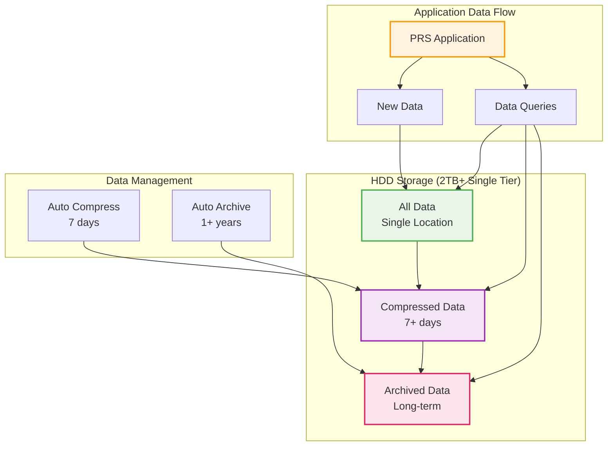
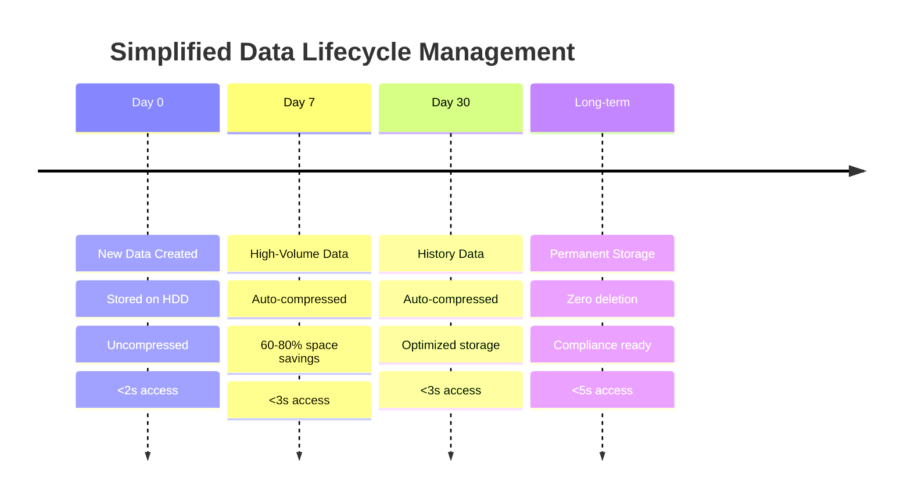

# Storage Configuration

## Overview

The PRS system implements a simplified HDD-only storage architecture that provides cost-effective, high-capacity storage for all data types. This configuration eliminates the complexity of dual-tier storage management while maintaining excellent performance for typical business workloads.

## Simplified HDD-Only Architecture

### Architecture



### Characteristics

| Storage Tier | Technology | Capacity | Access Time | Use Case |
|--------------|------------|----------|-------------|----------|
| **HDD All Data** | SATA HDD | 2TB+ | <2s | All operations, active data |
| **HDD Compressed** | SATA HDD | 60-80% savings | <3s | Older data, cached queries |
| **HDD Archive** | SATA HDD | Unlimited | <5s | Long-term storage, compliance |

## HDD Storage Configuration (2TB+ Single Drive or RAID)

### Strategy

| Component | Allocation | Purpose | Performance |
|-----------|------------|---------|-------------|
| **PostgreSQL Data** | 800 GB | All database records and indexes | <2s queries |
| **Redis Persistence** | 100 GB | Cache snapshots and AOF files | <3s access |
| **Application Uploads** | 500 GB | User files and attachments | <3s retrieval |
| **System Logs** | 200 GB | Application and system logs | <2s access |
| **Nginx Cache** | 50 GB | Web server static file cache | <2s serving |
| **Monitoring Data** | 100 GB | Prometheus metrics and Grafana data | <3s dashboards |
| **Backups** | 200 GB | Database and application backups | Archive access |
| **System Reserve** | 50 GB | Emergency space and temporary files | Buffer space |

### Mount Configuration

```bash
# Optimal HDD mount options for reliability
/dev/sda1 /mnt/hdd ext4 defaults,noatime,barrier=1 0 2

# Mount options explained:
# noatime    - Don't update access times (performance boost)
# barrier=1  - Enable write barriers (data safety)
# defaults   - Standard mount options for HDD
```

### Performance Optimization

```bash
# Set I/O scheduler for HDD
echo deadline | sudo tee /sys/block/sda/queue/scheduler

# Optimize read-ahead for HDD
echo 4096 | sudo tee /sys/block/sda/queue/read_ahead_kb

# Set optimal queue depth for HDD
echo 128 | sudo tee /sys/block/sda/queue/nr_requests
```

## Optional RAID Configuration

### RAID1 for Redundancy (Recommended)

```bash
# Create RAID1 array for redundancy (2 drives)
sudo mdadm --create /dev/md0 --level=1 --raid-devices=2 \
  /dev/sda /dev/sdb

# Monitor RAID status
cat /proc/mdstat

# Set read-ahead for better performance
echo 4096 | sudo tee /sys/block/md0/queue/read_ahead_kb
```

### Single Drive Configuration (Budget Option)

```bash
# Format single drive
sudo mkfs.ext4 /dev/sda1

# Create mount point
sudo mkdir -p /mnt/hdd

# Mount with optimal options
sudo mount -o defaults,noatime /dev/sda1 /mnt/hdd
```

## Automatic Data Lifecycle

### Simplified Timeline



### Policies

```sql
-- Compression policies for HDD-only setup
SELECT add_compression_policy('notifications', INTERVAL '7 days');
SELECT add_compression_policy('audit_logs', INTERVAL '7 days');
SELECT add_compression_policy('requisitions', INTERVAL '30 days');

-- No data movement policies needed - all data stays on HDD
-- Compression provides space savings without complexity
```

## Storage Monitoring

### Basic Monitoring

```bash
# Check storage usage
df -h /mnt/hdd

# Check RAID status (if using RAID)
cat /proc/mdstat

# Check HDD health
sudo smartctl -a /dev/sda

# Check filesystem health
sudo fsck -n /dev/sda1
```

### Performance Monitoring

```bash
# Monitor I/O performance
iostat -x 1

# Monitor storage latency
iotop -a

# Check filesystem performance
iozone -a -g 4G

# Monitor disk usage trends
du -sh /mnt/hdd/*
```

### Thresholds

| Storage | Warning | Critical | Action |
|---------|---------|----------|---------|
| **HDD Usage** | 70% | 85% | Clean old data or expand |
| **HDD IOPS** | 80% capacity | 95% capacity | Optimize queries |
| **HDD Throughput** | 80% bandwidth | 95% bandwidth | Balance load |
| **Disk Health** | SMART warnings | SMART errors | Replace drive |

## Storage Maintenance

### Daily Tasks

```bash
# Check storage health
sudo smartctl -H /dev/sda

# Monitor RAID status (if using RAID)
cat /proc/mdstat

# Check filesystem errors
dmesg | grep -i error

# Check disk usage
df -h /mnt/hdd
```

### Weekly Tasks

```bash
# Run filesystem check (when unmounted)
sudo fsck -f /dev/sda1

# Defragment if needed (ext4)
sudo e4defrag /mnt/hdd

# Update SMART data
sudo smartctl -t short /dev/sda

# Clean temporary files
sudo find /mnt/hdd -name "*.tmp" -mtime +7 -delete
```

### Monthly Tasks

```bash
# Full SMART test
sudo smartctl -t long /dev/sda

# RAID consistency check (if using RAID)
echo check | sudo tee /sys/block/md0/md/sync_action

# Storage performance benchmark
sudo fio --name=monthly-test --filename=/mnt/hdd/test --size=10G \
  --rw=randwrite --bs=4k --numjobs=2 --time_based --runtime=300
```

## Troubleshooting

### Common Issues

#### Performance Degradation

```bash
# Check HDD health
sudo smartctl -A /dev/sda

# Check for bad blocks
sudo badblocks -v /dev/sda

# Monitor I/O wait
iostat -x 1

# Check filesystem fragmentation
sudo e2fsck -fn /dev/sda1
```

#### RAID Issues (if using RAID)

```bash
# Check RAID health
sudo mdadm --detail /dev/md0

# Rebuild failed drive
sudo mdadm --manage /dev/md0 --add /dev/sdc

# Monitor rebuild progress
watch cat /proc/mdstat
```

#### Disk Full Issues

```bash
# Find large files
sudo find /mnt/hdd -type f -size +100M -exec ls -lh {} \;

# Clean temporary files
sudo find /mnt/hdd -name "*.tmp" -delete

# Compress old logs
sudo find /mnt/hdd/logs -name "*.log" -mtime +7 -exec gzip {} \;

# Check TimescaleDB compression
docker exec prs-onprem-postgres-timescale \
  psql -U $POSTGRES_USER -d $POSTGRES_DB \
  -c "SELECT * FROM timescaledb_information.compression_settings;"
```

## Capacity Planning

### Projections

| Time Period | HDD Usage | Action Required |
|-------------|-----------|-----------------|
| **Current** | 15% (300GB) | Monitor |
| **6 Months** | 30% (600GB) | Monitor growth |
| **1 Year** | 50% (1TB) | Plan expansion |
| **2 Years** | 70% (1.4TB) | Expand storage |

### Expansion Options

#### Single Drive Expansion

```bash
# Option 1: Replace with larger drive
# 1. Backup all data
# 2. Replace drive with larger capacity
# 3. Restore data

# Option 2: Add second drive for RAID1
sudo mdadm --create /dev/md0 --level=1 --raid-devices=2 /dev/sda /dev/sdb
```

#### RAID Expansion

```bash
# Add drives to existing RAID1 array
sudo mdadm --grow /dev/md0 --raid-devices=4 --add /dev/sdc /dev/sdd

# Monitor reshape progress
watch cat /proc/mdstat

# Resize filesystem after RAID expansion
sudo resize2fs /dev/md0
```

---

!!! tip "Simplified Management"
    The HDD-only storage system is designed for simplicity. TimescaleDB compression provides space savings without the complexity of multi-tier storage.

!!! warning "Backup Critical"
    Always maintain current backups before performing any storage maintenance operations.

!!! info "Performance Expectations"
    HDD storage provides adequate performance for most business workloads. Consider SSD upgrade only if experiencing performance issues.
