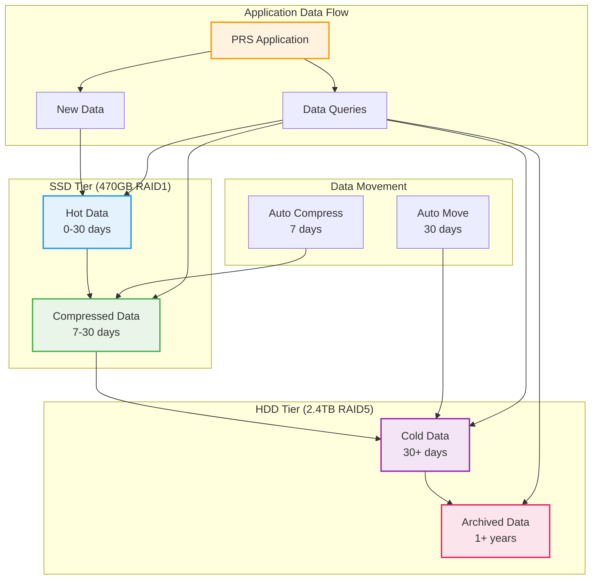
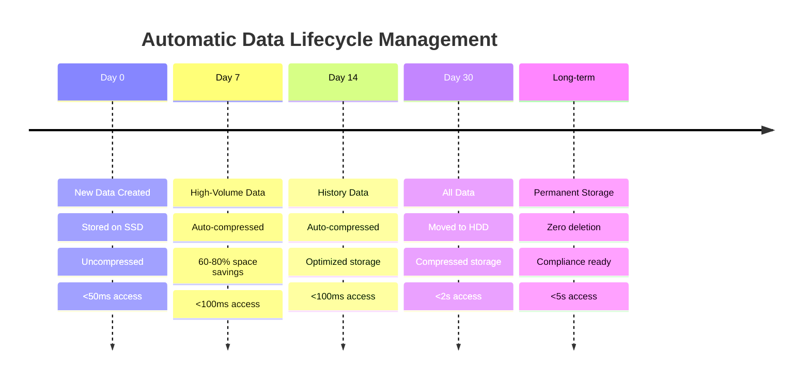

# Storage Configuration

## Overview

The PRS system implements a sophisticated dual-storage architecture that automatically manages data lifecycle between high-performance SSD and high-capacity HDD storage tiers.

## Dual Storage Architecture

### Tiers



### Characteristics

| Storage Tier | Technology | Capacity | Access Time | Use Case |
|--------------|------------|----------|-------------|----------|
| **SSD Hot** | NVMe/SATA SSD | 470GB | <50ms | Active operations, recent data |
| **SSD Compressed** | NVMe/SATA SSD | 60-80% savings | <100ms | Recent queries, cached data |
| **HDD Cold** | SATA HDD RAID5 | 2.4TB+ | <2s | Historical queries, reports |
| **HDD Archive** | SATA HDD RAID5 | Unlimited | <5s | Long-term storage, compliance |

## SSD Storage Configuration (470GB RAID1)

### Strategy

| Component | Allocation | Purpose | Performance |
|-----------|------------|---------|-------------|
| **PostgreSQL Hot Data** | 200 GB | Recent database records (0-30 days) | <50ms queries |
| **Redis Persistence** | 50 GB | Cache snapshots and AOF files | <10ms access |
| **Application Uploads** | 100 GB | User files and attachments | <100ms retrieval |
| **System Logs** | 50 GB | Active application and system logs | Real-time logging |
| **Nginx Cache** | 20 GB | Web server static file cache | <5ms serving |
| **Monitoring Data** | 30 GB | Prometheus metrics and Grafana data | <50ms dashboards |
| **System Reserve** | 20 GB | Emergency space and temporary files | Buffer space |

### Mount Configuration

```bash
# Optimal SSD mount options for performance
/dev/md0 /mnt/ssd ext4 defaults,noatime,discard,barrier=0 0 2

# Mount options explained:
# noatime    - Don't update access times (performance boost)
# discard    - Enable TRIM support for SSD longevity
# barrier=0  - Disable write barriers (safe with UPS)
```

### Performance Optimization

```bash
# Set I/O scheduler for SSD
echo noop | sudo tee /sys/block/sda/queue/scheduler

# Optimize read-ahead for SSD
echo 256 | sudo tee /sys/block/sda/queue/read_ahead_kb

# Set optimal queue depth
echo 32 | sudo tee /sys/block/sda/queue/nr_requests
```

## HDD Storage Configuration (2.4TB RAID5)

### Strategy

| Component | Allocation | Purpose | Retention |
|-----------|------------|---------|-----------|
| **PostgreSQL Cold Data** | 1,000 GB | Historical database records (30+ days) | Permanent |
| **Backup Archives** | 1,000 GB | Database and application backups | 1+ years |
| **Log Archives** | 200 GB | Archived application and system logs | 2+ years |
| **NAS Sync Staging** | 100 GB | Network storage synchronization | Temporary |
| **Future Growth** | 100+ TB | Unlimited expansion capacity | As needed |

### RAID5 Configuration

```bash
# Create RAID5 array (example with 4 drives)
sudo mdadm --create /dev/md1 --level=5 --raid-devices=4 \
  --chunk=256 /dev/sdb /dev/sdc /dev/sdd /dev/sde

# Optimize RAID5 for large files
echo 8192 | sudo tee /sys/block/md1/md/stripe_cache_size

# Set read-ahead for sequential access
echo 8192 | sudo tee /sys/block/md1/queue/read_ahead_kb
```

### Performance Optimization

```bash
# Set I/O scheduler for HDD
echo deadline | sudo tee /sys/block/md1/queue/scheduler

# Optimize for large sequential writes
echo 2048 | sudo tee /sys/block/md1/queue/nr_requests

# Enable write-back caching (with UPS)
hdparm -W1 /dev/md1
```

## Automatic Data Lifecycle

### Movement Timeline



### Policies

```sql
-- Compression policies by data type
SELECT add_compression_policy('notifications', INTERVAL '7 days');
SELECT add_compression_policy('audit_logs', INTERVAL '7 days');
SELECT add_compression_policy('requisitions', INTERVAL '30 days');

-- Data movement policies
SELECT add_move_chunk_policy('notifications', INTERVAL '30 days', 'hdd_cold');
SELECT add_move_chunk_policy('audit_logs', INTERVAL '30 days', 'hdd_cold');
SELECT add_move_chunk_policy('requisitions', INTERVAL '30 days', 'hdd_cold');
```

## Storage Monitoring

### Monitoring

```bash
# Check storage usage
df -h /mnt/ssd /mnt/hdd

# Check RAID status
cat /proc/mdstat

# Check SSD health
sudo smartctl -a /dev/sda

# Check HDD health
sudo smartctl -a /dev/sdb
```

### Monitoring

```bash
# Monitor I/O performance
iostat -x 1

# Monitor storage latency
iotop -a

# Check filesystem performance
iozone -a -g 4G
```

### Thresholds

| Storage | Warning | Critical | Action |
|---------|---------|----------|---------|
| **SSD Usage** | 80% (376GB) | 90% (423GB) | Archive old data |
| **HDD Usage** | 70% (1.68TB) | 85% (2.04TB) | Expand storage |
| **SSD IOPS** | 80% capacity | 95% capacity | Optimize queries |
| **HDD Throughput** | 80% bandwidth | 95% bandwidth | Balance load |

## Storage Maintenance

### Tasks

```bash
# Check storage health
sudo smartctl -H /dev/sda /dev/sdb /dev/sdc /dev/sdd

# Monitor RAID status
cat /proc/mdstat

# Check filesystem errors
dmesg | grep -i error
```

### Tasks

```bash
# Run filesystem check (when unmounted)
sudo fsck -f /dev/md0
sudo fsck -f /dev/md1

# Defragment if needed (ext4)
sudo e4defrag /mnt/ssd
sudo e4defrag /mnt/hdd

# Update SMART data
sudo smartctl -t short /dev/sda
```

### Tasks

```bash
# Full SMART test
sudo smartctl -t long /dev/sda /dev/sdb /dev/sdc /dev/sdd

# RAID consistency check
echo check | sudo tee /sys/block/md1/md/sync_action

# Storage performance benchmark
sudo fio --name=monthly-test --filename=/mnt/ssd/test --size=10G \
  --rw=randwrite --bs=4k --numjobs=4 --time_based --runtime=300
```

## Troubleshooting

### Issues

#### Performance Degradation

```bash
# Check SSD wear level
sudo smartctl -A /dev/sda | grep Wear_Leveling_Count

# Enable TRIM if disabled
sudo fstrim -v /mnt/ssd

# Check for bad blocks
sudo badblocks -v /dev/sda
```

#### RAID Issues

```bash
# Check RAID health
sudo mdadm --detail /dev/md1

# Rebuild failed drive
sudo mdadm --manage /dev/md1 --add /dev/sdf

# Monitor rebuild progress
watch cat /proc/mdstat
```

#### Full Issues

```bash
# Find large files
sudo find /mnt/ssd -type f -size +100M -exec ls -lh {} \;

# Clean temporary files
sudo find /mnt/ssd -name "*.tmp" -delete

# Compress old logs
sudo find /mnt/ssd/logs -name "*.log" -mtime +7 -exec gzip {} \;
```

## Capacity Planning

### Projections

| Time Period | SSD Usage | HDD Usage | Action Required |
|-------------|-----------|-----------|-----------------|
| **Current** | 60% (282GB) | 15% (360GB) | Monitor |
| **6 Months** | 75% (352GB) | 25% (600GB) | Plan SSD expansion |
| **1 Year** | 85% (399GB) | 40% (960GB) | Expand SSD |
| **2 Years** | 95% (446GB) | 60% (1.44TB) | Add SSD tier |

### Options

#### Expansion

```bash
# Option 1: Add SSD to existing RAID1
sudo mdadm --grow /dev/md0 --raid-devices=4 --add /dev/sdf /dev/sdg

# Option 2: Create new SSD tier
sudo mdadm --create /dev/md2 --level=1 --raid-devices=2 /dev/sdf /dev/sdg
```

#### Expansion

```bash
# Add drives to RAID5 array
sudo mdadm --grow /dev/md1 --raid-devices=6 --add /dev/sdf /dev/sdg

# Monitor reshape progress
watch cat /proc/mdstat
```

---

!!! tip "Automatic Management"
    The storage system is designed to be largely self-managing. TimescaleDB automatically handles data movement between tiers based on age and access patterns.

!!! warning "Backup Critical"
    Always maintain current backups before performing any storage maintenance operations.
