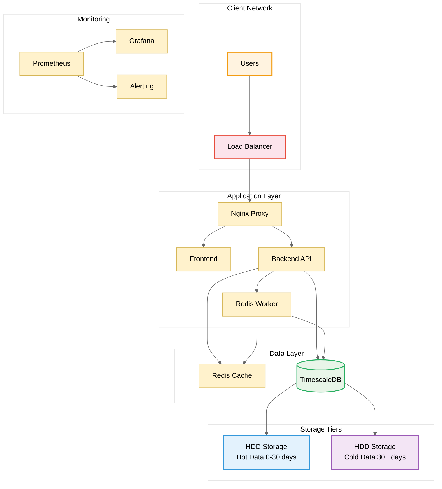

# PRS On-Premises Deployment Guide

Welcome to the comprehensive deployment and maintenance guide for the **PRS (Purchase Request System)** on-premises production environment.

## Overview

This documentation provides complete guidance for deploying, configuring, and maintaining the PRS system in an on-premises environment with enterprise-grade performance, security, and reliability.

### Features

- **Dual Storage Architecture**: SSD for performance, HDD for capacity
- **TimescaleDB Integration**: Zero-deletion policy with automatic data tiering
- **Enterprise Security**: SSL/TLS, security hardening, and monitoring
- **High Performance**: Optimized for 100+ concurrent users
- **Automated Operations**: Backup, monitoring, and maintenance automation
- **NAS Integration**: Enterprise backup with network storage support
- **One-Day Deployment**: Complete setup in 6-8 hours with automation

## Quick Start Options

### 🚀 Quick Deployment (Recommended)

**Complete enterprise-grade deployment in 2-3 hours:**

!!! danger "Prerequisites First"
    **[📋 Prerequisites Guide](getting-started/prerequisites.md)** - Essential server setup required before deployment

**[📖 Quick Start Guide](getting-started/quick-start.md)** - Simple 3-step process using proven scripts

```bash
# Clone deployment repository first:
sudo mkdir -p /opt/prs && sudo chown $USER:$USER /opt/prs
cd /opt/prs && git clone https://github.com/stratpoint-engineering/prs-deployment.git
cd prs-deployment/scripts

# Prerequisites check:
./check-prerequisites.sh

# Simple 3-step process:
1. Configure: ./quick-setup-helper.sh
2. Deploy: sudo ./deploy-onprem.sh deploy
3. Automate: ./setup-backup-automation.sh && ./setup-monitoring-automation.sh
```

**What you get:**
- Complete PRS application stack
- SSL/TLS security (GoDaddy/Let's Encrypt/Self-signed)
- Enterprise backup with NAS integration
- Grafana monitoring and alerting
- Automated maintenance and health checks
- Office network security configuration (192.168.0.0/20 internal access only)

### 📋 Manual Deployment

**Step-by-step deployment for custom requirements:**

1. **[Prerequisites](getting-started/prerequisites.md)** - System requirements and preparation
2. **[Hardware Setup](hardware/requirements.md)** - Configure HDD-only storage and network
3. **[Installation](installation/environment.md)** - Deploy the complete system
4. **[Configuration](configuration/application.md)** - Customize for your environment
5. **[Testing](deployment/testing.md)** - Validate your deployment

## Specifications

### Requirements
- **RAM**: 16 GB (4x improvement over cloud)
- **Storage**: 470 GB SSD RAID1 + 2.4 TB HDD RAID5
- **Network**: 1 Gbps dedicated interface
- **Backup Power**: UPS system available

### Targets
- **Concurrent Users**: 100+ users
- **Response Time**: <200ms for recent data
- **Uptime**: 99.9% availability
- **Data Growth**: 20GB/day sustainable

## Overview



## Sections

### & Installation
- **[Getting Started](getting-started/overview.md)** - Initial setup and prerequisites
- **[Hardware Configuration](hardware/requirements.md)** - Physical infrastructure setup
- **[Installation Guide](installation/environment.md)** - Step-by-step deployment

### & Management
- **[Application Configuration](configuration/application.md)** - Service configuration
- **[Database Management](database/timescaledb.md)** - TimescaleDB setup and tuning
- **[Security Configuration](configuration/security.md)** - Hardening and SSL setup

### & Maintenance
- **[Daily Operations](operations/daily.md)** - Routine operational tasks
- **[Monitoring & Alerting](operations/monitoring.md)** - System health monitoring
- **[Backup & Recovery](operations/backup.md)** - Data protection procedures

### & Automation
- **[Deployment Scripts](scripts/deployment.md)** - Automated deployment tools
- **[Maintenance Scripts](scripts/maintenance.md)** - Automated maintenance tasks
- **[Monitoring Scripts](scripts/monitoring.md)** - Health check automation

## Benefits

### Improvements
| Metric | Previous (Cloud) | On-Premises | Improvement |
|--------|------------------|-------------|-------------|
| **Concurrent Users** | 30 | 100+ | **233%** |
| **Response Time** | 200-500ms | 50-200ms | **60-75%** |
| **Storage Capacity** | 20 GB | 2.4+ TB | **12,000%** |
| **Database Performance** | 100 queries/sec | 500+ queries/sec | **400%** |

### Features
- **Zero Data Loss**: Complete backup and recovery procedures
- **Automatic Scaling**: TimescaleDB handles unlimited data growth
- **Security Compliance**: Enterprise-grade security hardening
- **24/7 Monitoring**: Comprehensive health monitoring and alerting

## & Resources

- **[FAQ](appendix/faq.md)** - Common questions and solutions
- **[Troubleshooting](deployment/troubleshooting.md)** - Problem resolution guide
- **[Command Reference](reference/commands.md)** - Quick command lookup
- **[Support Contacts](appendix/support.md)** - Get help when needed

## Steps

1. Review the **[Prerequisites](getting-started/prerequisites.md)** to ensure your environment is ready
2. Follow the **[Quick Start Guide](getting-started/quick-start.md)** for rapid deployment
3. Configure **[Monitoring](configuration/monitoring.md)** for production readiness
4. Set up **[Automated Backups](operations/backup.md)** for data protection

---

!!! tip "Production Ready"
    This deployment guide has been tested and optimized for production environments with 100+ concurrent users and enterprise-grade requirements.

!!! warning "Important"
    Always test deployment procedures in a staging environment before applying to production systems.
