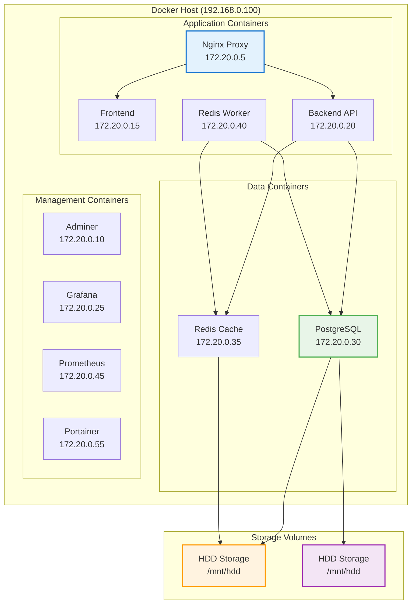

# Docker Configuration

## Overview

This guide covers the Docker configuration for the PRS on-premises deployment, including container orchestration, networking, and resource management.

## Container Architecture



## Service Configuration

### Application Services

#### Reverse Proxy

```yaml
nginx:
  image: nginx:1.24-alpine
  container_name: prs-onprem-nginx
  restart: unless-stopped
  ports:
    - "${SERVER_IP:-192.168.0.100}:80:80"
    - "${SERVER_IP:-192.168.0.100}:443:443"
  volumes:
    - ./nginx/nginx.conf:/etc/nginx/nginx.conf:ro
    - ./nginx/sites-enabled:/etc/nginx/sites-enabled:ro
    - ./ssl:/etc/nginx/ssl:ro
    - uploads_data:/var/www/uploads:ro
    - /mnt/hdd/nginx-cache:/var/cache/nginx/ssd
  networks:
    prs_onprem_network:
      ipv4_address: 172.20.0.5
  deploy:
    resources:
      limits:
        memory: 256m
        cpus: '0.5'
```

#### API

```yaml
backend:
  image: prs-backend:latest
  container_name: prs-onprem-backend
  restart: unless-stopped
  environment:
    - NODE_ENV=production
    - PORT=4000
    - POSTGRES_HOST=postgres
    - REDIS_HOST=redis
    - NODEJS_MAX_OLD_SPACE_SIZE=2048
  volumes:
    - uploads_data:/usr/app/upload
    - logs_data:/usr/app/logs
    - /mnt/hdd/app-logs-archive:/usr/app/logs/archive
  networks:
    prs_onprem_network:
      ipv4_address: 172.20.0.20
  deploy:
    resources:
      limits:
        memory: 4g
        cpus: '2.0'
```

#### Application

```yaml
frontend:
  image: prs-frontend:latest
  container_name: prs-onprem-frontend
  restart: unless-stopped
  environment:
    - NODE_ENV=production
    - VITE_APP_API_URL=https://${DOMAIN}/api
  networks:
    prs_onprem_network:
      ipv4_address: 172.20.0.15
  deploy:
    resources:
      limits:
        memory: 1g
        cpus: '1.0'
```

### Services

#### with TimescaleDB

```yaml
postgres:
  image: timescale/timescaledb:latest-pg15
  container_name: prs-onprem-postgres-timescale
  restart: unless-stopped
  environment:
    - POSTGRES_DB=${POSTGRES_DB}
    - POSTGRES_USER=${POSTGRES_USER}
    - POSTGRES_PASSWORD=${POSTGRES_PASSWORD}
    - TIMESCALEDB_TELEMETRY=off
  command: >
    postgres
    -c max_connections=150
    -c shared_buffers=2GB
    -c effective_cache_size=4GB
    -c work_mem=32MB
    -c maintenance_work_mem=512MB
    -c random_page_cost=1.1
    -c effective_io_concurrency=200
    -c shared_preload_libraries=timescaledb
  volumes:
    - database_data:/var/lib/postgresql/data
    - /mnt/hdd/postgresql-hot:/mnt/hdd/postgresql-hot
    - /mnt/hdd/postgresql-cold:/mnt/hdd/postgresql-cold
    - /mnt/hdd/postgres-backups:/var/lib/postgresql/backups
  networks:
    prs_onprem_network:
      ipv4_address: 172.20.0.30
  deploy:
    resources:
      limits:
        memory: 6g
        cpus: '3.0'
```

#### Cache

```yaml
redis:
  image: redis:7-alpine
  container_name: prs-onprem-redis
  restart: unless-stopped
  command: >
    redis-server
    --requirepass ${REDIS_PASSWORD}
    --appendonly yes
    --maxmemory 2g
    --maxmemory-policy allkeys-lru
  volumes:
    - redis_data:/data
    - /mnt/hdd/redis-persistence:/data/ssd
    - /mnt/hdd/redis-backups:/data/backups
  networks:
    prs_onprem_network:
      ipv4_address: 172.20.0.35
  deploy:
    resources:
      limits:
        memory: 2g
        cpus: '1.0'
```

## Network Configuration

### Bridge Network

```yaml
networks:
  prs_onprem_network:
    driver: bridge
    ipam:
      config:
        - subnet: 172.20.0.0/24
          gateway: 172.20.0.1
    driver_opts:
      com.docker.network.bridge.name: prs-onprem-br0
      com.docker.network.bridge.enable_icc: "true"
      com.docker.network.bridge.enable_ip_masquerade: "true"
      com.docker.network.driver.mtu: 1500
```

### Discovery

Services communicate using container names:
- `postgres` - Database server
- `redis` - Cache server
- `backend` - API server
- `frontend` - Web application
- `nginx` - Reverse proxy

## Volume Configuration

### Volumes

```yaml
volumes:
  # Database volume (managed by Docker)
  database_data:
    driver: local

  # Redis data (SSD for performance)
  redis_data:
    driver: local
    driver_opts:
      type: none
      o: bind
      device: /mnt/hdd/redis-data

  # Upload files (SSD for fast access)
  uploads_data:
    driver: local
    driver_opts:
      type: none
      o: bind
      device: /mnt/hdd/uploads

  # Application logs (SSD for active logs)
  logs_data:
    driver: local
    driver_opts:
      type: none
      o: bind
      device: /mnt/hdd/logs

  # Nginx cache (SSD for performance)
  nginx_cache:
    driver: local
    driver_opts:
      type: none
      o: bind
      device: /mnt/hdd/nginx-cache
```

### Mounts

Direct mounts for HDD-only storage:
- `/mnt/hdd/postgresql-hot` - Hot database data
- `/mnt/hdd/postgresql-cold` - Cold database data
- `/mnt/hdd/postgres-backups` - Database backups
- `/mnt/hdd/app-logs-archive` - Archived logs

## Resource Management

### Allocation

| Service | Memory Limit | CPU Limit | Purpose |
|---------|--------------|-----------|---------|
| **PostgreSQL** | 6GB | 3.0 cores | Database operations |
| **Backend API** | 4GB | 2.0 cores | Application logic |
| **Redis** | 2GB | 1.0 core | Caching and sessions |
| **Frontend** | 1GB | 1.0 core | Static file serving |
| **Nginx** | 256MB | 0.5 core | Reverse proxy |
| **Monitoring** | 2GB | 1.5 cores | Metrics and dashboards |

### Checks

```yaml
# PostgreSQL health check
healthcheck:
  test: ["CMD-SHELL", "pg_isready -U ${POSTGRES_USER} -d ${POSTGRES_DB}"]
  interval: 30s
  timeout: 10s
  retries: 5
  start_period: 120s

# Redis health check
healthcheck:
  test: ["CMD", "redis-cli", "--no-auth-warning", "-a", "${REDIS_PASSWORD}", "ping"]
  interval: 30s
  timeout: 10s
  retries: 3
  start_period: 30s

# Backend API health check
healthcheck:
  test: ["CMD-SHELL", "curl -f http://localhost:4000/health || exit 1"]
  interval: 30s
  timeout: 15s
  retries: 5
  start_period: 120s
```

## Container Lifecycle

### Order

1. **Data Services**: PostgreSQL, Redis
2. **Application Services**: Backend API, Frontend
3. **Proxy Services**: Nginx
4. **Management Services**: Adminer, Grafana, Prometheus

### Policies

- **unless-stopped**: Restart containers unless explicitly stopped
- **on-failure**: Restart only on failure (for development)
- **always**: Always restart (for critical services)

### Management

```yaml
depends_on:
  postgres:
    condition: service_healthy
  redis:
    condition: service_healthy
```

## Monitoring Integration

### Metrics

```yaml
prometheus:
  image: prom/prometheus:latest
  container_name: prs-onprem-prometheus
  command:
    - '--config.file=/etc/prometheus/prometheus.yml'
    - '--storage.tsdb.path=/prometheus'
    - '--storage.tsdb.retention.time=30d'
    - '--storage.tsdb.retention.size=10GB'
  volumes:
    - ./config/prometheus/prometheus.yml:/etc/prometheus/prometheus.yml:ro
    - prometheus_data:/prometheus
    - /mnt/hdd/prometheus-data:/prometheus/ssd
    - /mnt/hdd/prometheus-archive:/prometheus/archive
  networks:
    prs_onprem_network:
      ipv4_address: 172.20.0.45
```

### Dashboards

```yaml
grafana:
  image: grafana/grafana:latest
  container_name: prs-onprem-grafana
  environment:
    - GF_SECURITY_ADMIN_PASSWORD=${GRAFANA_ADMIN_PASSWORD}
    - GF_USERS_ALLOW_SIGN_UP=false
    - GF_DATABASE_TYPE=postgres
    - GF_DATABASE_HOST=postgres:5432
    - GF_DATABASE_NAME=grafana
  volumes:
    - grafana_data:/var/lib/grafana
    - ./config/grafana/provisioning:/etc/grafana/provisioning:ro
    - /mnt/hdd/grafana-data:/var/lib/grafana/ssd
  networks:
    prs_onprem_network:
      ipv4_address: 172.20.0.25
```

## Security Configuration

### Security

```yaml
# Security options for containers
security_opt:
  - no-new-privileges:true

# Read-only root filesystem (where possible)
read_only: true

# Temporary filesystem for writable areas
tmpfs:
  - /tmp
  - /var/tmp

# User namespace mapping
user: "1000:1000"
```

### Security

```yaml
# Disable inter-container communication (where not needed)
driver_opts:
  com.docker.network.bridge.enable_icc: "false"

# Custom firewall rules
iptables:
  - "-A DOCKER-USER -i prs-onprem-br0 -j ACCEPT"
  - "-A DOCKER-USER -j DROP"
```

## Docker Management

### Operations

```bash
# Start all services
docker-compose -f docker-compose.onprem.yml up -d

# Stop all services
docker-compose -f docker-compose.onprem.yml down

# Restart specific service
docker-compose -f docker-compose.onprem.yml restart backend

# View logs
docker-compose -f docker-compose.onprem.yml logs -f backend

# Check service status
docker-compose -f docker-compose.onprem.yml ps
```

### Management

```bash
# Build images
docker-compose -f docker-compose.onprem.yml build

# Pull latest images
docker-compose -f docker-compose.onprem.yml pull

# Remove unused images
docker image prune -f

# Remove unused volumes
docker volume prune -f
```

### Monitoring

```bash
# Monitor container resources
docker stats

# Check container health
docker inspect prs-onprem-backend | grep Health -A 10

# View container logs
docker logs prs-onprem-backend --tail 100 -f
```

## Troubleshooting

### Issues

#### Won't Start

```bash
# Check container logs
docker logs prs-onprem-backend

# Check container configuration
docker inspect prs-onprem-backend

# Check resource usage
docker stats prs-onprem-backend
```

#### Issues

```bash
# Check network configuration
docker network inspect prs_onprem_network

# Test container connectivity
docker exec prs-onprem-backend ping prs-onprem-postgres-timescale

# Check port bindings
docker port prs-onprem-nginx
```

#### Issues

```bash
# Check volume mounts
docker inspect prs-onprem-backend | grep Mounts -A 20

# Check volume permissions
ls -la /mnt/hdd/uploads
ls -la /mnt/hdd/postgres-backups

# Fix volume permissions
sudo chown -R 999:999 /mnt/hdd/postgresql-hot
```

### Issues

```bash
# Monitor container performance
docker stats --no-stream

# Check container resource limits
docker inspect prs-onprem-backend | grep -A 10 Resources

# Monitor I/O performance
docker exec prs-onprem-backend iostat -x 1
```

---

!!! success "Docker Ready"
    With proper Docker configuration, the PRS system can efficiently manage resources and provide high availability.

!!! tip "Next Steps"
    Proceed to [Database Setup](database.md) to configure TimescaleDB with HDD-only storage.
