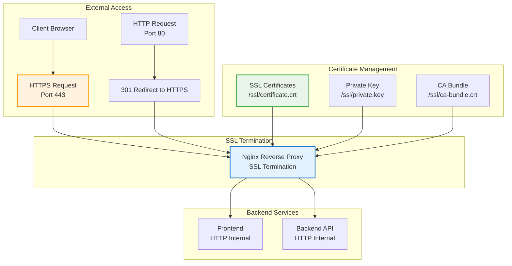

# SSL Configuration

## Overview

This guide covers SSL/TLS certificate setup for the PRS on-premises deployment, including automated certificate management and security configuration.

## SSL Architecture



## Certificate Options

### Option 1: Let's Encrypt (Automated)

#### Prerequisites

```bash
# Install Certbot
sudo apt update
sudo apt install certbot

# Verify domain DNS points to server
nslookup your-domain.com
```

#### Automated Certificate Generation

```bash
# Run SSL automation script
cd /opt/prs-deployment/scripts
./ssl-automation-citylandcondo.sh

# The script will:
# 1. Stop nginx temporarily
# 2. Generate certificate using Certbot
# 3. Configure nginx with new certificate
# 4. Setup auto-renewal
# 5. Restart nginx
```

#### Manual Let's Encrypt Setup

```bash
# Stop nginx for standalone mode
docker-compose -f ../02-docker-configuration/docker-compose.onprem.yml stop nginx

# Generate certificate
sudo certbot certonly \
  --standalone \
  --email admin@your-domain.com \
  --agree-tos \
  --no-eff-email \
  --domains your-domain.com

# Copy certificates to SSL directory
sudo cp /etc/letsencrypt/live/your-domain.com/fullchain.pem \
  /opt/prs-deployment/02-docker-configuration/ssl/certificate.crt

sudo cp /etc/letsencrypt/live/your-domain.com/privkey.pem \
  /opt/prs-deployment/02-docker-configuration/ssl/private.key

sudo cp /etc/letsencrypt/live/your-domain.com/chain.pem \
  /opt/prs-deployment/02-docker-configuration/ssl/ca-bundle.crt

# Start nginx
docker-compose -f ../02-docker-configuration/docker-compose.onprem.yml start nginx
```

### Option 2: Existing Certificates

#### Copy Existing Certificates

```bash
# Create SSL directory
sudo mkdir -p /opt/prs-deployment/02-docker-configuration/ssl

# Copy your existing certificates
sudo cp /path/to/your/certificate.crt \
  /opt/prs-deployment/02-docker-configuration/ssl/certificate.crt

sudo cp /path/to/your/private.key \
  /opt/prs-deployment/02-docker-configuration/ssl/private.key

sudo cp /path/to/your/ca-bundle.crt \
  /opt/prs-deployment/02-docker-configuration/ssl/ca-bundle.crt

# Set proper permissions
sudo chmod 644 /opt/prs-deployment/02-docker-configuration/ssl/certificate.crt
sudo chmod 600 /opt/prs-deployment/02-docker-configuration/ssl/private.key
sudo chmod 644 /opt/prs-deployment/02-docker-configuration/ssl/ca-bundle.crt
```

### Option 3: Self-Signed Certificate (Development Only)

```bash
# Generate self-signed certificate (NOT for production)
sudo openssl req -x509 -nodes -days 365 -newkey rsa:2048 \
  -keyout /opt/prs-deployment/02-docker-configuration/ssl/private.key \
  -out /opt/prs-deployment/02-docker-configuration/ssl/certificate.crt \
  -subj "/C=US/ST=State/L=City/O=Organization/CN=your-domain.com"

# Create empty CA bundle
sudo touch /opt/prs-deployment/02-docker-configuration/ssl/ca-bundle.crt
```

## Nginx SSL Configuration

### SSL Virtual Host

```nginx
# HTTP to HTTPS redirect
server {
    listen 80;
    server_name your-domain.com;
    return 301 https://$server_name$request_uri;
}

# Main HTTPS server
server {
    listen 443 ssl http2;
    server_name your-domain.com;

    # SSL Configuration
    ssl_certificate /etc/nginx/ssl/certificate.crt;
    ssl_certificate_key /etc/nginx/ssl/private.key;
    ssl_trusted_certificate /etc/nginx/ssl/ca-bundle.crt;

    # SSL Security Settings
    ssl_protocols TLSv1.2 TLSv1.3;
    ssl_ciphers ECDHE-RSA-AES256-GCM-SHA512:DHE-RSA-AES256-GCM-SHA512:ECDHE-RSA-AES256-GCM-SHA384:DHE-RSA-AES256-GCM-SHA384;
    ssl_prefer_server_ciphers off;
    ssl_session_cache shared:SSL:10m;
    ssl_session_timeout 10m;
    ssl_session_tickets off;

    # HSTS (HTTP Strict Transport Security)
    add_header Strict-Transport-Security "max-age=31536000; includeSubDomains" always;

    # Security Headers
    add_header X-Frame-Options DENY always;
    add_header X-Content-Type-Options nosniff always;
    add_header X-XSS-Protection "1; mode=block" always;
    add_header Referrer-Policy "strict-origin-when-cross-origin" always;

    # OCSP Stapling
    ssl_stapling on;
    ssl_stapling_verify on;
    resolver 8.8.8.8 8.8.4.4 valid=300s;
    resolver_timeout 5s;

    # Application routes
    location / {
        proxy_pass http://frontend:3000;
        proxy_set_header Host $host;
        proxy_set_header X-Real-IP $remote_addr;
        proxy_set_header X-Forwarded-For $proxy_add_x_forwarded_for;
        proxy_set_header X-Forwarded-Proto $scheme;
    }

    location /api/ {
        proxy_pass http://backend:4000;
        proxy_set_header Host $host;
        proxy_set_header X-Real-IP $remote_addr;
        proxy_set_header X-Forwarded-For $proxy_add_x_forwarded_for;
        proxy_set_header X-Forwarded-Proto $scheme;
    }
}
```

### SSL Security Optimization

```nginx
# SSL optimization in main nginx.conf
http {
    # SSL session cache
    ssl_session_cache shared:SSL:50m;
    ssl_session_timeout 1d;
    ssl_session_tickets off;

    # Modern configuration
    ssl_protocols TLSv1.2 TLSv1.3;
    ssl_ciphers ECDHE-ECDSA-AES128-GCM-SHA256:ECDHE-RSA-AES128-GCM-SHA256:ECDHE-ECDSA-AES256-GCM-SHA384:ECDHE-RSA-AES256-GCM-SHA384;
    ssl_prefer_server_ciphers off;

    # HSTS preload
    add_header Strict-Transport-Security "max-age=63072000; includeSubDomains; preload" always;
}
```

## Certificate Management

### Automatic Renewal Setup

```bash
# Create renewal script
cat > /opt/prs-deployment/scripts/ssl-renewal.sh << 'EOF'
#!/bin/bash
set -e

# Renew certificates
certbot renew --quiet

# Copy renewed certificates
if [ -f /etc/letsencrypt/live/your-domain.com/fullchain.pem ]; then
    cp /etc/letsencrypt/live/your-domain.com/fullchain.pem \
       /opt/prs-deployment/02-docker-configuration/ssl/certificate.crt
    
    cp /etc/letsencrypt/live/your-domain.com/privkey.pem \
       /opt/prs-deployment/02-docker-configuration/ssl/private.key
    
    cp /etc/letsencrypt/live/your-domain.com/chain.pem \
       /opt/prs-deployment/02-docker-configuration/ssl/ca-bundle.crt
    
    # Reload nginx
    docker-compose -f /opt/prs-deployment/02-docker-configuration/docker-compose.onprem.yml exec nginx nginx -s reload
    
    echo "$(date): SSL certificates renewed successfully" >> /var/log/ssl-renewal.log
fi
EOF

# Make executable
chmod +x /opt/prs-deployment/scripts/ssl-renewal.sh

# Add to crontab (runs twice daily)
(crontab -l 2>/dev/null; echo "0 3,15 * * * /opt/prs-deployment/scripts/ssl-renewal.sh") | crontab -
```

### Certificate Monitoring

```bash
# Check certificate expiration
openssl x509 -in /opt/prs-deployment/02-docker-configuration/ssl/certificate.crt -noout -dates

# Check certificate details
openssl x509 -in /opt/prs-deployment/02-docker-configuration/ssl/certificate.crt -text -noout

# Verify certificate chain
openssl verify -CAfile /opt/prs-deployment/02-docker-configuration/ssl/ca-bundle.crt \
  /opt/prs-deployment/02-docker-configuration/ssl/certificate.crt
```

## SSL Testing and Validation

### Certificate Validation

```bash
# Test SSL connection
openssl s_client -connect your-domain.com:443 -servername your-domain.com

# Check certificate chain
curl -vI https://your-domain.com/

# Test with SSL Labs (external)
# Visit: https://www.ssllabs.com/ssltest/analyze.html?d=your-domain.com
```

### Security Headers Testing

```bash
# Test security headers
curl -I https://your-domain.com/

# Expected headers:
# Strict-Transport-Security: max-age=31536000; includeSubDomains
# X-Frame-Options: DENY
# X-Content-Type-Options: nosniff
# X-XSS-Protection: 1; mode=block
```

### Performance Testing

```bash
# Test SSL handshake time
curl -w "@curl-format.txt" -o /dev/null -s https://your-domain.com/

# Create curl-format.txt
cat > curl-format.txt << 'EOF'
     time_namelookup:  %{time_namelookup}\n
        time_connect:  %{time_connect}\n
     time_appconnect:  %{time_appconnect}\n
    time_pretransfer:  %{time_pretransfer}\n
       time_redirect:  %{time_redirect}\n
  time_starttransfer:  %{time_starttransfer}\n
                     ----------\n
          time_total:  %{time_total}\n
EOF
```

## Management Interfaces SSL

### Grafana SSL Access

```nginx
# Grafana with SSL
server {
    listen 3001 ssl http2;
    server_name your-domain.com;

    ssl_certificate /etc/nginx/ssl/certificate.crt;
    ssl_certificate_key /etc/nginx/ssl/private.key;

    location / {
        proxy_pass http://grafana:3000;
        proxy_set_header Host $host;
        proxy_set_header X-Real-IP $remote_addr;
        proxy_set_header X-Forwarded-For $proxy_add_x_forwarded_for;
        proxy_set_header X-Forwarded-Proto $scheme;
    }
}
```

### Adminer SSL Access

```nginx
# Adminer with SSL
server {
    listen 8080 ssl http2;
    server_name your-domain.com;

    ssl_certificate /etc/nginx/ssl/certificate.crt;
    ssl_certificate_key /etc/nginx/ssl/private.key;

    # Restrict access to admin network
    allow 192.168.0.201/24;
    deny all;

    location / {
        proxy_pass http://adminer:8080;
        proxy_set_header Host $host;
        proxy_set_header X-Real-IP $remote_addr;
        proxy_set_header X-Forwarded-For $proxy_add_x_forwarded_for;
        proxy_set_header X-Forwarded-Proto $scheme;
    }
}
```

## Troubleshooting

### Common SSL Issues

#### Certificate Not Found

```bash
# Check certificate files exist
ls -la /opt/prs-deployment/02-docker-configuration/ssl/

# Check file permissions
ls -la /opt/prs-deployment/02-docker-configuration/ssl/
# certificate.crt should be 644
# private.key should be 600
# ca-bundle.crt should be 644
```

#### Certificate Expired

```bash
# Check expiration date
openssl x509 -in /opt/prs-deployment/02-docker-configuration/ssl/certificate.crt -noout -dates

# Renew Let's Encrypt certificate
sudo certbot renew --force-renewal

# Copy renewed certificates
sudo cp /etc/letsencrypt/live/your-domain.com/fullchain.pem \
  /opt/prs-deployment/02-docker-configuration/ssl/certificate.crt
```

#### SSL Handshake Failures

```bash
# Check nginx SSL configuration
docker exec prs-onprem-nginx nginx -t

# Check nginx logs
docker logs prs-onprem-nginx

# Test SSL configuration
openssl s_client -connect your-domain.com:443 -servername your-domain.com
```

#### Mixed Content Warnings

```bash
# Ensure all internal URLs use HTTPS
grep -r "http://" /opt/prs/prs-frontend-a/src/

# Update environment variables
# VITE_APP_API_URL=https://your-domain.com/api
```

### SSL Security Audit

```bash
# Check SSL configuration strength
nmap --script ssl-enum-ciphers -p 443 your-domain.com

# Test for vulnerabilities
nmap --script ssl-heartbleed,ssl-poodle,ssl-dh-params -p 443 your-domain.com

# Check certificate transparency logs
# Visit: https://crt.sh/?q=your-domain.com
```

---

!!! success "SSL Configured"
    Your PRS deployment now has enterprise-grade SSL/TLS security with automatic certificate renewal.

!!! tip "Security Best Practices"
    - Use strong cipher suites (TLSv1.2 and TLSv1.3 only)
    - Enable HSTS with preload
    - Implement proper security headers
    - Monitor certificate expiration dates
    - Regular security audits

!!! warning "Certificate Management"
    Always test certificate renewal procedures and monitor expiration dates to prevent service interruptions.
