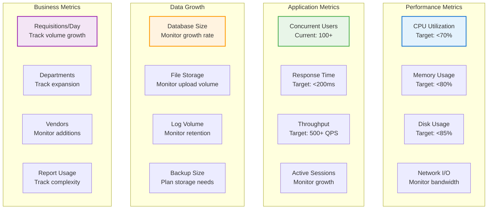

# Capacity Planning

## Overview

This guide covers capacity planning procedures for the PRS on-premises deployment, including growth analysis, resource forecasting, and scaling recommendations to ensure optimal performance as your organization grows.

## Capacity Planning Framework

### Planning Horizons

| Timeframe | Focus | Actions |
|-----------|-------|---------|
| **Short-term (1-3 months)** | Immediate needs | Resource monitoring, quick optimizations |
| **Medium-term (3-12 months)** | Growth trends | Hardware planning, budget allocation |
| **Long-term (1-3 years)** | Strategic planning | Architecture evolution, major upgrades |

### Key Metrics for Capacity Planning



## Current Capacity Assessment

### System Resource Analysis

```bash
#!/bin/bash
# /opt/prs-deployment/scripts/capacity-assessment.sh

set -euo pipefail

REPORT_FILE="/tmp/capacity-assessment-$(date +%Y%m%d).txt"

generate_capacity_report() {
    cat > "$REPORT_FILE" << EOF
PRS Capacity Assessment Report
==============================
Generated: $(date)
Assessment Period: Last 30 days

CURRENT SYSTEM SPECIFICATIONS
-----------------------------
EOF

    # Hardware specifications
    echo "Hardware Configuration:" >> "$REPORT_FILE"
    echo "- CPU Cores: $(nproc)" >> "$REPORT_FILE"
    echo "- Total Memory: $(free -h | grep Mem | awk '{print $2}')" >> "$REPORT_FILE"
    echo "- SSD Storage: $(df -h /mnt/ssd | awk 'NR==2 {print $2}')" >> "$REPORT_FILE"
    echo "- HDD Storage: $(df -h /mnt/hdd | awk 'NR==2 {print $2}')" >> "$REPORT_FILE"

    # Current utilization
    echo "" >> "$REPORT_FILE"
    echo "CURRENT RESOURCE UTILIZATION" >> "$REPORT_FILE"
    echo "----------------------------" >> "$REPORT_FILE"
    echo "- CPU Usage: $(top -bn1 | grep "Cpu(s)" | awk '{print $2}' | sed 's/%us,//')%" >> "$REPORT_FILE"
    echo "- Memory Usage: $(free | grep Mem | awk '{printf "%.1f", $3/$2 * 100.0}')%" >> "$REPORT_FILE"
    echo "- SSD Usage: $(df /mnt/ssd | awk 'NR==2 {print $5}')" >> "$REPORT_FILE"
    echo "- HDD Usage: $(df /mnt/hdd | awk 'NR==2 {print $5}')" >> "$REPORT_FILE"

    # Application metrics
    echo "" >> "$REPORT_FILE"
    echo "APPLICATION PERFORMANCE METRICS" >> "$REPORT_FILE"
    echo "-------------------------------" >> "$REPORT_FILE"

    # Database metrics
    docker exec prs-onprem-postgres-timescale psql -U prs_admin -d prs_production -c "
    SELECT
        'Database Size: ' || pg_size_pretty(pg_database_size('prs_production'))
    UNION ALL
    SELECT
        'Active Connections: ' || count(*)::text
    FROM pg_stat_activity
    UNION ALL
    SELECT
        'Cache Hit Ratio: ' || round(100.0 * sum(blks_hit) / nullif(sum(blks_hit) + sum(blks_read), 0), 2)::text || '%'
    FROM pg_stat_database
    WHERE datname = 'prs_production'
    UNION ALL
    SELECT
        'Total Users: ' || count(*)::text
    FROM users
    UNION ALL
    SELECT
        'Active Users (30d): ' || count(DISTINCT user_id)::text
    FROM audit_logs
    WHERE created_at >= NOW() - INTERVAL '30 days'
    UNION ALL
    SELECT
        'Requisitions (30d): ' || count(*)::text
    FROM requisitions
    WHERE created_at >= NOW() - INTERVAL '30 days';
    " >> "$REPORT_FILE"

    # Growth analysis
    echo "" >> "$REPORT_FILE"
    echo "GROWTH ANALYSIS (30-day trends)" >> "$REPORT_FILE"
    echo "-------------------------------" >> "$REPORT_FILE"

    # Calculate growth rates
    analyze_growth_trends >> "$REPORT_FILE"

    # Capacity recommendations
    echo "" >> "$REPORT_FILE"
    echo "CAPACITY RECOMMENDATIONS" >> "$REPORT_FILE"
    echo "------------------------" >> "$REPORT_FILE"

    generate_recommendations >> "$REPORT_FILE"

    echo "Capacity assessment completed: $REPORT_FILE"
}

analyze_growth_trends() {
    # User growth
    USER_GROWTH=$(docker exec prs-onprem-postgres-timescale psql -U prs_admin -d prs_production -t -c "
    WITH monthly_users AS (
        SELECT
            DATE_TRUNC('month', created_at) as month,
            COUNT(*) as new_users
        FROM users
        WHERE created_at >= NOW() - INTERVAL '3 months'
        GROUP BY DATE_TRUNC('month', created_at)
        ORDER BY month
    )
    SELECT COALESCE(
        ROUND(
            (LAST_VALUE(new_users) OVER (ORDER BY month ROWS BETWEEN UNBOUNDED PRECEDING AND UNBOUNDED FOLLOWING) -
             FIRST_VALUE(new_users) OVER (ORDER BY month ROWS BETWEEN UNBOUNDED PRECEDING AND UNBOUNDED FOLLOWING))::numeric /
            NULLIF(FIRST_VALUE(new_users) OVER (ORDER BY month ROWS BETWEEN UNBOUNDED PRECEDING AND UNBOUNDED FOLLOWING), 0) * 100, 2
        ), 0
    ) as growth_rate
    FROM monthly_users
    LIMIT 1;
    " | xargs)

    echo "- User Growth Rate: ${USER_GROWTH}% per month"

    # Data growth
    DATA_GROWTH=$(docker exec prs-onprem-postgres-timescale psql -U prs_admin -d prs_production -t -c "
    SELECT
        pg_size_pretty(
            (SELECT pg_database_size('prs_production')) -
            (SELECT COALESCE(SUM(chunk_size), 0) FROM timescaledb_information.chunks
             WHERE range_start < NOW() - INTERVAL '30 days')
        ) as monthly_growth;
    " | xargs)

    echo "- Data Growth (30d): $DATA_GROWTH"

    # Transaction growth
    TRANSACTION_GROWTH=$(docker exec prs-onprem-postgres-timescale psql -U prs_admin -d prs_production -t -c "
    WITH daily_transactions AS (
        SELECT
            DATE(created_at) as day,
            COUNT(*) as transactions
        FROM audit_logs
        WHERE created_at >= NOW() - INTERVAL '30 days'
        GROUP BY DATE(created_at)
    )
    SELECT ROUND(AVG(transactions), 0) as avg_daily_transactions
    FROM daily_transactions;
    " | xargs)

    echo "- Average Daily Transactions: $TRANSACTION_GROWTH"
}

generate_recommendations() {
    # CPU recommendations
    CPU_USAGE=$(top -bn1 | grep "Cpu(s)" | awk '{print $2}' | sed 's/%us,//' | cut -d. -f1)
    if [ "$CPU_USAGE" -gt 70 ]; then
        echo "- CPU: Consider upgrading to more cores (current usage: ${CPU_USAGE}%)"
    else
        echo "- CPU: Current capacity sufficient (usage: ${CPU_USAGE}%)"
    fi

    # Memory recommendations
    MEMORY_USAGE=$(free | grep Mem | awk '{printf "%.0f", $3/$2 * 100.0}')
    if [ "$MEMORY_USAGE" -gt 80 ]; then
        echo "- Memory: Upgrade recommended (current usage: ${MEMORY_USAGE}%)"
    else
        echo "- Memory: Current capacity sufficient (usage: ${MEMORY_USAGE}%)"
    fi

    # Storage recommendations
    SSD_USAGE=$(df /mnt/ssd | awk 'NR==2 {print $5}' | sed 's/%//')
    HDD_USAGE=$(df /mnt/hdd | awk 'NR==2 {print $5}' | sed 's/%//')

    if [ "$SSD_USAGE" -gt 85 ]; then
        echo "- SSD Storage: Expansion needed (current usage: ${SSD_USAGE}%)"
    elif [ "$SSD_USAGE" -gt 70 ]; then
        echo "- SSD Storage: Plan expansion within 3 months (current usage: ${SSD_USAGE}%)"
    else
        echo "- SSD Storage: Current capacity sufficient (usage: ${SSD_USAGE}%)"
    fi

    if [ "$HDD_USAGE" -gt 80 ]; then
        echo "- HDD Storage: Expansion recommended (current usage: ${HDD_USAGE}%)"
    else
        echo "- HDD Storage: Current capacity sufficient (usage: ${HDD_USAGE}%)"
    fi

    # Database recommendations
    DB_SIZE_GB=$(docker exec prs-onprem-postgres-timescale psql -U prs_admin -d prs_production -t -c "
    SELECT ROUND(pg_database_size('prs_production') / 1024.0 / 1024.0 / 1024.0, 2);
    " | xargs)

    if (( $(echo "$DB_SIZE_GB > 100" | bc -l) )); then
        echo "- Database: Consider partitioning optimization (size: ${DB_SIZE_GB}GB)"
    fi

    # Connection recommendations
    ACTIVE_CONNECTIONS=$(docker exec prs-onprem-postgres-timescale psql -U prs_admin -d prs_production -t -c "
    SELECT count(*) FROM pg_stat_activity;
    " | xargs)

    if [ "$ACTIVE_CONNECTIONS" -gt 100 ]; then
        echo "- Database Connections: Consider connection pooling optimization (active: $ACTIVE_CONNECTIONS)"
    fi
}

# Execute capacity assessment
generate_capacity_report

# Email report if configured
if command -v mail >/dev/null 2>&1; then
    mail -s "PRS Capacity Assessment Report" admin@your-domain.com < "$REPORT_FILE"
fi
```

## Growth Forecasting

### User Growth Projection

```bash
#!/bin/bash
# User growth forecasting

forecast_user_growth() {
    docker exec prs-onprem-postgres-timescale psql -U prs_admin -d prs_production -c "
    WITH monthly_growth AS (
        SELECT
            DATE_TRUNC('month', created_at) as month,
            COUNT(*) as new_users,
            SUM(COUNT(*)) OVER (ORDER BY DATE_TRUNC('month', created_at)) as cumulative_users
        FROM users
        WHERE created_at >= NOW() - INTERVAL '12 months'
        GROUP BY DATE_TRUNC('month', created_at)
        ORDER BY month
    ),
    growth_rate AS (
        SELECT
            AVG(
                CASE
                    WHEN LAG(new_users) OVER (ORDER BY month) > 0
                    THEN (new_users::float / LAG(new_users) OVER (ORDER BY month) - 1) * 100
                    ELSE 0
                END
            ) as avg_monthly_growth_rate
        FROM monthly_growth
    )
    SELECT
        'Current Users: ' || (SELECT COUNT(*) FROM users)::text ||
        ', Avg Monthly Growth: ' || ROUND(avg_monthly_growth_rate, 2)::text || '%' ||
        ', Projected 6-month: ' || ROUND((SELECT COUNT(*) FROM users) * POWER(1 + avg_monthly_growth_rate/100, 6))::text ||
        ', Projected 12-month: ' || ROUND((SELECT COUNT(*) FROM users) * POWER(1 + avg_monthly_growth_rate/100, 12))::text
    FROM growth_rate;
    "
}
```

### Data Growth Projection

```bash
#!/bin/bash
# Data growth forecasting

forecast_data_growth() {
    docker exec prs-onprem-postgres-timescale psql -U prs_admin -d prs_production -c "
    WITH monthly_data AS (
        SELECT
            DATE_TRUNC('month', range_start) as month,
            SUM(chunk_size) as monthly_data_size
        FROM timescaledb_information.chunks
        WHERE range_start >= NOW() - INTERVAL '6 months'
        GROUP BY DATE_TRUNC('month', range_start)
        ORDER BY month
    ),
    growth_analysis AS (
        SELECT
            AVG(monthly_data_size) as avg_monthly_growth,
            pg_size_pretty(AVG(monthly_data_size)::bigint) as avg_monthly_growth_pretty
        FROM monthly_data
    )
    SELECT
        'Current DB Size: ' || pg_size_pretty(pg_database_size('prs_production')) ||
        ', Avg Monthly Growth: ' || avg_monthly_growth_pretty ||
        ', Projected 6-month: ' || pg_size_pretty((pg_database_size('prs_production') + avg_monthly_growth * 6)::bigint) ||
        ', Projected 12-month: ' || pg_size_pretty((pg_database_size('prs_production') + avg_monthly_growth * 12)::bigint)
    FROM growth_analysis;
    "
}
```

## Scaling Recommendations

### Vertical Scaling (Scale Up)

#### CPU Scaling Guidelines

```bash
# CPU scaling decision matrix
check_cpu_scaling_needs() {
    CPU_USAGE=$(top -bn1 | grep "Cpu(s)" | awk '{print $2}' | sed 's/%us,//' | cut -d. -f1)
    CURRENT_CORES=$(nproc)

    echo "CPU Scaling Assessment:"
    echo "Current cores: $CURRENT_CORES"
    echo "Current usage: ${CPU_USAGE}%"

    if [ "$CPU_USAGE" -gt 80 ]; then
        RECOMMENDED_CORES=$((CURRENT_CORES * 2))
        echo "RECOMMENDATION: Immediate CPU upgrade to $RECOMMENDED_CORES cores"
        echo "REASON: High CPU utilization (${CPU_USAGE}%)"
    elif [ "$CPU_USAGE" -gt 70 ]; then
        RECOMMENDED_CORES=$((CURRENT_CORES + CURRENT_CORES / 2))
        echo "RECOMMENDATION: Plan CPU upgrade to $RECOMMENDED_CORES cores within 3 months"
        echo "REASON: Approaching CPU capacity (${CPU_USAGE}%)"
    else
        echo "RECOMMENDATION: Current CPU capacity sufficient"
    fi
}
```

#### Memory Scaling Guidelines

```bash
# Memory scaling decision matrix
check_memory_scaling_needs() {
    MEMORY_USAGE=$(free | grep Mem | awk '{printf "%.0f", $3/$2 * 100.0}')
    CURRENT_MEMORY_GB=$(free -g | grep Mem | awk '{print $2}')

    echo "Memory Scaling Assessment:"
    echo "Current memory: ${CURRENT_MEMORY_GB}GB"
    echo "Current usage: ${MEMORY_USAGE}%"

    if [ "$MEMORY_USAGE" -gt 85 ]; then
        RECOMMENDED_MEMORY=$((CURRENT_MEMORY_GB * 2))
        echo "RECOMMENDATION: Immediate memory upgrade to ${RECOMMENDED_MEMORY}GB"
        echo "REASON: High memory utilization (${MEMORY_USAGE}%)"
    elif [ "$MEMORY_USAGE" -gt 75 ]; then
        RECOMMENDED_MEMORY=$((CURRENT_MEMORY_GB + CURRENT_MEMORY_GB / 2))
        echo "RECOMMENDATION: Plan memory upgrade to ${RECOMMENDED_MEMORY}GB within 3 months"
        echo "REASON: Approaching memory capacity (${MEMORY_USAGE}%)"
    else
        echo "RECOMMENDATION: Current memory capacity sufficient"
    fi
}
```

#### Storage Scaling Guidelines

```bash
# Storage scaling decision matrix
check_storage_scaling_needs() {
    SSD_USAGE=$(df /mnt/ssd | awk 'NR==2 {print $5}' | sed 's/%//')
    HDD_USAGE=$(df /mnt/hdd | awk 'NR==2 {print $5}' | sed 's/%//')
    SSD_SIZE_GB=$(df -BG /mnt/ssd | awk 'NR==2 {print $2}' | sed 's/G//')
    HDD_SIZE_TB=$(df -BT /mnt/hdd | awk 'NR==2 {print $2}' | sed 's/T//')

    echo "Storage Scaling Assessment:"
    echo "SSD: ${SSD_SIZE_GB}GB (${SSD_USAGE}% used)"
    echo "HDD: ${HDD_SIZE_TB}TB (${HDD_USAGE}% used)"

    # SSD recommendations
    if [ "$SSD_USAGE" -gt 90 ]; then
        RECOMMENDED_SSD=$((SSD_SIZE_GB * 2))
        echo "RECOMMENDATION: Immediate SSD expansion to ${RECOMMENDED_SSD}GB"
        echo "REASON: Critical SSD usage (${SSD_USAGE}%)"
    elif [ "$SSD_USAGE" -gt 80 ]; then
        RECOMMENDED_SSD=$((SSD_SIZE_GB + SSD_SIZE_GB / 2))
        echo "RECOMMENDATION: Plan SSD expansion to ${RECOMMENDED_SSD}GB within 2 months"
        echo "REASON: High SSD usage (${SSD_USAGE}%)"
    fi

    # HDD recommendations
    if [ "$HDD_USAGE" -gt 85 ]; then
        RECOMMENDED_HDD=$((HDD_SIZE_TB + 1))
        echo "RECOMMENDATION: Plan HDD expansion to ${RECOMMENDED_HDD}TB"
        echo "REASON: High HDD usage (${HDD_USAGE}%)"
    fi
}
```

### Horizontal Scaling (Scale Out)

#### Load Balancing Setup

```bash
# Horizontal scaling preparation
prepare_horizontal_scaling() {
    echo "Horizontal Scaling Readiness Assessment:"

    # Check current load
    CONCURRENT_USERS=$(docker exec prs-onprem-redis redis-cli -a "$REDIS_PASSWORD" eval "return #redis.call('keys', 'session:*')" 0)
    echo "Current concurrent users: $CONCURRENT_USERS"

    # Database connection analysis
    DB_CONNECTIONS=$(docker exec prs-onprem-postgres-timescale psql -U prs_admin -d prs_production -t -c "
    SELECT count(*) FROM pg_stat_activity;
    " | xargs)
    echo "Current database connections: $DB_CONNECTIONS"

    # Recommendations
    if [ "$CONCURRENT_USERS" -gt 150 ]; then
        echo "RECOMMENDATION: Consider horizontal scaling"
        echo "- Add load balancer"
        echo "- Deploy additional application instances"
        echo "- Implement database read replicas"
    elif [ "$CONCURRENT_USERS" -gt 100 ]; then
        echo "RECOMMENDATION: Prepare for horizontal scaling"
        echo "- Plan load balancer implementation"
        echo "- Test application clustering"
    else
        echo "RECOMMENDATION: Vertical scaling sufficient for current load"
    fi
}
```

## Resource Planning

### Hardware Upgrade Planning

```bash
#!/bin/bash
# Hardware upgrade planning

generate_upgrade_plan() {
    CURRENT_DATE=$(date +%Y-%m-%d)
    UPGRADE_PLAN="/tmp/hardware-upgrade-plan-$CURRENT_DATE.txt"

    cat > "$UPGRADE_PLAN" << EOF
PRS Hardware Upgrade Plan
=========================
Generated: $CURRENT_DATE
Planning Horizon: 12 months

CURRENT CONFIGURATION
--------------------
- CPU: $(nproc) cores
- Memory: $(free -h | grep Mem | awk '{print $2}')
- SSD: $(df -h /mnt/ssd | awk 'NR==2 {print $2}')
- HDD: $(df -h /mnt/hdd | awk 'NR==2 {print $2}')

UPGRADE TIMELINE
---------------
EOF

    # Generate upgrade timeline based on current usage
    check_cpu_scaling_needs >> "$UPGRADE_PLAN"
    echo "" >> "$UPGRADE_PLAN"
    check_memory_scaling_needs >> "$UPGRADE_PLAN"
    echo "" >> "$UPGRADE_PLAN"
    check_storage_scaling_needs >> "$UPGRADE_PLAN"

    # Budget estimation
    echo "" >> "$UPGRADE_PLAN"
    echo "BUDGET ESTIMATION" >> "$UPGRADE_PLAN"
    echo "-----------------" >> "$UPGRADE_PLAN"
    echo "CPU Upgrade: \$2,000 - \$5,000" >> "$UPGRADE_PLAN"
    echo "Memory Upgrade: \$500 - \$2,000" >> "$UPGRADE_PLAN"
    echo "SSD Expansion: \$1,000 - \$3,000" >> "$UPGRADE_PLAN"
    echo "HDD Expansion: \$500 - \$1,500" >> "$UPGRADE_PLAN"
    echo "Load Balancer Setup: \$3,000 - \$8,000" >> "$UPGRADE_PLAN"

    echo "Hardware upgrade plan generated: $UPGRADE_PLAN"
}
```

### Capacity Monitoring Dashboard

```bash
#!/bin/bash
# Capacity monitoring dashboard

display_capacity_dashboard() {
    clear
    echo "======================================"
    echo "    PRS Capacity Monitoring Dashboard"
    echo "======================================"
    echo "Last Updated: $(date)"
    echo ""

    # System resources
    echo "SYSTEM RESOURCES"
    echo "----------------"
    printf "CPU Usage:    %3s%% " "$(top -bn1 | grep "Cpu(s)" | awk '{print $2}' | sed 's/%us,//' | cut -d. -f1)"
    [ "$(top -bn1 | grep "Cpu(s)" | awk '{print $2}' | sed 's/%us,//' | cut -d. -f1)" -gt 70 ] && echo "[WARNING]" || echo "[OK]"

    printf "Memory Usage: %3s%% " "$(free | grep Mem | awk '{printf "%.0f", $3/$2 * 100.0}')"
    [ "$(free | grep Mem | awk '{printf "%.0f", $3/$2 * 100.0}')" -gt 80 ] && echo "[WARNING]" || echo "[OK]"

    printf "SSD Usage:    %3s%% " "$(df /mnt/ssd | awk 'NR==2 {print $5}' | sed 's/%//')"
    [ "$(df /mnt/ssd | awk 'NR==2 {print $5}' | sed 's/%//')" -gt 85 ] && echo "[WARNING]" || echo "[OK]"

    printf "HDD Usage:    %3s%% " "$(df /mnt/hdd | awk 'NR==2 {print $5}' | sed 's/%//')"
    [ "$(df /mnt/hdd | awk 'NR==2 {print $5}' | sed 's/%//')" -gt 80 ] && echo "[WARNING]" || echo "[OK]"

    echo ""

    # Application metrics
    echo "APPLICATION METRICS"
    echo "-------------------"
    ACTIVE_SESSIONS=$(docker exec prs-onprem-redis redis-cli -a "$REDIS_PASSWORD" eval "return #redis.call('keys', 'session:*')" 0 2>/dev/null || echo "N/A")
    echo "Active Sessions: $ACTIVE_SESSIONS"

    DB_CONNECTIONS=$(docker exec prs-onprem-postgres-timescale psql -U prs_admin -d prs_production -t -c "SELECT count(*) FROM pg_stat_activity;" 2>/dev/null | xargs || echo "N/A")
    echo "DB Connections: $DB_CONNECTIONS"

    DB_SIZE=$(docker exec prs-onprem-postgres-timescale psql -U prs_admin -d prs_production -t -c "SELECT pg_size_pretty(pg_database_size('prs_production'));" 2>/dev/null | xargs || echo "N/A")
    echo "Database Size: $DB_SIZE"

    echo ""
    echo "Press Ctrl+C to exit"
    sleep 5
}

# Run dashboard in loop
while true; do
    display_capacity_dashboard
done
```

---

!!! success "Capacity Planning Ready"
    Your PRS deployment now has comprehensive capacity planning tools to monitor growth, forecast needs, and plan for scaling requirements.

!!! tip "Proactive Planning"
    Regular capacity assessments help prevent performance issues and ensure smooth scaling as your organization grows.

!!! warning "Growth Monitoring"
    Monitor growth trends closely and plan upgrades well in advance to avoid capacity constraints that could impact system performance.
