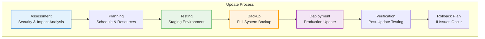

# Updates & Upgrades

## Overview

This guide covers the complete process for updating and upgrading the PRS on-premises deployment, including system updates, application updates, and database migrations.

## Update Strategy

### Update Types

| Update Type | Frequency | Risk Level | Downtime | Testing Required |
|-------------|-----------|------------|----------|------------------|
| **Security Patches** | As needed | Low | Minimal | Basic |
| **System Updates** | Monthly | Medium | Moderate | Comprehensive |
| **Application Updates** | Quarterly | High | Planned | Extensive |
| **Database Upgrades** | Annually | Very High | Extended | Full Testing |

### Update Planning



## Security Updates

### Critical Security Patches

```bash
#!/bin/bash
# /opt/prs-deployment/scripts/security-updates.sh

set -euo pipefail

LOG_FILE="/var/log/prs-updates.log"
BACKUP_DIR="/mnt/hdd/pre-update-backups"

log_message() {
    echo "$(date '+%Y-%m-%d %H:%M:%S') - $1" | tee -a "$LOG_FILE"
}

log_message "Starting security update process"

# 1. Check for security updates
log_message "Checking for available security updates"
apt update
SECURITY_UPDATES=$(apt list --upgradable 2>/dev/null | grep security | wc -l)

if [ "$SECURITY_UPDATES" -eq 0 ]; then
    log_message "No security updates available"
    exit 0
fi

log_message "Found $SECURITY_UPDATES security updates"

# 2. Create pre-update backup
log_message "Creating pre-update backup"
mkdir -p "$BACKUP_DIR/$(date +%Y%m%d_%H%M%S)"
BACKUP_PATH="$BACKUP_DIR/$(date +%Y%m%d_%H%M%S)"

# Backup critical configurations
cp -r /opt/prs-deployment/02-docker-configuration "$BACKUP_PATH/"
cp /etc/crontab "$BACKUP_PATH/" 2>/dev/null || true
cp -r /etc/nginx "$BACKUP_PATH/" 2>/dev/null || true

# Database backup
docker exec prs-onprem-postgres-timescale pg_dump -U prs_admin -d prs_production -Fc > "$BACKUP_PATH/database-backup.dump"

log_message "Backup created at: $BACKUP_PATH"

# 3. Apply security updates
log_message "Applying security updates"
apt list --upgradable 2>/dev/null | grep security > "$BACKUP_PATH/applied-updates.txt"

# Apply updates with automatic restart if needed
DEBIAN_FRONTEND=noninteractive apt-get -y upgrade

# 4. Restart services if needed
if [ -f /var/run/reboot-required ]; then
    log_message "System reboot required - scheduling for next maintenance window"
    echo "System reboot required after security updates" | \
    mail -s "PRS Security Updates - Reboot Required" admin@your-domain.com
else
    log_message "Restarting affected services"
    systemctl restart docker
    docker-compose -f /opt/prs-deployment/02-docker-configuration/docker-compose.onprem.yml restart
fi

# 5. Verify system health
log_message "Verifying system health after updates"
sleep 30
/opt/prs-deployment/scripts/system-health-check.sh all > "$BACKUP_PATH/post-update-health.log"

if grep -q "ERROR" "$BACKUP_PATH/post-update-health.log"; then
    log_message "ERROR: Health check failed after updates"
    echo "Security updates completed but health check failed" | \
    mail -s "PRS Security Updates - Health Check Failed" admin@your-domain.com
else
    log_message "Security updates completed successfully"
    echo "Security updates applied successfully" | \
    mail -s "PRS Security Updates - Success" admin@your-domain.com
fi

log_message "Security update process completed"
```

### Automated Security Update Check

```bash
#!/bin/bash
# Daily security update check

SECURITY_UPDATES=$(apt list --upgradable 2>/dev/null | grep security | wc -l)

if [ "$SECURITY_UPDATES" -gt 0 ]; then
    echo "Security updates available: $SECURITY_UPDATES"
    apt list --upgradable 2>/dev/null | grep security | \
    mail -s "PRS Security Updates Available" admin@your-domain.com
    
    # Auto-apply critical security updates (optional)
    if [ "$SECURITY_UPDATES" -le 5 ]; then
        echo "Auto-applying $SECURITY_UPDATES security updates"
        /opt/prs-deployment/scripts/security-updates.sh
    fi
fi
```

## System Updates

### Monthly System Update Process

```bash
#!/bin/bash
# /opt/prs-deployment/scripts/monthly-system-update.sh

set -euo pipefail

LOG_FILE="/var/log/prs-updates.log"
UPDATE_DATE=$(date +%Y%m%d)
MAINTENANCE_WINDOW="4 hours"

log_message() {
    echo "$(date '+%Y-%m-%d %H:%M:%S') - $1" | tee -a "$LOG_FILE"
}

log_message "Starting monthly system update (Maintenance window: $MAINTENANCE_WINDOW)"

# 1. Pre-update preparation
log_message "Preparing for system update"

# Create maintenance notification
docker exec prs-onprem-postgres-timescale psql -U prs_admin -d prs_production -c "
INSERT INTO system_notifications (message, type, created_at) 
VALUES ('System maintenance in progress. Service may be temporarily unavailable.', 'maintenance', NOW());
"

# Stop non-essential services
log_message "Stopping non-essential services"
docker-compose -f /opt/prs-deployment/02-docker-configuration/docker-compose.onprem.yml stop frontend backend worker

# 2. System backup
log_message "Creating comprehensive system backup"
BACKUP_DIR="/mnt/hdd/system-backups/$UPDATE_DATE"
mkdir -p "$BACKUP_DIR"

# Database backup
docker exec prs-onprem-postgres-timescale pg_dump -U prs_admin -d prs_production -Fc > "$BACKUP_DIR/database-full.dump"

# Configuration backup
tar -czf "$BACKUP_DIR/configuration-backup.tar.gz" /opt/prs-deployment/02-docker-configuration/

# Application data backup
tar -czf "$BACKUP_DIR/uploads-backup.tar.gz" /mnt/ssd/uploads/

log_message "System backup completed"

# 3. Update system packages
log_message "Updating system packages"
apt update
apt list --upgradable > "$BACKUP_DIR/available-updates.txt"

# Apply updates
DEBIAN_FRONTEND=noninteractive apt-get -y upgrade
DEBIAN_FRONTEND=noninteractive apt-get -y autoremove
DEBIAN_FRONTEND=noninteractive apt-get -y autoclean

# 4. Update Docker and Docker Compose
log_message "Checking Docker updates"
DOCKER_VERSION=$(docker --version)
log_message "Current Docker version: $DOCKER_VERSION"

# Update Docker if newer version available
if apt list --upgradable 2>/dev/null | grep -q docker; then
    log_message "Updating Docker"
    apt-get -y install docker-ce docker-ce-cli containerd.io
fi

# 5. Update container images
log_message "Updating container images"
cd /opt/prs-deployment
docker-compose -f 02-docker-configuration/docker-compose.onprem.yml pull

# 6. Restart services
log_message "Restarting services"
if [ -f /var/run/reboot-required ]; then
    log_message "System reboot required"
    # Schedule reboot for immediate execution
    shutdown -r +1 "System reboot required for updates"
else
    # Restart Docker and services
    systemctl restart docker
    docker-compose -f 02-docker-configuration/docker-compose.onprem.yml up -d
fi

# 7. Post-update verification
log_message "Performing post-update verification"
sleep 60  # Wait for services to start

# Health check
/opt/prs-deployment/scripts/system-health-check.sh all > "$BACKUP_DIR/post-update-health.log"

# Test application functionality
API_STATUS=$(curl -s -o /dev/null -w "%{http_code}" https://localhost/api/health)
if [ "$API_STATUS" = "200" ]; then
    log_message "Application health check passed"
else
    log_message "ERROR: Application health check failed (Status: $API_STATUS)"
fi

# 8. Clear maintenance notification
docker exec prs-onprem-postgres-timescale psql -U prs_admin -d prs_production -c "
DELETE FROM system_notifications WHERE type = 'maintenance';
"

# 9. Generate update report
UPDATE_REPORT="$BACKUP_DIR/update-report.txt"
cat > "$UPDATE_REPORT" << EOF
PRS Monthly System Update Report
Date: $UPDATE_DATE
================================

Updates Applied:
$(cat "$BACKUP_DIR/available-updates.txt")

Docker Version:
Before: $DOCKER_VERSION
After: $(docker --version)

System Status:
- Reboot Required: $([ -f /var/run/reboot-required ] && echo "Yes" || echo "No")
- API Status: $API_STATUS
- Services: $(docker-compose -f 02-docker-configuration/docker-compose.onprem.yml ps --services | wc -l) running

Health Check Results:
$(cat "$BACKUP_DIR/post-update-health.log")

Backup Location: $BACKUP_DIR
EOF

log_message "Monthly system update completed"

# Send update report
if command -v mail >/dev/null 2>&1; then
    mail -s "PRS Monthly System Update Report" admin@your-domain.com < "$UPDATE_REPORT"
fi
```

## Application Updates

### Application Update Process

```bash
#!/bin/bash
# /opt/prs-deployment/scripts/application-update.sh

set -euo pipefail

NEW_VERSION="$1"
CURRENT_VERSION=$(cat /opt/prs-deployment/VERSION 2>/dev/null || echo "unknown")

if [ -z "$NEW_VERSION" ]; then
    echo "Usage: $0 <new-version>"
    echo "Current version: $CURRENT_VERSION"
    exit 1
fi

LOG_FILE="/var/log/prs-updates.log"
BACKUP_DIR="/mnt/hdd/app-backups/v$NEW_VERSION-$(date +%Y%m%d_%H%M%S)"

log_message() {
    echo "$(date '+%Y-%m-%d %H:%M:%S') - $1" | tee -a "$LOG_FILE"
}

log_message "Starting application update from $CURRENT_VERSION to $NEW_VERSION"

# 1. Pre-update validation
log_message "Performing pre-update validation"

# Check if update is available
if ! git ls-remote --tags origin | grep -q "v$NEW_VERSION"; then
    log_message "ERROR: Version $NEW_VERSION not found in repository"
    exit 1
fi

# Check system resources
FREE_SPACE=$(df /mnt/ssd | awk 'NR==2 {print $4}')
if [ "$FREE_SPACE" -lt 5000000 ]; then  # 5GB
    log_message "ERROR: Insufficient disk space for update"
    exit 1
fi

# 2. Create comprehensive backup
log_message "Creating comprehensive backup"
mkdir -p "$BACKUP_DIR"

# Database backup
docker exec prs-onprem-postgres-timescale pg_dump -U prs_admin -d prs_production -Fc > "$BACKUP_DIR/database.dump"

# Application code backup
tar -czf "$BACKUP_DIR/application-code.tar.gz" /opt/prs/

# Configuration backup
tar -czf "$BACKUP_DIR/configuration.tar.gz" /opt/prs-deployment/02-docker-configuration/

# Uploads backup
tar -czf "$BACKUP_DIR/uploads.tar.gz" /mnt/ssd/uploads/

log_message "Backup completed: $BACKUP_DIR"

# 3. Download and prepare new version
log_message "Downloading new version"
cd /opt/prs-deployment
git fetch origin
git checkout "v$NEW_VERSION"

# 4. Check for database migrations
log_message "Checking for database migrations"
if [ -f "migrations/v$NEW_VERSION.sql" ]; then
    log_message "Database migration required"
    
    # Test migration on backup database
    docker exec prs-onprem-postgres-timescale psql -U prs_admin -c "CREATE DATABASE prs_migration_test;"
    docker exec -i prs-onprem-postgres-timescale pg_restore -U prs_admin -d prs_migration_test < "$BACKUP_DIR/database.dump"
    
    if docker exec -i prs-onprem-postgres-timescale psql -U prs_admin -d prs_migration_test < "migrations/v$NEW_VERSION.sql"; then
        log_message "Migration test successful"
        docker exec prs-onprem-postgres-timescale psql -U prs_admin -c "DROP DATABASE prs_migration_test;"
    else
        log_message "ERROR: Migration test failed"
        exit 1
    fi
fi

# 5. Stop application services
log_message "Stopping application services"
docker-compose -f 02-docker-configuration/docker-compose.onprem.yml stop frontend backend worker

# 6. Update application images
log_message "Building new application images"
docker build -t prs-frontend:$NEW_VERSION -f dockerfiles/Dockerfile.frontend /opt/prs/prs-frontend-a/
docker build -t prs-backend:$NEW_VERSION -f dockerfiles/Dockerfile.backend /opt/prs/prs-backend-a/

# Update image tags in docker-compose
sed -i "s/prs-frontend:.*/prs-frontend:$NEW_VERSION/" 02-docker-configuration/docker-compose.onprem.yml
sed -i "s/prs-backend:.*/prs-backend:$NEW_VERSION/" 02-docker-configuration/docker-compose.onprem.yml

# 7. Apply database migrations
if [ -f "migrations/v$NEW_VERSION.sql" ]; then
    log_message "Applying database migration"
    docker exec -i prs-onprem-postgres-timescale psql -U prs_admin -d prs_production < "migrations/v$NEW_VERSION.sql"
fi

# 8. Start updated services
log_message "Starting updated services"
docker-compose -f 02-docker-configuration/docker-compose.onprem.yml up -d

# 9. Post-update verification
log_message "Performing post-update verification"
sleep 60

# Health check
/opt/prs-deployment/scripts/system-health-check.sh all > "$BACKUP_DIR/post-update-health.log"

# API version check
API_VERSION=$(curl -s https://localhost/api/version | jq -r '.version' 2>/dev/null || echo "unknown")
if [ "$API_VERSION" = "$NEW_VERSION" ]; then
    log_message "Version verification successful: $API_VERSION"
else
    log_message "WARNING: Version mismatch. Expected: $NEW_VERSION, Got: $API_VERSION"
fi

# 10. Update version file
echo "$NEW_VERSION" > /opt/prs-deployment/VERSION

log_message "Application update completed successfully"

# Generate update report
UPDATE_REPORT="$BACKUP_DIR/application-update-report.txt"
cat > "$UPDATE_REPORT" << EOF
PRS Application Update Report
=============================
Date: $(date)
From Version: $CURRENT_VERSION
To Version: $NEW_VERSION

Update Process:
- Database migration: $([ -f "migrations/v$NEW_VERSION.sql" ] && echo "Applied" || echo "Not required")
- API version check: $API_VERSION
- Health check: $(grep -q "ERROR" "$BACKUP_DIR/post-update-health.log" && echo "Failed" || echo "Passed")

Backup Location: $BACKUP_DIR

$(cat "$BACKUP_DIR/post-update-health.log")
EOF

# Send update report
if command -v mail >/dev/null 2>&1; then
    mail -s "PRS Application Update Report - v$NEW_VERSION" admin@your-domain.com < "$UPDATE_REPORT"
fi
```

## Database Upgrades

### PostgreSQL/TimescaleDB Upgrade

```bash
#!/bin/bash
# Major database upgrade process

OLD_VERSION="$1"
NEW_VERSION="$2"

if [ -z "$OLD_VERSION" ] || [ -z "$NEW_VERSION" ]; then
    echo "Usage: $0 <old-version> <new-version>"
    echo "Example: $0 14 15"
    exit 1
fi

LOG_FILE="/var/log/prs-database-upgrade.log"
UPGRADE_DIR="/mnt/hdd/database-upgrade-$(date +%Y%m%d_%H%M%S)"

log_message() {
    echo "$(date '+%Y-%m-%d %H:%M:%S') - $1" | tee -a "$LOG_FILE"
}

log_message "Starting PostgreSQL upgrade from $OLD_VERSION to $NEW_VERSION"

# 1. Pre-upgrade preparation
mkdir -p "$UPGRADE_DIR"

# Full system backup
log_message "Creating full system backup"
docker exec prs-onprem-postgres-timescale pg_dumpall -U prs_admin > "$UPGRADE_DIR/full-database-backup.sql"

# Stop application services
docker-compose -f /opt/prs-deployment/02-docker-configuration/docker-compose.onprem.yml stop frontend backend worker

# 2. Export current data
log_message "Exporting current database data"
docker exec prs-onprem-postgres-timescale pg_dump -U prs_admin -d prs_production -Fc > "$UPGRADE_DIR/prs-production-backup.dump"

# 3. Stop database
docker-compose -f /opt/prs-deployment/02-docker-configuration/docker-compose.onprem.yml stop postgres

# 4. Backup data directory
log_message "Backing up data directory"
tar -czf "$UPGRADE_DIR/postgresql-data-backup.tar.gz" /mnt/ssd/postgresql-hot/

# 5. Update Docker image
log_message "Updating PostgreSQL Docker image"
sed -i "s/timescale\/timescaledb:.*-pg$OLD_VERSION/timescale\/timescaledb:latest-pg$NEW_VERSION/" \
  /opt/prs-deployment/02-docker-configuration/docker-compose.onprem.yml

# 6. Initialize new database
log_message "Initializing new database cluster"
rm -rf /mnt/ssd/postgresql-hot/*
docker-compose -f /opt/prs-deployment/02-docker-configuration/docker-compose.onprem.yml up -d postgres

# Wait for database to be ready
sleep 60
while ! docker exec prs-onprem-postgres-timescale pg_isready -U prs_admin; do
    log_message "Waiting for database to be ready..."
    sleep 10
done

# 7. Restore data
log_message "Restoring database data"
docker exec -i prs-onprem-postgres-timescale pg_restore -U prs_admin -d prs_production --clean --if-exists < "$UPGRADE_DIR/prs-production-backup.dump"

# 8. Update TimescaleDB extension
log_message "Updating TimescaleDB extension"
docker exec prs-onprem-postgres-timescale psql -U prs_admin -d prs_production -c "ALTER EXTENSION timescaledb UPDATE;"

# 9. Verify upgrade
log_message "Verifying database upgrade"
PG_VERSION=$(docker exec prs-onprem-postgres-timescale psql -U prs_admin -d prs_production -t -c "SELECT version();" | head -1)
TS_VERSION=$(docker exec prs-onprem-postgres-timescale psql -U prs_admin -d prs_production -t -c "SELECT extversion FROM pg_extension WHERE extname='timescaledb';" | xargs)

log_message "PostgreSQL version: $PG_VERSION"
log_message "TimescaleDB version: $TS_VERSION"

# 10. Start application services
log_message "Starting application services"
docker-compose -f /opt/prs-deployment/02-docker-configuration/docker-compose.onprem.yml up -d

# 11. Post-upgrade verification
sleep 60
/opt/prs-deployment/scripts/system-health-check.sh all > "$UPGRADE_DIR/post-upgrade-health.log"

log_message "Database upgrade completed"

# Generate upgrade report
cat > "$UPGRADE_DIR/upgrade-report.txt" << EOF
PostgreSQL/TimescaleDB Upgrade Report
====================================
Date: $(date)
From: PostgreSQL $OLD_VERSION
To: PostgreSQL $NEW_VERSION

Versions After Upgrade:
- PostgreSQL: $PG_VERSION
- TimescaleDB: $TS_VERSION

Health Check:
$(cat "$UPGRADE_DIR/post-upgrade-health.log")

Backup Location: $UPGRADE_DIR
EOF

if command -v mail >/dev/null 2>&1; then
    mail -s "PRS Database Upgrade Report" admin@your-domain.com < "$UPGRADE_DIR/upgrade-report.txt"
fi
```

## Rollback Procedures

### Application Rollback

```bash
#!/bin/bash
# Emergency application rollback

BACKUP_DIR="$1"

if [ -z "$BACKUP_DIR" ] || [ ! -d "$BACKUP_DIR" ]; then
    echo "Usage: $0 <backup-directory>"
    echo "Available backups:"
    ls -la /mnt/hdd/app-backups/
    exit 1
fi

log_message() {
    echo "$(date '+%Y-%m-%d %H:%M:%S') - $1" | tee -a /var/log/prs-rollback.log
}

log_message "Starting emergency rollback from: $BACKUP_DIR"

# 1. Stop current services
docker-compose -f /opt/prs-deployment/02-docker-configuration/docker-compose.onprem.yml down

# 2. Restore database
log_message "Restoring database"
docker-compose -f /opt/prs-deployment/02-docker-configuration/docker-compose.onprem.yml up -d postgres
sleep 30

docker exec -i prs-onprem-postgres-timescale pg_restore -U prs_admin -d prs_production --clean --if-exists < "$BACKUP_DIR/database.dump"

# 3. Restore configuration
log_message "Restoring configuration"
tar -xzf "$BACKUP_DIR/configuration.tar.gz" -C /

# 4. Restore application code
log_message "Restoring application code"
tar -xzf "$BACKUP_DIR/application-code.tar.gz" -C /

# 5. Start services
log_message "Starting services"
docker-compose -f /opt/prs-deployment/02-docker-configuration/docker-compose.onprem.yml up -d

log_message "Rollback completed"
```

---

!!! success "Update Procedures Ready"
    Your PRS deployment now has comprehensive update and upgrade procedures with proper backup, testing, and rollback capabilities.

!!! tip "Testing Environment"
    Always test updates in a staging environment that mirrors production before applying to the live system.

!!! warning "Backup Verification"
    Always verify backup integrity before starting any update process and ensure rollback procedures are tested and ready.
