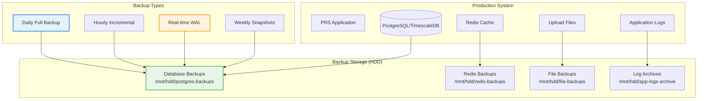

# Backup Procedures

## Overview

This guide covers comprehensive backup and recovery procedures for the PRS on-premises deployment, ensuring zero data loss and rapid recovery capabilities.

## Backup Architecture



## Backup Schedule

### Backup Schedule

| Backup Type | Frequency | Retention | Storage Location | Size Estimate |
|-------------|-----------|-----------|------------------|---------------|
| **Database Full** | Daily 2:00 AM | 30 days | `/mnt/hdd/postgres-backups/daily/` | 5-20 GB |
| **Database Incremental** | Every 6 hours | 7 days | `/mnt/hdd/postgres-backups/incremental/` | 1-5 GB |
| **WAL Archives** | Continuous | 7 days | `/mnt/hdd/postgres-backups/wal/` | 100 MB/hour |
| **Redis Snapshots** | Daily 3:00 AM | 14 days | `/mnt/hdd/redis-backups/` | 100-500 MB |
| **File Uploads** | Daily 4:00 AM | 90 days | `/mnt/hdd/file-backups/` | 10-50 GB |
| **Application Logs** | Daily 5:00 AM | 365 days | `/mnt/hdd/app-logs-archive/` | 1-5 GB |
| **Configuration** | Weekly | 12 weeks | `/mnt/hdd/config-backups/` | 10-50 MB |

### Cron Configuration

```bash
# View current backup cron jobs
crontab -l

# Expected backup schedule:
0 2 * * * /opt/prs-deployment/scripts/backup-database-full.sh
0 */6 * * * /opt/prs-deployment/scripts/backup-database-incremental.sh
0 3 * * * /opt/prs-deployment/scripts/backup-redis.sh
0 4 * * * /opt/prs-deployment/scripts/backup-files.sh
0 5 * * * /opt/prs-deployment/scripts/backup-logs.sh
0 6 * * 0 /opt/prs-deployment/scripts/backup-configuration.sh
```

## Database Backup Procedures

### Database Backup

```bash
#!/bin/bash
# Daily full database backup script

BACKUP_DIR="/mnt/hdd/postgres-backups/daily"
DATE=$(date +%Y%m%d_%H%M%S)
BACKUP_FILE="prs_full_backup_${DATE}.sql"

# Create backup directory
mkdir -p "$BACKUP_DIR"

# Perform full backup
docker exec prs-onprem-postgres-timescale pg_dump \
  -U prs_admin \
  -d prs_production \
  --verbose \
  --format=custom \
  --compress=9 \
  --file="/var/lib/postgresql/backups/daily/${BACKUP_FILE}"

# Verify backup
if [ $? -eq 0 ]; then
    echo "$(date): Full backup completed successfully: ${BACKUP_FILE}" >> /var/log/prs-backup.log
    
    # Create checksum
    cd "$BACKUP_DIR"
    sha256sum "${BACKUP_FILE}" > "${BACKUP_FILE}.sha256"
    
    # Cleanup old backups (keep 30 days)
    find "$BACKUP_DIR" -name "*.sql" -mtime +30 -delete
    find "$BACKUP_DIR" -name "*.sha256" -mtime +30 -delete
else
    echo "$(date): Full backup failed!" >> /var/log/prs-backup.log
    exit 1
fi
```

### Database Backup

```bash
#!/bin/bash
# Incremental database backup using WAL-E or similar

BACKUP_DIR="/mnt/hdd/postgres-backups/incremental"
DATE=$(date +%Y%m%d_%H%M%S)

# Create backup directory
mkdir -p "$BACKUP_DIR"

# Perform incremental backup (WAL archiving)
docker exec prs-onprem-postgres-timescale pg_basebackup \
  -U prs_admin \
  -D "/var/lib/postgresql/backups/incremental/backup_${DATE}" \
  --wal-method=stream \
  --compress \
  --progress \
  --verbose

# Log result
if [ $? -eq 0 ]; then
    echo "$(date): Incremental backup completed: backup_${DATE}" >> /var/log/prs-backup.log
else
    echo "$(date): Incremental backup failed!" >> /var/log/prs-backup.log
fi
```

### Recovery Setup

```sql
-- Enable WAL archiving for point-in-time recovery
ALTER SYSTEM SET wal_level = 'replica';
ALTER SYSTEM SET archive_mode = 'on';
ALTER SYSTEM SET archive_command = 'cp %p /var/lib/postgresql/wal-archive/%f';
ALTER SYSTEM SET max_wal_senders = 3;
ALTER SYSTEM SET wal_keep_segments = 64;

-- Reload configuration
SELECT pg_reload_conf();
```

## Redis Backup Procedures

### Snapshot Backup

```bash
#!/bin/bash
# Daily Redis backup script

BACKUP_DIR="/mnt/hdd/redis-backups"
DATE=$(date +%Y%m%d_%H%M%S)
BACKUP_FILE="redis_backup_${DATE}.rdb"

# Create backup directory
mkdir -p "$BACKUP_DIR"

# Trigger Redis save
docker exec prs-onprem-redis redis-cli -a $REDIS_PASSWORD BGSAVE

# Wait for backup to complete
while [ $(docker exec prs-onprem-redis redis-cli -a $REDIS_PASSWORD LASTSAVE) -eq $(docker exec prs-onprem-redis redis-cli -a $REDIS_PASSWORD LASTSAVE) ]; do
    sleep 1
done

# Copy backup file
docker cp prs-onprem-redis:/data/dump.rdb "${BACKUP_DIR}/${BACKUP_FILE}"

# Compress backup
gzip "${BACKUP_DIR}/${BACKUP_FILE}"

# Verify and log
if [ -f "${BACKUP_DIR}/${BACKUP_FILE}.gz" ]; then
    echo "$(date): Redis backup completed: ${BACKUP_FILE}.gz" >> /var/log/prs-backup.log
    
    # Cleanup old backups (keep 14 days)
    find "$BACKUP_DIR" -name "*.rdb.gz" -mtime +14 -delete
else
    echo "$(date): Redis backup failed!" >> /var/log/prs-backup.log
fi
```

## File System Backup Procedures

### Files Backup

```bash
#!/bin/bash
# Daily file uploads backup script

SOURCE_DIR="/mnt/ssd/uploads"
BACKUP_DIR="/mnt/hdd/file-backups"
DATE=$(date +%Y%m%d)

# Create backup directory
mkdir -p "$BACKUP_DIR/$DATE"

# Perform incremental backup using rsync
rsync -av \
  --link-dest="$BACKUP_DIR/latest" \
  "$SOURCE_DIR/" \
  "$BACKUP_DIR/$DATE/"

# Update latest symlink
rm -f "$BACKUP_DIR/latest"
ln -s "$DATE" "$BACKUP_DIR/latest"

# Log result
if [ $? -eq 0 ]; then
    echo "$(date): File backup completed: $DATE" >> /var/log/prs-backup.log
    
    # Cleanup old backups (keep 90 days)
    find "$BACKUP_DIR" -maxdepth 1 -type d -name "20*" -mtime +90 -exec rm -rf {} \;
else
    echo "$(date): File backup failed!" >> /var/log/prs-backup.log
fi
```

### Backup

```bash
#!/bin/bash
# Weekly configuration backup script

BACKUP_DIR="/mnt/hdd/config-backups"
DATE=$(date +%Y%m%d)
BACKUP_FILE="config_backup_${DATE}.tar.gz"

# Create backup directory
mkdir -p "$BACKUP_DIR"

# Backup configuration files
tar -czf "$BACKUP_DIR/$BACKUP_FILE" \
  /opt/prs-deployment/02-docker-configuration/ \
  /opt/prs-deployment/scripts/ \
  /etc/nginx/ \
  /etc/ssl/ \
  /etc/crontab \
  /etc/systemd/system/

# Log result
if [ $? -eq 0 ]; then
    echo "$(date): Configuration backup completed: $BACKUP_FILE" >> /var/log/prs-backup.log
    
    # Cleanup old backups (keep 12 weeks)
    find "$BACKUP_DIR" -name "config_backup_*.tar.gz" -mtime +84 -delete
else
    echo "$(date): Configuration backup failed!" >> /var/log/prs-backup.log
fi
```

## Recovery Procedures

### Recovery

#### Database Restore

```bash
#!/bin/bash
# Full database restore procedure

BACKUP_FILE="$1"
if [ -z "$BACKUP_FILE" ]; then
    echo "Usage: $0 <backup_file>"
    exit 1
fi

# Stop application services
docker-compose -f /opt/prs-deployment/02-docker-configuration/docker-compose.onprem.yml stop backend frontend worker

# Verify backup integrity
sha256sum -c "${BACKUP_FILE}.sha256"
if [ $? -ne 0 ]; then
    echo "Backup integrity check failed!"
    exit 1
fi

# Drop and recreate database
docker exec prs-onprem-postgres-timescale psql -U prs_admin -c "DROP DATABASE IF EXISTS prs_production;"
docker exec prs-onprem-postgres-timescale psql -U prs_admin -c "CREATE DATABASE prs_production;"

# Restore database
docker exec prs-onprem-postgres-timescale pg_restore \
  -U prs_admin \
  -d prs_production \
  --verbose \
  --clean \
  --if-exists \
  "/var/lib/postgresql/backups/daily/$(basename $BACKUP_FILE)"

# Restart services
docker-compose -f /opt/prs-deployment/02-docker-configuration/docker-compose.onprem.yml start backend frontend worker

echo "Database restore completed from: $BACKUP_FILE"
```

#### Recovery

```bash
#!/bin/bash
# Point-in-time recovery procedure

TARGET_TIME="$1"
if [ -z "$TARGET_TIME" ]; then
    echo "Usage: $0 'YYYY-MM-DD HH:MM:SS'"
    exit 1
fi

# Stop PostgreSQL
docker-compose -f /opt/prs-deployment/02-docker-configuration/docker-compose.onprem.yml stop postgres

# Restore base backup
LATEST_BASE_BACKUP=$(ls -t /mnt/hdd/postgres-backups/incremental/ | head -1)
rm -rf /mnt/ssd/postgresql-data/*
tar -xzf "/mnt/hdd/postgres-backups/incremental/$LATEST_BASE_BACKUP" -C /mnt/ssd/postgresql-data/

# Create recovery configuration
cat > /mnt/ssd/postgresql-data/recovery.conf << EOF
restore_command = 'cp /mnt/hdd/postgres-backups/wal/%f %p'
recovery_target_time = '$TARGET_TIME'
recovery_target_action = 'promote'
EOF

# Start PostgreSQL
docker-compose -f /opt/prs-deployment/02-docker-configuration/docker-compose.onprem.yml start postgres

echo "Point-in-time recovery initiated to: $TARGET_TIME"
```

### Recovery

```bash
#!/bin/bash
# Redis restore procedure

BACKUP_FILE="$1"
if [ -z "$BACKUP_FILE" ]; then
    echo "Usage: $0 <redis_backup_file.rdb.gz>"
    exit 1
fi

# Stop Redis
docker-compose -f /opt/prs-deployment/02-docker-configuration/docker-compose.onprem.yml stop redis

# Restore backup
gunzip -c "$BACKUP_FILE" > /mnt/ssd/redis-data/dump.rdb
chown 999:999 /mnt/ssd/redis-data/dump.rdb

# Start Redis
docker-compose -f /opt/prs-deployment/02-docker-configuration/docker-compose.onprem.yml start redis

echo "Redis restore completed from: $BACKUP_FILE"
```

### System Recovery

```bash
#!/bin/bash
# File system restore procedure

BACKUP_DATE="$1"
if [ -z "$BACKUP_DATE" ]; then
    echo "Usage: $0 <YYYYMMDD>"
    exit 1
fi

BACKUP_DIR="/mnt/hdd/file-backups/$BACKUP_DATE"
if [ ! -d "$BACKUP_DIR" ]; then
    echo "Backup directory not found: $BACKUP_DIR"
    exit 1
fi

# Stop services
docker-compose -f /opt/prs-deployment/02-docker-configuration/docker-compose.onprem.yml stop backend frontend

# Restore files
rsync -av "$BACKUP_DIR/" /mnt/ssd/uploads/

# Start services
docker-compose -f /opt/prs-deployment/02-docker-configuration/docker-compose.onprem.yml start backend frontend

echo "File system restore completed from: $BACKUP_DATE"
```

## Backup Monitoring and Verification

### Verification Script

```bash
#!/bin/bash
# Daily backup verification script

LOG_FILE="/var/log/prs-backup-verification.log"
DATE=$(date +%Y-%m-%d)

echo "=== Backup Verification Report - $DATE ===" >> "$LOG_FILE"

# Check database backup
LATEST_DB_BACKUP=$(ls -t /mnt/hdd/postgres-backups/daily/*.sql 2>/dev/null | head -1)
if [ -n "$LATEST_DB_BACKUP" ]; then
    if [ -f "${LATEST_DB_BACKUP}.sha256" ]; then
        cd "$(dirname "$LATEST_DB_BACKUP")"
        if sha256sum -c "$(basename "${LATEST_DB_BACKUP}.sha256")" >/dev/null 2>&1; then
            echo "✓ Database backup verified: $(basename "$LATEST_DB_BACKUP")" >> "$LOG_FILE"
        else
            echo "✗ Database backup checksum failed: $(basename "$LATEST_DB_BACKUP")" >> "$LOG_FILE"
        fi
    else
        echo "✗ Database backup checksum missing: $(basename "$LATEST_DB_BACKUP")" >> "$LOG_FILE"
    fi
else
    echo "✗ No database backup found" >> "$LOG_FILE"
fi

# Check Redis backup
LATEST_REDIS_BACKUP=$(ls -t /mnt/hdd/redis-backups/*.rdb.gz 2>/dev/null | head -1)
if [ -n "$LATEST_REDIS_BACKUP" ]; then
    if gzip -t "$LATEST_REDIS_BACKUP" >/dev/null 2>&1; then
        echo "✓ Redis backup verified: $(basename "$LATEST_REDIS_BACKUP")" >> "$LOG_FILE"
    else
        echo "✗ Redis backup corrupted: $(basename "$LATEST_REDIS_BACKUP")" >> "$LOG_FILE"
    fi
else
    echo "✗ No Redis backup found" >> "$LOG_FILE"
fi

# Check file backup
if [ -d "/mnt/hdd/file-backups/latest" ]; then
    FILE_COUNT=$(find /mnt/hdd/file-backups/latest -type f | wc -l)
    echo "✓ File backup verified: $FILE_COUNT files" >> "$LOG_FILE"
else
    echo "✗ No file backup found" >> "$LOG_FILE"
fi

echo "" >> "$LOG_FILE"
```

### Storage Monitoring

```bash
# Monitor backup storage usage
df -h /mnt/hdd | grep -E "(Filesystem|/mnt/hdd)"

# Check backup directory sizes
du -sh /mnt/hdd/postgres-backups/
du -sh /mnt/hdd/redis-backups/
du -sh /mnt/hdd/file-backups/
du -sh /mnt/hdd/app-logs-archive/

# Monitor backup growth trends
find /mnt/hdd/postgres-backups/daily -name "*.sql" -mtime -7 -exec ls -lh {} \; | awk '{print $5, $9}'
```

## Backup Troubleshooting

### Backup Issues

#### Script Failures

```bash
# Check backup logs
tail -50 /var/log/prs-backup.log

# Check disk space
df -h /mnt/hdd

# Check permissions
ls -la /mnt/hdd/postgres-backups/

# Test database connectivity
docker exec prs-onprem-postgres-timescale pg_isready -U prs_admin
```

#### Space Issues

```bash
# Clean up old backups manually
find /mnt/hdd/postgres-backups/daily -name "*.sql" -mtime +30 -delete
find /mnt/hdd/redis-backups -name "*.rdb.gz" -mtime +14 -delete

# Compress old backups
find /mnt/hdd/postgres-backups/daily -name "*.sql" -mtime +7 ! -name "*.gz" -exec gzip {} \;
```

#### Corruption

```bash
# Verify backup integrity
sha256sum -c /mnt/hdd/postgres-backups/daily/*.sha256

# Test restore on backup database
docker run --rm -v /mnt/hdd/postgres-backups:/backups postgres:15 \
  pg_restore --list /backups/daily/latest_backup.sql
```

---

!!! success "Backup Strategy"
    The comprehensive backup strategy ensures zero data loss with multiple recovery options including full restore, point-in-time recovery, and incremental restoration.

!!! warning "Regular Testing"
    Backup procedures should be tested monthly to ensure recovery capabilities are working correctly.
