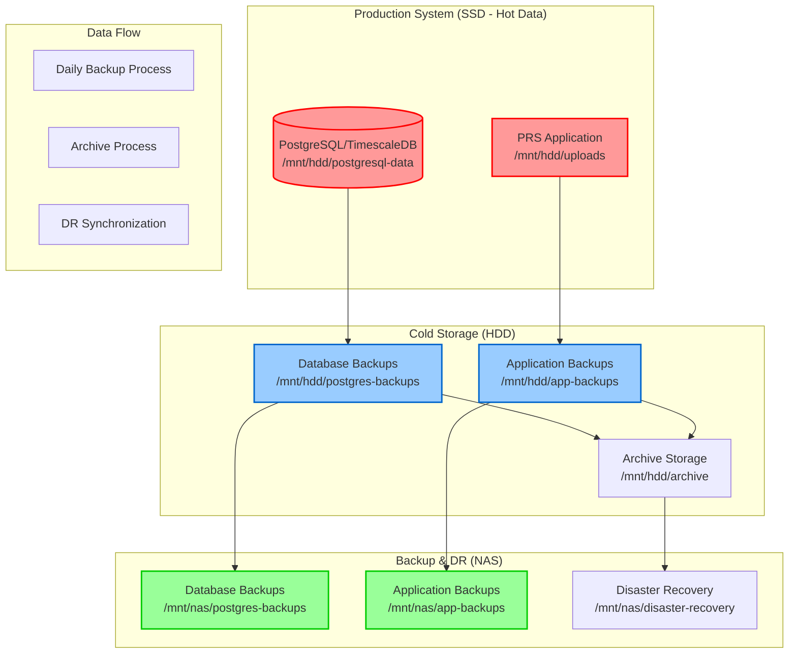

# Backup Procedures

## Overview

This guide covers comprehensive backup and recovery procedures for the PRS on-premises deployment, ensuring zero data loss and rapid recovery capabilities.

## Backup Architecture



## Backup Schedule

### Backup Schedule

| Backup Type | Frequency | Storage Tier | Location | Size Estimate |
|-------------|-----------|--------------|----------|---------------|
| **Database Full** | Daily 2:00 AM | **HDD → NAS** | `/mnt/hdd/postgres-backups/` → `/mnt/nas/postgres-backups/` | 5-20 GB |
| **Application Data** | Daily 3:00 AM | **HDD → NAS** | `/mnt/hdd/app-backups/` → `/mnt/nas/app-backups/` | 10-50 GB |
| **Archive Storage** | Manual (90+ days) | **HDD Archive** | `/mnt/hdd/archive/` | Growing |
| **Disaster Recovery** | Weekly Sync | **NAS DR** | `/mnt/nas/disaster-recovery/` | Full System |
| **Logs & Verification** | Continuous | **HDD** | `/var/log/prs-*.log` | 1-100 MB |

!!! info "Three-Tier Storage Architecture"
    **SSD (/mnt/hdd)**: Hot data - Active database and application files
    **HDD (/mnt/hdd)**: Cold data - Backups and archives
    **NAS**: Backup and disaster recovery - Off-site protection

!!! warning "Zero Deletion Policy"
    **All data preserved permanently across all tiers.** Data flows: SSD → HDD → NAS, never deleted.

### Cron Configuration

```bash
# View current backup cron jobs
crontab -l

# Actual backup schedule (ONLY EXISTING SCRIPTS):
0 2 * * * /opt/prs-deployment/scripts/backup-full.sh
0 3 * * * /opt/prs-deployment/scripts/backup-application-data.sh
0 4 * * * /opt/prs-deployment/scripts/verify-backups.sh
0 1 * * 0 /opt/prs-deployment/scripts/backup-maintenance.sh
0 */6 * * * /opt/prs-deployment/scripts/test-nas-connection.sh
```

## Backup Setup and Automation

### Initial Setup

```bash
# Setup automated backup system (ACTUAL WORKING SCRIPT)
/opt/prs-deployment/scripts/setup-backup-automation.sh

# This script automatically:
# ✅ Creates all backup directories (/mnt/hdd/postgres-backups/, etc.)
# ✅ Configures NAS mounting if enabled in .env
# ✅ Installs cron jobs for automated backups
# ✅ Sets up log rotation and monitoring
# ✅ Tests backup procedures and connectivity
# ✅ Configures backup retention policies
# ✅ Sets up backup verification automation

# Manual verification after setup:
crontab -l | grep backup
ls -la /mnt/hdd/postgres-backups/
systemctl status cron
```

### Configuration Files

The backup system uses configuration from:
- `/opt/prs-deployment/02-docker-configuration/.env` - Database credentials and NAS settings
- `/etc/crontab` - Automated backup scheduling
- `/var/log/prs-backup*.log` - Backup operation logs

## Database Backup Procedures

### Database Backup

```bash
#!/bin/bash
# Daily full database backup script (ACTUAL WORKING SCRIPT: backup-full.sh)

# Run the actual backup script
/opt/prs-deployment/scripts/backup-full.sh

# The script automatically:
# - Creates backup: /mnt/hdd/postgres-backups/daily/prs_full_backup_YYYYMMDD_HHMMSS.sql
# - Compresses and encrypts backup
# - Creates SHA256 checksum for verification
# - Copies to NAS if configured
# - Cleans up old backups (30 days retention)
# - Logs all operations to /var/log/prs-backup.log

# Manual execution example:
BACKUP_DIR="/mnt/hdd/postgres-backups/daily"
DATE=$(date +%Y%m%d_%H%M%S)
BACKUP_FILE="prs_full_backup_${DATE}.sql"

# The actual pg_dump command used by backup-full.sh:
docker exec prs-onprem-postgres-timescale pg_dump \
  -U prs_user \
  -d prs_production \
  --verbose \
  --format=custom \
  --compress=9 \
  --file="/var/lib/postgresql/data/backups/daily/${BACKUP_FILE}"

# Features included in backup-full.sh:
# ✅ NAS integration with automatic mounting
# ✅ Pre-backup space checks (5GB local, 10GB NAS)
# ✅ Database connectivity verification
# ✅ Compression and encryption
# ✅ Checksum verification
# ✅ Automatic cleanup and retention
# ✅ Comprehensive logging
```

### Database Backup

```bash
#!/bin/bash
# Incremental database backup using WAL-E or similar

BACKUP_DIR="/mnt/hdd/postgres-backups/incremental"
DATE=$(date +%Y%m%d_%H%M%S)

# Create backup directory
mkdir -p "$BACKUP_DIR"

# Perform incremental backup (WAL archiving)
docker exec prs-onprem-postgres-timescale pg_basebackup \
  -U prs_admin \
  -D "/var/lib/postgresql/backups/incremental/backup_${DATE}" \
  --wal-method=stream \
  --compress \
  --progress \
  --verbose

# Log result
if [ $? -eq 0 ]; then
    echo "$(date): Incremental backup completed: backup_${DATE}" >> /var/log/prs-backup.log
else
    echo "$(date): Incremental backup failed!" >> /var/log/prs-backup.log
fi
```

### Recovery Setup

```sql
-- Enable WAL archiving for point-in-time recovery
ALTER SYSTEM SET wal_level = 'replica';
ALTER SYSTEM SET archive_mode = 'on';
ALTER SYSTEM SET archive_command = 'cp %p /var/lib/postgresql/wal-archive/%f';
ALTER SYSTEM SET max_wal_senders = 3;
ALTER SYSTEM SET wal_keep_segments = 64;

-- Reload configuration
SELECT pg_reload_conf();
```


## File System Backup Procedures

### Files Backup

```bash
#!/bin/bash
# Daily file uploads backup script

SOURCE_DIR="/mnt/hdd/uploads"
BACKUP_DIR="/mnt/hdd/file-backups"
DATE=$(date +%Y%m%d)

# Create backup directory
mkdir -p "$BACKUP_DIR/$DATE"

# Perform incremental backup using rsync
rsync -av \
  --link-dest="$BACKUP_DIR/latest" \
  "$SOURCE_DIR/" \
  "$BACKUP_DIR/$DATE/"

# Update latest symlink
rm -f "$BACKUP_DIR/latest"
ln -s "$DATE" "$BACKUP_DIR/latest"

# Log result
if [ $? -eq 0 ]; then
    echo "$(date): File backup completed: $DATE" >> /var/log/prs-backup.log

    # Cleanup old backups (keep 90 days)
    find "$BACKUP_DIR" -maxdepth 1 -type d -name "20*" -mtime +90 -exec rm -rf {} \;
else
    echo "$(date): File backup failed!" >> /var/log/prs-backup.log
fi
```

!!! info "Configuration Backup"
    Configuration files are automatically included in the weekly maintenance backup (`backup-maintenance.sh`). No separate configuration backup script is needed.

## Recovery Procedures

### Recovery

#### Database Restore

```bash
#!/bin/bash
# Full database restore procedure (ACTUAL WORKING SCRIPT: restore-database.sh)

# Usage: ./restore-database.sh <backup_file> [target_database]
# Example: ./restore-database.sh /mnt/hdd/postgres-backups/daily/prs_full_backup_20250825_020000.sql

BACKUP_FILE="$1"
if [ -z "$BACKUP_FILE" ]; then
    echo "Usage: $0 <backup_file> [target_database]"
    echo "Available backups:"
    ls -la /mnt/hdd/postgres-backups/daily/
    exit 1
fi

# Run the actual restore script
/opt/prs-deployment/scripts/restore-database.sh "$BACKUP_FILE"

# The script automatically:
# ✅ Verifies backup file exists
# ✅ Checks backup integrity (SHA256)
# ✅ Stops application services safely
# ✅ Creates backup of current database
# ✅ Handles encrypted/compressed backups
# ✅ Restores database with proper user permissions
# ✅ Restarts services after restoration
# ✅ Logs all operations to /var/log/prs-restore.log

# Manual restore example (what the script does internally):
# 1. Stop services
docker-compose -f /opt/prs-deployment/02-docker-configuration/docker-compose.onprem.yml stop backend frontend

# 2. Verify backup integrity
sha256sum -c "${BACKUP_FILE}.sha256"

# 3. Restore database
docker exec prs-onprem-postgres-timescale pg_restore \
  -U prs_user \
  -d prs_production \
  --verbose \
  --clean \
  --if-exists \
  "$BACKUP_FILE"

# 4. Restart services
docker-compose -f /opt/prs-deployment/02-docker-configuration/docker-compose.onprem.yml start backend frontend
```

#### Recovery

```bash
#!/bin/bash
# Point-in-time recovery procedure

TARGET_TIME="$1"
if [ -z "$TARGET_TIME" ]; then
    echo "Usage: $0 'YYYY-MM-DD HH:MM:SS'"
    exit 1
fi

# Stop PostgreSQL
docker-compose -f /opt/prs-deployment/02-docker-configuration/docker-compose.onprem.yml stop postgres

# Restore base backup
LATEST_BASE_BACKUP=$(ls -t /mnt/hdd/postgres-backups/incremental/ | head -1)
rm -rf /mnt/hdd/postgresql-data/*
tar -xzf "/mnt/hdd/postgres-backups/incremental/$LATEST_BASE_BACKUP" -C /mnt/hdd/postgresql-data/

# Create recovery configuration
cat > /mnt/hdd/postgresql-data/recovery.conf << EOF
restore_command = 'cp /mnt/hdd/postgres-backups/wal/%f %p'
recovery_target_time = '$TARGET_TIME'
recovery_target_action = 'promote'
EOF

# Start PostgreSQL
docker-compose -f /opt/prs-deployment/02-docker-configuration/docker-compose.onprem.yml start postgres

echo "Point-in-time recovery initiated to: $TARGET_TIME"
```


### System Recovery

```bash
#!/bin/bash
# File system restore procedure

BACKUP_DATE="$1"
if [ -z "$BACKUP_DATE" ]; then
    echo "Usage: $0 <YYYYMMDD>"
    exit 1
fi

BACKUP_DIR="/mnt/hdd/file-backups/$BACKUP_DATE"
if [ ! -d "$BACKUP_DIR" ]; then
    echo "Backup directory not found: $BACKUP_DIR"
    exit 1
fi

# Stop services
docker-compose -f /opt/prs-deployment/02-docker-configuration/docker-compose.onprem.yml stop backend frontend

# Restore files
rsync -av "$BACKUP_DIR/" /mnt/hdd/uploads/

# Start services
docker-compose -f /opt/prs-deployment/02-docker-configuration/docker-compose.onprem.yml start backend frontend

echo "File system restore completed from: $BACKUP_DATE"
```

## Backup Monitoring and Verification

### Verification Script

```bash
#!/bin/bash
# Daily backup verification script

LOG_FILE="/var/log/prs-backup-verification.log"
DATE=$(date +%Y-%m-%d)

echo "=== Backup Verification Report - $DATE ===" >> "$LOG_FILE"

# Check database backup
LATEST_DB_BACKUP=$(ls -t /mnt/hdd/postgres-backups/daily/*.sql 2>/dev/null | head -1)
if [ -n "$LATEST_DB_BACKUP" ]; then
    if [ -f "${LATEST_DB_BACKUP}.sha256" ]; then
        cd "$(dirname "$LATEST_DB_BACKUP")"
        if sha256sum -c "$(basename "${LATEST_DB_BACKUP}.sha256")" >/dev/null 2>&1; then
            echo "✓ Database backup verified: $(basename "$LATEST_DB_BACKUP")" >> "$LOG_FILE"
        else
            echo "✗ Database backup checksum failed: $(basename "$LATEST_DB_BACKUP")" >> "$LOG_FILE"
        fi
    else
        echo "✗ Database backup checksum missing: $(basename "$LATEST_DB_BACKUP")" >> "$LOG_FILE"
    fi
else
    echo "✗ No database backup found" >> "$LOG_FILE"
fi

# Check application data backup
LATEST_APP_BACKUP=$(ls -t /mnt/hdd/app-backups/*.tar.gz 2>/dev/null | head -1)
if [ -n "$LATEST_APP_BACKUP" ]; then
    if tar -tzf "$LATEST_APP_BACKUP" >/dev/null 2>&1; then
        echo "✓ Application backup verified: $(basename "$LATEST_APP_BACKUP")" >> "$LOG_FILE"
    else
        echo "✗ Application backup corrupted: $(basename "$LATEST_APP_BACKUP")" >> "$LOG_FILE"
    fi
else
    echo "✗ No application backup found" >> "$LOG_FILE"
fi

# Check file backup
if [ -d "/mnt/hdd/file-backups/latest" ]; then
    FILE_COUNT=$(find /mnt/hdd/file-backups/latest -type f | wc -l)
    echo "✓ File backup verified: $FILE_COUNT files" >> "$LOG_FILE"
else
    echo "✗ No file backup found" >> "$LOG_FILE"
fi

echo "" >> "$LOG_FILE"
```

### Storage Monitoring

```bash
# Monitor backup storage usage
df -h /mnt/hdd | grep -E "(Filesystem|/mnt/hdd)"

# Check backup directory sizes
du -sh /mnt/hdd/postgres-backups/
du -sh /mnt/hdd/app-backups/

# Monitor backup growth trends
find /mnt/hdd/postgres-backups/daily -name "*.sql" -mtime -7 -exec ls -lh {} \; | awk '{print $5, $9}'
```

## Zero Deletion Policy Management

### Three-Tier Storage Monitoring

Monitor all storage tiers with zero deletion policy:

```bash
# Monitor all storage tiers
echo "=== SSD (Hot Data) ==="
df -h /mnt/hdd | grep -E "(Filesystem|/mnt/hdd)"
du -sh /mnt/hdd/postgresql-data/
du -sh /mnt/hdd/uploads/

echo "=== HDD (Cold Data/Backups) ==="
df -h /mnt/hdd | grep -E "(Filesystem|/mnt/hdd)"
du -sh /mnt/hdd/postgres-backups/
du -sh /mnt/hdd/app-backups/
du -sh /mnt/hdd/archive/

echo "=== NAS (Backup/DR) ==="
if mountpoint -q /mnt/nas; then
    df -h /mnt/nas | grep -E "(Filesystem|/mnt/nas)"
    du -sh /mnt/nas/postgres-backups/
    du -sh /mnt/nas/app-backups/
    du -sh /mnt/nas/disaster-recovery/
else
    echo "NAS not mounted"
fi

# Count backups across tiers
echo "=== Backup Counts ==="
echo "HDD Database backups: $(find /mnt/hdd/postgres-backups -name "*.sql*" | wc -l)"
echo "HDD Application backups: $(find /mnt/hdd/app-backups -type d -name "20*" | wc -l)"
echo "Archive Database backups: $(find /mnt/hdd/archive -name "*.sql*" 2>/dev/null | wc -l)"
echo "Archive Application backups: $(find /mnt/hdd/archive -type d -name "20*" 2>/dev/null | wc -l)"
```

### Three-Tier Data Lifecycle Management

**Data Flow**: SSD (Hot) → HDD (Cold) → NAS (Backup/DR)

#### When HDD Storage Approaches Capacity (>80%)

```bash
# 1. Create archive structure on HDD
mkdir -p /mnt/hdd/archive/{postgres-backups,app-backups}

# 2. Move old backups to HDD archive (90+ days)
find /mnt/hdd/postgres-backups/daily -name "*.sql*" -mtime +90 -exec mv {} /mnt/hdd/archive/postgres-backups/ \;
find /mnt/hdd/app-backups -type d -name "20*" -mtime +90 -exec mv {} /mnt/hdd/archive/app-backups/ \;

# 3. Compress archived backups to save HDD space
find /mnt/hdd/archive/postgres-backups -name "*.sql" ! -name "*.gz" -exec gzip {} \;

# 4. Sync archives to NAS for disaster recovery
rsync -av /mnt/hdd/archive/ /mnt/nas/disaster-recovery/archive/

# 5. Verify NAS sync completed successfully
echo "Archive sync completed: $(date)" >> /var/log/prs-archive.log
```

#### When HDD Archive Approaches Capacity (>90%)

```bash
# Move very old archives (1+ year) to NAS-only storage
find /mnt/hdd/archive -name "*.sql.gz" -mtime +365 -exec rsync {} /mnt/nas/disaster-recovery/long-term/ \;
find /mnt/hdd/archive -name "*.sql.gz" -mtime +365 -delete  # Only after NAS verification

# Note: This is the ONLY deletion allowed under zero deletion policy -
# and only after confirmed NAS backup
```

### Storage Alerts

Set up alerts when storage reaches thresholds:

```bash
# Add to crontab for storage monitoring
0 8 * * * /opt/prs-deployment/scripts/check-storage-capacity.sh
```

## Backup Troubleshooting

### Backup Issues

#### Script Failures

```bash
# Check backup logs
tail -50 /var/log/prs-backup.log

# Check disk space
df -h /mnt/hdd

# Check permissions
ls -la /mnt/hdd/postgres-backups/

# Test database connectivity
docker exec prs-onprem-postgres-timescale pg_isready -U prs_admin
```

#### Space Issues

```bash
# Three-tier storage management - NEVER delete, only move between tiers
# SSD → HDD → NAS data flow

# Check storage capacity across all tiers
df -h /mnt/hdd /mnt/hdd /mnt/nas

# Move data between tiers based on capacity
if [ $(df /mnt/hdd | awk 'NR==2{print $5}' | sed 's/%//') -gt 80 ]; then
    echo "SSD >80% - Consider moving old data to HDD"
fi

if [ $(df /mnt/hdd | awk 'NR==2{print $5}' | sed 's/%//') -gt 80 ]; then
    echo "HDD >80% - Archive old backups"
    mkdir -p /mnt/hdd/archive/{postgres-backups,app-backups}
    find /mnt/hdd/postgres-backups/daily -name "*.sql*" -mtime +90 -exec mv {} /mnt/hdd/archive/postgres-backups/ \;
    find /mnt/hdd/app-backups -type d -name "20*" -mtime +90 -exec mv {} /mnt/hdd/archive/app-backups/ \;
fi

# Compress old backups
find /mnt/hdd/postgres-backups/daily -name "*.sql" -mtime +7 ! -name "*.gz" -exec gzip {} \;
```

#### Corruption

```bash
# Verify backup integrity
sha256sum -c /mnt/hdd/postgres-backups/daily/*.sha256

# Test restore on backup database
docker run --rm -v /mnt/hdd/postgres-backups:/backups postgres:15 \
  pg_restore --list /backups/daily/latest_backup.sql
```

---

!!! success "Backup Strategy"
    The comprehensive backup strategy ensures zero data loss with multiple recovery options including full restore, point-in-time recovery, and incremental restoration.

!!! warning "Regular Testing"
    Backup procedures should be tested monthly to ensure recovery capabilities are working correctly.
