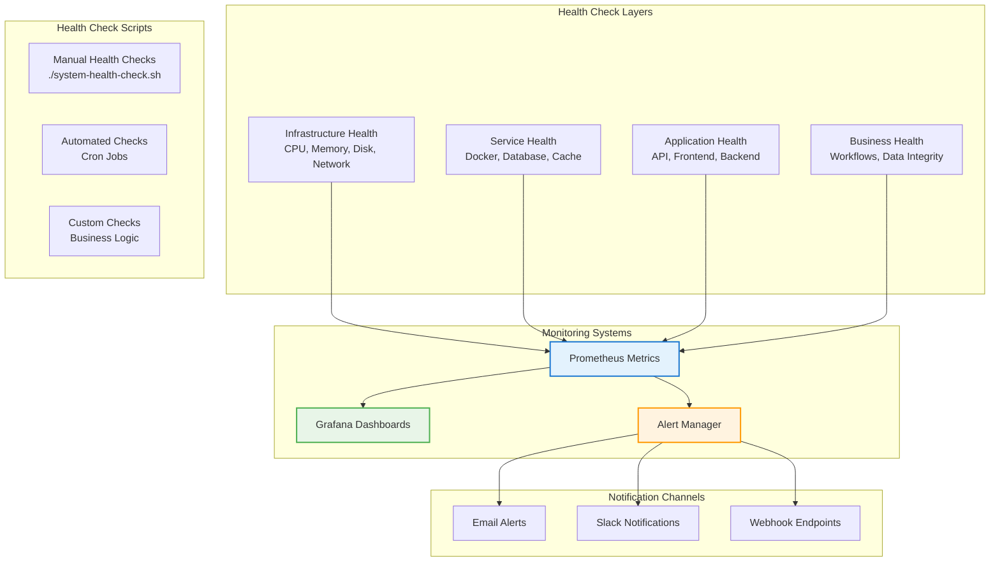

# Health Checks

## Overview

This guide covers comprehensive health check procedures for the PRS on-premises deployment, including automated monitoring, manual validation, and proactive system health management.

## Health Check Architecture



## Automated Health Checks

### System Health Check Script

```bash
#!/bin/bash
# /opt/prs-deployment/scripts/system-health-check.sh

set -euo pipefail

# Configuration
HEALTH_LOG="/var/log/prs-health.log"
METRICS_FILE="/tmp/prs-health-metrics.prom"
ALERT_EMAIL="admin@your-domain.com"
COMPONENT="$1"

# Colors for output
RED='\033[0;31m'
GREEN='\033[0;32m'
YELLOW='\033[1;33m'
NC='\033[0m' # No Color

log_message() {
    echo "$(date '+%Y-%m-%d %H:%M:%S') - $1" | tee -a "$HEALTH_LOG"
}

print_status() {
    local status="$1"
    local message="$2"
    
    case "$status" in
        "OK")
            echo -e "${GREEN}✓${NC} $message"
            ;;
        "WARNING")
            echo -e "${YELLOW}⚠${NC} $message"
            ;;
        "ERROR")
            echo -e "${RED}✗${NC} $message"
            ;;
    esac
}

# Infrastructure Health Checks
check_infrastructure() {
    echo "=== Infrastructure Health ==="
    
    # CPU Usage
    CPU_USAGE=$(top -bn1 | grep "Cpu(s)" | awk '{print $2}' | sed 's/%us,//')
    if (( $(echo "$CPU_USAGE > 80" | bc -l) )); then
        print_status "WARNING" "High CPU usage: ${CPU_USAGE}%"
    else
        print_status "OK" "CPU usage: ${CPU_USAGE}%"
    fi
    
    # Memory Usage
    MEMORY_USAGE=$(free | grep Mem | awk '{printf "%.1f", $3/$2 * 100.0}')
    if (( $(echo "$MEMORY_USAGE > 85" | bc -l) )); then
        print_status "WARNING" "High memory usage: ${MEMORY_USAGE}%"
    else
        print_status "OK" "Memory usage: ${MEMORY_USAGE}%"
    fi
    
    # Disk Usage
    SSD_USAGE=$(df /mnt/hdd | awk 'NR==2 {print $5}' | sed 's/%//')
    HDD_USAGE=$(df /mnt/hdd | awk 'NR==2 {print $5}' | sed 's/%//')
    
    if [ "$SSD_USAGE" -gt 90 ]; then
        print_status "ERROR" "SSD usage critical: ${SSD_USAGE}%"
    elif [ "$SSD_USAGE" -gt 85 ]; then
        print_status "WARNING" "SSD usage high: ${SSD_USAGE}%"
    else
        print_status "OK" "SSD usage: ${SSD_USAGE}%"
    fi
    
    if [ "$HDD_USAGE" -gt 85 ]; then
        print_status "WARNING" "HDD usage high: ${HDD_USAGE}%"
    else
        print_status "OK" "HDD usage: ${HDD_USAGE}%"
    fi
    
    # RAID Status
    if [ -f /proc/mdstat ]; then
        RAID_STATUS=$(cat /proc/mdstat | grep -E "(md0|md1)" | grep -c "active")
        if [ "$RAID_STATUS" -eq 2 ]; then
            print_status "OK" "RAID arrays active"
        else
            print_status "ERROR" "RAID array issues detected"
        fi
    fi
    
    # Network Connectivity
    if ping -c 1 8.8.8.8 >/dev/null 2>&1; then
        print_status "OK" "External network connectivity"
    else
        print_status "ERROR" "No external network connectivity"
    fi
}

# Service Health Checks
check_services() {
    echo "=== Service Health ==="
    
    # Docker Service
    if systemctl is-active docker >/dev/null 2>&1; then
        print_status "OK" "Docker service running"
    else
        print_status "ERROR" "Docker service not running"
        return 1
    fi
    
    # Container Status
    local containers=(
        "prs-onprem-nginx"
        "prs-onprem-frontend"
        "prs-onprem-backend"
        "prs-onprem-postgres-timescale"
        "prs-onprem-redis"
    )
    
    for container in "${containers[@]}"; do
        if docker ps --filter "name=$container" --filter "status=running" | grep -q "$container"; then
            print_status "OK" "$container running"
        else
            print_status "ERROR" "$container not running"
        fi
    done
    
    # Database Connectivity
    if docker exec prs-onprem-postgres-timescale pg_isready -U prs_admin >/dev/null 2>&1; then
        print_status "OK" "Database connectivity"
        
        # Database Connection Count
        CONNECTIONS=$(docker exec prs-onprem-postgres-timescale psql -U prs_admin -d prs_production -t -c "SELECT count(*) FROM pg_stat_activity;" 2>/dev/null | xargs)
        if [ "$CONNECTIONS" -gt 120 ]; then
            print_status "WARNING" "High database connections: $CONNECTIONS"
        else
            print_status "OK" "Database connections: $CONNECTIONS"
        fi
    else
        print_status "ERROR" "Database connectivity failed"
    fi
    
    # Redis Connectivity
    if docker exec prs-onprem-redis redis-cli ping >/dev/null 2>&1; then
        print_status "OK" "Redis connectivity"
    else
        print_status "ERROR" "Redis connectivity failed"
    fi
}

# Application Health Checks
check_application() {
    echo "=== Application Health ==="
    
    # API Health Endpoint
    if curl -f -s https://localhost/api/health >/dev/null 2>&1; then
        print_status "OK" "API health endpoint"
        
        # API Response Time
        RESPONSE_TIME=$(curl -w "%{time_total}" -o /dev/null -s https://localhost/api/health)
        if (( $(echo "$RESPONSE_TIME > 2.0" | bc -l) )); then
            print_status "WARNING" "Slow API response: ${RESPONSE_TIME}s"
        else
            print_status "OK" "API response time: ${RESPONSE_TIME}s"
        fi
    else
        print_status "ERROR" "API health endpoint failed"
    fi
    
    # Frontend Accessibility
    if curl -f -s https://localhost/ >/dev/null 2>&1; then
        print_status "OK" "Frontend accessibility"
    else
        print_status "ERROR" "Frontend not accessible"
    fi
    
    # SSL Certificate
    CERT_EXPIRY=$(openssl x509 -in /opt/prs-deployment/02-docker-configuration/ssl/certificate.crt -noout -enddate 2>/dev/null | cut -d= -f2)
    if [ -n "$CERT_EXPIRY" ]; then
        EXPIRY_EPOCH=$(date -d "$CERT_EXPIRY" +%s)
        CURRENT_EPOCH=$(date +%s)
        DAYS_UNTIL_EXPIRY=$(( (EXPIRY_EPOCH - CURRENT_EPOCH) / 86400 ))
        
        if [ "$DAYS_UNTIL_EXPIRY" -lt 7 ]; then
            print_status "ERROR" "SSL certificate expires in $DAYS_UNTIL_EXPIRY days"
        elif [ "$DAYS_UNTIL_EXPIRY" -lt 30 ]; then
            print_status "WARNING" "SSL certificate expires in $DAYS_UNTIL_EXPIRY days"
        else
            print_status "OK" "SSL certificate valid for $DAYS_UNTIL_EXPIRY days"
        fi
    else
        print_status "ERROR" "SSL certificate check failed"
    fi
}

# Business Logic Health Checks
check_business_logic() {
    echo "=== Business Logic Health ==="
    
    # Database Table Counts
    USER_COUNT=$(docker exec prs-onprem-postgres-timescale psql -U prs_admin -d prs_production -t -c "SELECT count(*) FROM users;" 2>/dev/null | xargs)
    if [ "$USER_COUNT" -gt 0 ]; then
        print_status "OK" "User data present: $USER_COUNT users"
    else
        print_status "WARNING" "No user data found"
    fi
    
    # Recent Activity
    RECENT_ACTIVITY=$(docker exec prs-onprem-postgres-timescale psql -U prs_admin -d prs_production -t -c "
    SELECT count(*) FROM audit_logs 
    WHERE created_at >= NOW() - INTERVAL '24 hours';" 2>/dev/null | xargs)
    
    if [ "$RECENT_ACTIVITY" -gt 0 ]; then
        print_status "OK" "Recent system activity: $RECENT_ACTIVITY events"
    else
        print_status "WARNING" "No recent system activity"
    fi
    
    # Data Integrity Checks
    ORPHANED_RECORDS=$(docker exec prs-onprem-postgres-timescale psql -U prs_admin -d prs_production -t -c "
    SELECT count(*) FROM requisitions r 
    LEFT JOIN users u ON r.user_id = u.id 
    WHERE u.id IS NULL;" 2>/dev/null | xargs)
    
    if [ "$ORPHANED_RECORDS" -eq 0 ]; then
        print_status "OK" "Data integrity check passed"
    else
        print_status "WARNING" "Found $ORPHANED_RECORDS orphaned records"
    fi
}

# Performance Health Checks
check_performance() {
    echo "=== Performance Health ==="
    
    # Database Cache Hit Ratio
    CACHE_HIT_RATIO=$(docker exec prs-onprem-postgres-timescale psql -U prs_admin -d prs_production -t -c "
    SELECT round(100.0 * sum(blks_hit) / nullif(sum(blks_hit) + sum(blks_read), 0), 2)
    FROM pg_stat_database WHERE datname = 'prs_production';" 2>/dev/null | xargs)
    
    if (( $(echo "$CACHE_HIT_RATIO < 95" | bc -l) )); then
        print_status "WARNING" "Low cache hit ratio: ${CACHE_HIT_RATIO}%"
    else
        print_status "OK" "Cache hit ratio: ${CACHE_HIT_RATIO}%"
    fi
    
    # TimescaleDB Compression
    COMPRESSION_RATIO=$(docker exec prs-onprem-postgres-timescale psql -U prs_admin -d prs_production -t -c "
    SELECT round(AVG((before_compression_total_bytes::numeric - after_compression_total_bytes::numeric) 
    / before_compression_total_bytes::numeric * 100), 2)
    FROM timescaledb_information.compressed_hypertable_stats;" 2>/dev/null | xargs)
    
    if [ -n "$COMPRESSION_RATIO" ] && (( $(echo "$COMPRESSION_RATIO > 50" | bc -l) )); then
        print_status "OK" "Compression ratio: ${COMPRESSION_RATIO}%"
    else
        print_status "WARNING" "Low compression ratio: ${COMPRESSION_RATIO}%"
    fi
    
    # Load Average
    LOAD_AVERAGE=$(uptime | awk -F'load average:' '{print $2}' | awk '{print $1}' | sed 's/,//')
    CPU_CORES=$(nproc)
    
    if (( $(echo "$LOAD_AVERAGE > $CPU_CORES" | bc -l) )); then
        print_status "WARNING" "High load average: $LOAD_AVERAGE (cores: $CPU_CORES)"
    else
        print_status "OK" "Load average: $LOAD_AVERAGE (cores: $CPU_CORES)"
    fi
}

# Generate Health Metrics
generate_metrics() {
    > "$METRICS_FILE"
    
    # System metrics
    echo "prs_cpu_usage_percent $(top -bn1 | grep "Cpu(s)" | awk '{print $2}' | sed 's/%us,//')" >> "$METRICS_FILE"
    echo "prs_memory_usage_percent $(free | grep Mem | awk '{printf "%.1f", $3/$2 * 100.0}')" >> "$METRICS_FILE"
    echo "prs_ssd_usage_percent $(df /mnt/hdd | awk 'NR==2 {print $5}' | sed 's/%//')" >> "$METRICS_FILE"
    echo "prs_hdd_usage_percent $(df /mnt/hdd | awk 'NR==2 {print $5}' | sed 's/%//')" >> "$METRICS_FILE"
    
    # Service metrics
    for container in prs-onprem-nginx prs-onprem-frontend prs-onprem-backend prs-onprem-postgres-timescale prs-onprem-redis; do
        if docker ps --filter "name=$container" --filter "status=running" | grep -q "$container"; then
            echo "prs_service_up{service=\"$container\"} 1" >> "$METRICS_FILE"
        else
            echo "prs_service_up{service=\"$container\"} 0" >> "$METRICS_FILE"
        fi
    done
    
    # Application metrics
    if curl -f -s https://localhost/api/health >/dev/null 2>&1; then
        echo "prs_api_healthy 1" >> "$METRICS_FILE"
        RESPONSE_TIME=$(curl -w "%{time_total}" -o /dev/null -s https://localhost/api/health)
        echo "prs_api_response_time_seconds $RESPONSE_TIME" >> "$METRICS_FILE"
    else
        echo "prs_api_healthy 0" >> "$METRICS_FILE"
    fi
    
    # Copy metrics for Prometheus
    if [ -d "/var/lib/node_exporter/textfile_collector" ]; then
        cp "$METRICS_FILE" /var/lib/node_exporter/textfile_collector/prs-health.prom
    fi
}

# Main execution
main() {
    log_message "Starting health check (component: ${COMPONENT:-all})"
    
    case "${COMPONENT:-all}" in
        "infrastructure"|"infra")
            check_infrastructure
            ;;
        "services"|"service")
            check_services
            ;;
        "application"|"app")
            check_application
            ;;
        "business")
            check_business_logic
            ;;
        "performance"|"perf")
            check_performance
            ;;
        "all"|"")
            check_infrastructure
            echo ""
            check_services
            echo ""
            check_application
            echo ""
            check_business_logic
            echo ""
            check_performance
            ;;
        *)
            echo "Usage: $0 [infrastructure|services|application|business|performance|all]"
            exit 1
            ;;
    esac
    
    echo ""
    generate_metrics
    log_message "Health check completed"
}

main "$@"
```

## Manual Health Check Procedures

### Daily Health Check Routine

```bash
#!/bin/bash
# Daily health check routine

echo "=== Daily PRS Health Check - $(date) ==="

# 1. Quick system overview
echo "System Overview:"
echo "- Uptime: $(uptime -p)"
echo "- Load: $(uptime | awk -F'load average:' '{print $2}')"
echo "- Memory: $(free -h | grep Mem | awk '{print $3 "/" $2}')"
echo "- SSD: $(df -h /mnt/hdd | awk 'NR==2 {print $5}')"
echo "- HDD: $(df -h /mnt/hdd | awk 'NR==2 {print $5}')"

# 2. Service status
echo -e "\nService Status:"
docker-compose -f 02-docker-configuration/docker-compose.onprem.yml ps

# 3. Application accessibility
echo -e "\nApplication Tests:"
curl -s -o /dev/null -w "API Health: %{http_code} (%{time_total}s)\n" https://localhost/api/health
curl -s -o /dev/null -w "Frontend: %{http_code} (%{time_total}s)\n" https://localhost/

# 4. Database health
echo -e "\nDatabase Health:"
docker exec prs-onprem-postgres-timescale psql -U prs_admin -d prs_production -c "
SELECT 
    'Connections: ' || count(*) as metric
FROM pg_stat_activity
UNION ALL
SELECT 
    'Cache Hit Ratio: ' || round(100.0 * sum(blks_hit) / nullif(sum(blks_hit) + sum(blks_read), 0), 2) || '%'
FROM pg_stat_database 
WHERE datname = 'prs_production';
"

# 5. Recent errors
echo -e "\nRecent Errors:"
ERROR_COUNT=$(docker logs prs-onprem-backend --since 24h 2>&1 | grep -i error | wc -l)
echo "Backend errors (24h): $ERROR_COUNT"

if [ "$ERROR_COUNT" -gt 10 ]; then
    echo "WARNING: High error count detected"
    docker logs prs-onprem-backend --since 24h 2>&1 | grep -i error | tail -5
fi
```

### Weekly Health Assessment

```bash
#!/bin/bash
# Weekly comprehensive health assessment

REPORT_FILE="/tmp/weekly-health-report-$(date +%Y%m%d).txt"

cat > "$REPORT_FILE" << EOF
PRS Weekly Health Report
Generated: $(date)
========================

System Information:
- Hostname: $(hostname)
- OS: $(lsb_release -d | cut -f2)
- Kernel: $(uname -r)
- Uptime: $(uptime -p)

Hardware Status:
- CPU Cores: $(nproc)
- Total Memory: $(free -h | grep Mem | awk '{print $2}')
- SSD Capacity: $(df -h /mnt/hdd | awk 'NR==2 {print $2}')
- HDD Capacity: $(df -h /mnt/hdd | awk 'NR==2 {print $2}')

Performance Metrics (7-day average):
EOF

# Add performance data
docker exec prs-onprem-postgres-timescale psql -U prs_admin -d prs_production -c "
SELECT 
    'Database Size: ' || pg_size_pretty(pg_database_size('prs_production'))
UNION ALL
SELECT 
    'Active Users (7d): ' || count(DISTINCT user_id)::text
FROM audit_logs 
WHERE created_at >= NOW() - INTERVAL '7 days'
UNION ALL
SELECT 
    'Total Requisitions: ' || count(*)::text
FROM requisitions
UNION ALL
SELECT 
    'Avg Response Time: ' || round(avg(total_time), 2)::text || 'ms'
FROM pg_stat_statements 
WHERE calls > 100;
" >> "$REPORT_FILE"

echo "Weekly health report generated: $REPORT_FILE"

# Email report if mail is configured
if command -v mail >/dev/null 2>&1; then
    mail -s "PRS Weekly Health Report" admin@your-domain.com < "$REPORT_FILE"
fi
```

## Health Check Automation

### Cron Schedule

```bash
# Setup health check automation
(crontab -l 2>/dev/null; cat << 'EOF'
# PRS Health Check Schedule

# Comprehensive health check every 5 minutes
*/5 * * * * /opt/prs-deployment/scripts/system-health-check.sh >/dev/null 2>&1

# Daily health summary at 8:00 AM
0 8 * * * /opt/prs-deployment/scripts/daily-health-check.sh

# Weekly health report on Monday at 9:00 AM
0 9 * * 1 /opt/prs-deployment/scripts/weekly-health-assessment.sh

# Performance check every hour
0 * * * * /opt/prs-deployment/scripts/system-health-check.sh performance >/dev/null 2>&1
EOF
) | crontab -
```

### Health Check Alerts

```bash
#!/bin/bash
# Health check alerting system

ALERT_THRESHOLD_FILE="/tmp/prs-alert-thresholds"
LAST_ALERT_FILE="/tmp/prs-last-alert"

# Alert thresholds
cat > "$ALERT_THRESHOLD_FILE" << EOF
CPU_THRESHOLD=80
MEMORY_THRESHOLD=85
SSD_THRESHOLD=90
HDD_THRESHOLD=85
RESPONSE_TIME_THRESHOLD=2.0
CONNECTION_THRESHOLD=120
EOF

source "$ALERT_THRESHOLD_FILE"

send_alert() {
    local severity="$1"
    local message="$2"
    local current_time=$(date +%s)
    local last_alert_time=0
    
    # Rate limiting: don't send same alert within 1 hour
    if [ -f "$LAST_ALERT_FILE" ]; then
        last_alert_time=$(cat "$LAST_ALERT_FILE")
    fi
    
    if [ $((current_time - last_alert_time)) -gt 3600 ]; then
        echo "$current_time" > "$LAST_ALERT_FILE"
        
        # Send email alert
        echo "$message" | mail -s "PRS Health Alert: $severity" admin@your-domain.com
        
        # Log alert
        echo "$(date): ALERT [$severity] $message" >> /var/log/prs-health.log
        
        # Send to monitoring system (if configured)
        if command -v curl >/dev/null 2>&1; then
            curl -X POST http://monitoring-system/alerts \
                -H "Content-Type: application/json" \
                -d "{\"severity\":\"$severity\",\"message\":\"$message\",\"timestamp\":\"$(date -Iseconds)\"}"
        fi
    fi
}

# Check thresholds and send alerts
check_and_alert() {
    # CPU check
    CPU_USAGE=$(top -bn1 | grep "Cpu(s)" | awk '{print $2}' | sed 's/%us,//')
    if (( $(echo "$CPU_USAGE > $CPU_THRESHOLD" | bc -l) )); then
        send_alert "WARNING" "High CPU usage: ${CPU_USAGE}% (threshold: ${CPU_THRESHOLD}%)"
    fi
    
    # Memory check
    MEMORY_USAGE=$(free | grep Mem | awk '{printf "%.1f", $3/$2 * 100.0}')
    if (( $(echo "$MEMORY_USAGE > $MEMORY_THRESHOLD" | bc -l) )); then
        send_alert "WARNING" "High memory usage: ${MEMORY_USAGE}% (threshold: ${MEMORY_THRESHOLD}%)"
    fi
    
    # Storage checks
    SSD_USAGE=$(df /mnt/hdd | awk 'NR==2 {print $5}' | sed 's/%//')
    if [ "$SSD_USAGE" -gt "$SSD_THRESHOLD" ]; then
        send_alert "CRITICAL" "SSD storage critical: ${SSD_USAGE}% (threshold: ${SSD_THRESHOLD}%)"
    fi
    
    # Service checks
    if ! docker ps --filter "name=prs-onprem-backend" --filter "status=running" | grep -q prs-onprem-backend; then
        send_alert "CRITICAL" "Backend service is down"
    fi
    
    if ! docker exec prs-onprem-postgres-timescale pg_isready -U prs_admin >/dev/null 2>&1; then
        send_alert "CRITICAL" "Database is not accessible"
    fi
}

check_and_alert
```

---

!!! success "Health Monitoring Active"
    Your PRS deployment now has comprehensive health monitoring with automated checks, alerting, and reporting capabilities.

!!! tip "Proactive Monitoring"
    Regular health checks help identify issues before they impact users. Review health reports weekly and adjust thresholds based on your environment.

!!! warning "Alert Fatigue"
    Tune alert thresholds to reduce false positives while maintaining effective monitoring coverage. Too many alerts can lead to important issues being ignored.
