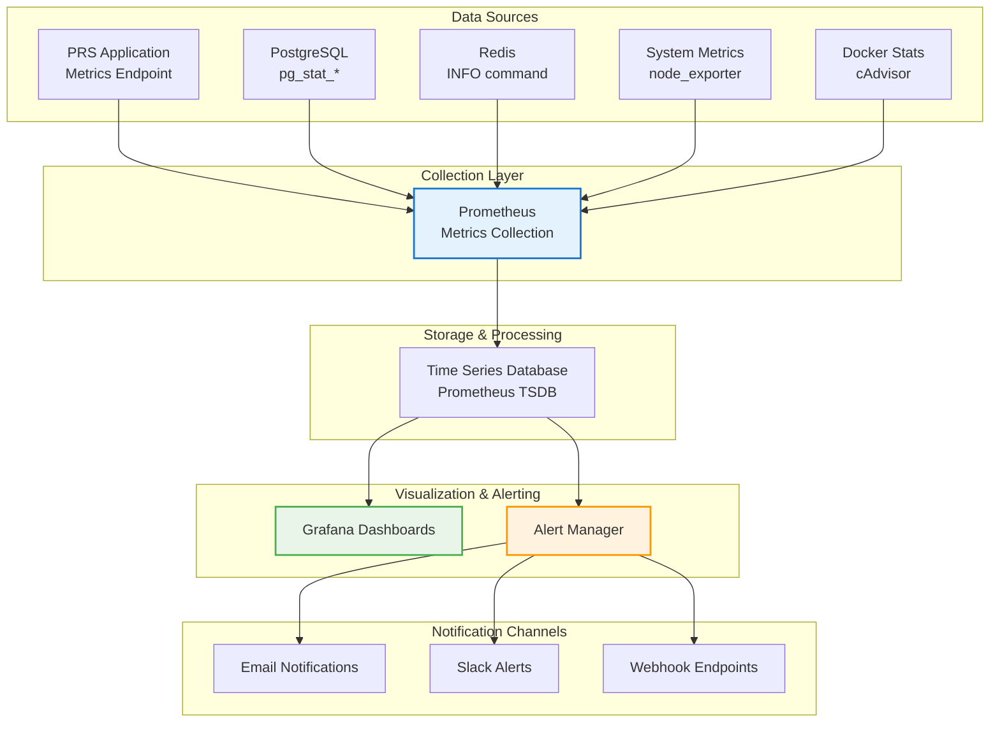

# Monitoring

## Overview

This guide covers comprehensive monitoring setup for the PRS on-premises deployment using Prometheus, Grafana, and custom monitoring solutions.

## Monitoring Architecture



## Prometheus Configuration

### Main Configuration

```yaml
# config/prometheus/prometheus.yml
global:
  scrape_interval: 15s
  evaluation_interval: 15s
  external_labels:
    cluster: 'prs-onprem'
    environment: 'production'

rule_files:
  - "alerts.yml"
  - "recording_rules.yml"

scrape_configs:
  # Prometheus self-monitoring
  - job_name: 'prometheus'
    static_configs:
      - targets: ['localhost:9090']

  # System metrics
  - job_name: 'node-exporter'
    static_configs:
      - targets: ['node-exporter:9100']
    scrape_interval: 30s

  # PostgreSQL metrics
  - job_name: 'postgres-exporter'
    static_configs:
      - targets: ['postgres-exporter:9187']
    scrape_interval: 30s

  # Redis metrics
  - job_name: 'redis-exporter'
    static_configs:
      - targets: ['redis-exporter:9121']
    scrape_interval: 30s

  # Nginx metrics
  - job_name: 'nginx-exporter'
    static_configs:
      - targets: ['nginx-exporter:9113']
    scrape_interval: 30s

  # PRS Backend application
  - job_name: 'prs-backend'
    static_configs:
      - targets: ['backend:4000']
    metrics_path: '/metrics'
    scrape_interval: 30s

  # Docker container metrics
  - job_name: 'cadvisor'
    static_configs:
      - targets: ['cadvisor:8080']
    scrape_interval: 30s

alerting:
  alertmanagers:
    - static_configs:
        - targets:
          - alertmanager:9093
```

### Recording Rules

```yaml
# config/prometheus/recording_rules.yml
groups:
  - name: prs_application_rules
    interval: 30s
    rules:
      # Application performance metrics
      - record: prs:request_duration_seconds:rate5m
        expr: rate(http_request_duration_seconds_sum[5m]) / rate(http_request_duration_seconds_count[5m])

      - record: prs:request_rate:rate5m
        expr: rate(http_requests_total[5m])

      - record: prs:error_rate:rate5m
        expr: rate(http_requests_total{status=~"5.."}[5m]) / rate(http_requests_total[5m])

  - name: prs_database_rules
    interval: 30s
    rules:
      # Database performance metrics
      - record: prs:db_connections:active
        expr: pg_stat_database_numbackends{datname="prs_production"}

      - record: prs:db_cache_hit_ratio
        expr: pg_stat_database_blks_hit{datname="prs_production"} / (pg_stat_database_blks_hit{datname="prs_production"} + pg_stat_database_blks_read{datname="prs_production"})

      - record: prs:db_transaction_rate:rate5m
        expr: rate(pg_stat_database_xact_commit{datname="prs_production"}[5m])

  - name: prs_system_rules
    interval: 30s
    rules:
      # System resource metrics
      - record: prs:cpu_usage:rate5m
        expr: 1 - rate(node_cpu_seconds_total{mode="idle"}[5m])

      - record: prs:memory_usage:ratio
        expr: (node_memory_MemTotal_bytes - node_memory_MemAvailable_bytes) / node_memory_MemTotal_bytes

      - record: prs:disk_usage:ratio
        expr: (node_filesystem_size_bytes - node_filesystem_avail_bytes) / node_filesystem_size_bytes
```

## Alert Configuration

### Alert Rules

```yaml
# config/prometheus/alerts.yml
groups:
  - name: prs_critical_alerts
    rules:
      # Service availability
      - alert: ServiceDown
        expr: up == 0
        for: 1m
        labels:
          severity: critical
        annotations:
          summary: "Service {{ $labels.job }} is down"
          description: "Service {{ $labels.job }} has been down for more than 1 minute"

      # High error rate
      - alert: HighErrorRate
        expr: prs:error_rate:rate5m > 0.05
        for: 5m
        labels:
          severity: critical
        annotations:
          summary: "High error rate detected"
          description: "Error rate is {{ $value | humanizePercentage }} for the last 5 minutes"

      # Database connection issues
      - alert: DatabaseConnectionHigh
        expr: prs:db_connections:active > 120
        for: 2m
        labels:
          severity: warning
        annotations:
          summary: "High database connections"
          description: "Database has {{ $value }} active connections"

      # Storage space alerts
      - alert: DiskSpaceHigh
        expr: prs:disk_usage:ratio{mountpoint="/mnt/hdd"} > 0.85
        for: 1m
        labels:
          severity: warning
        annotations:
          summary: "SSD disk space high"
          description: "SSD usage is {{ $value | humanizePercentage }}"

      - alert: DiskSpaceCritical
        expr: prs:disk_usage:ratio{mountpoint="/mnt/hdd"} > 0.90
        for: 1m
        labels:
          severity: critical
        annotations:
          summary: "SSD disk space critical"
          description: "SSD usage is {{ $value | humanizePercentage }}"

  - name: prs_performance_alerts
    rules:
      # High CPU usage
      - alert: HighCPUUsage
        expr: prs:cpu_usage:rate5m > 0.80
        for: 5m
        labels:
          severity: warning
        annotations:
          summary: "High CPU usage"
          description: "CPU usage is {{ $value | humanizePercentage }} for the last 5 minutes"

      # High memory usage
      - alert: HighMemoryUsage
        expr: prs:memory_usage:ratio > 0.85
        for: 5m
        labels:
          severity: warning
        annotations:
          summary: "High memory usage"
          description: "Memory usage is {{ $value | humanizePercentage }}"

      # Slow response times
      - alert: SlowResponseTime
        expr: prs:request_duration_seconds:rate5m > 1.0
        for: 5m
        labels:
          severity: warning
        annotations:
          summary: "Slow response times"
          description: "Average response time is {{ $value }}s for the last 5 minutes"

  - name: prs_database_alerts
    rules:
      # Low cache hit ratio
      - alert: LowDatabaseCacheHitRatio
        expr: prs:db_cache_hit_ratio < 0.95
        for: 5m
        labels:
          severity: warning
        annotations:
          summary: "Low database cache hit ratio"
          description: "Cache hit ratio is {{ $value | humanizePercentage }}"

      # TimescaleDB chunk issues
      - alert: TimescaleDBCompressionFailed
        expr: increase(timescaledb_background_job_failures_total[1h]) > 0
        for: 1m
        labels:
          severity: warning
        annotations:
          summary: "TimescaleDB background job failed"
          description: "TimescaleDB background job has failed {{ $value }} times in the last hour"
```

## Grafana Dashboards

### System Overview Dashboard

```json
{
  "dashboard": {
    "title": "PRS System Overview",
    "panels": [
      {
        "title": "System Health",
        "type": "stat",
        "targets": [
          {
            "expr": "up",
            "legendFormat": "{{ job }}"
          }
        ]
      },
      {
        "title": "CPU Usage",
        "type": "graph",
        "targets": [
          {
            "expr": "prs:cpu_usage:rate5m * 100",
            "legendFormat": "CPU Usage %"
          }
        ]
      },
      {
        "title": "Memory Usage",
        "type": "graph",
        "targets": [
          {
            "expr": "prs:memory_usage:ratio * 100",
            "legendFormat": "Memory Usage %"
          }
        ]
      },
      {
        "title": "Disk Usage",
        "type": "graph",
        "targets": [
          {
            "expr": "prs:disk_usage:ratio{mountpoint=\"/mnt/hdd\"} * 100",
            "legendFormat": "HDD Usage %"
          },
          {
            "expr": "prs:disk_usage:ratio{mountpoint=\"/mnt/hdd\"} * 100",
            "legendFormat": "HDD Usage %"
          }
        ]
      }
    ]
  }
}
```

### Application Performance Dashboard

```json
{
  "dashboard": {
    "title": "PRS Application Performance",
    "panels": [
      {
        "title": "Request Rate",
        "type": "graph",
        "targets": [
          {
            "expr": "prs:request_rate:rate5m",
            "legendFormat": "Requests/sec"
          }
        ]
      },
      {
        "title": "Response Time",
        "type": "graph",
        "targets": [
          {
            "expr": "prs:request_duration_seconds:rate5m",
            "legendFormat": "Avg Response Time"
          }
        ]
      },
      {
        "title": "Error Rate",
        "type": "graph",
        "targets": [
          {
            "expr": "prs:error_rate:rate5m * 100",
            "legendFormat": "Error Rate %"
          }
        ]
      },
      {
        "title": "Active Users",
        "type": "stat",
        "targets": [
          {
            "expr": "prs_active_sessions_total",
            "legendFormat": "Active Sessions"
          }
        ]
      }
    ]
  }
}
```

### Database Performance Dashboard

```json
{
  "dashboard": {
    "title": "PRS Database Performance",
    "panels": [
      {
        "title": "Database Connections",
        "type": "graph",
        "targets": [
          {
            "expr": "prs:db_connections:active",
            "legendFormat": "Active Connections"
          }
        ]
      },
      {
        "title": "Cache Hit Ratio",
        "type": "graph",
        "targets": [
          {
            "expr": "prs:db_cache_hit_ratio * 100",
            "legendFormat": "Cache Hit Ratio %"
          }
        ]
      },
      {
        "title": "Transaction Rate",
        "type": "graph",
        "targets": [
          {
            "expr": "prs:db_transaction_rate:rate5m",
            "legendFormat": "Transactions/sec"
          }
        ]
      },
      {
        "title": "TimescaleDB Chunks",
        "type": "table",
        "targets": [
          {
            "expr": "timescaledb_hypertable_chunks_total",
            "legendFormat": "{{ hypertable_name }}"
          }
        ]
      }
    ]
  }
}
```

## Custom Monitoring Scripts

### Health Check Script

```bash
#!/bin/bash
# /opt/prs-deployment/scripts/health-monitor.sh

METRICS_FILE="/tmp/prs-health-metrics.prom"
LOG_FILE="/var/log/prs-health.log"

# Function to log with timestamp
log_message() {
    echo "$(date '+%Y-%m-%d %H:%M:%S') - $1" >> "$LOG_FILE"
}

# Check service health
check_services() {
    local healthy=0
    local total=0
    
    services=(
        "prs-onprem-nginx"
        "prs-onprem-frontend"
        "prs-onprem-backend"
        "prs-onprem-postgres-timescale"
        "prs-onprem-redis"
    )
    
    for service in "${services[@]}"; do
        total=$((total + 1))
        if docker ps --filter "name=$service" --filter "status=running" | grep -q "$service"; then
            healthy=$((healthy + 1))
            echo "prs_service_up{service=\"$service\"} 1" >> "$METRICS_FILE"
        else
            echo "prs_service_up{service=\"$service\"} 0" >> "$METRICS_FILE"
            log_message "WARNING: Service $service is not running"
        fi
    done
    
    echo "prs_services_healthy_ratio $(echo "scale=2; $healthy / $total" | bc)" >> "$METRICS_FILE"
}

# Check API endpoints
check_api_health() {
    local response_time
    local status_code
    
    # Test main API health endpoint
    response_time=$(curl -w "%{time_total}" -s -o /dev/null https://localhost/api/health)
    status_code=$(curl -w "%{http_code}" -s -o /dev/null https://localhost/api/health)
    
    echo "prs_api_response_time_seconds $response_time" >> "$METRICS_FILE"
    echo "prs_api_status_code $status_code" >> "$METRICS_FILE"
    
    if [ "$status_code" = "200" ]; then
        echo "prs_api_healthy 1" >> "$METRICS_FILE"
    else
        echo "prs_api_healthy 0" >> "$METRICS_FILE"
        log_message "ERROR: API health check failed with status $status_code"
    fi
}

# Check database connectivity
check_database() {
    if docker exec prs-onprem-postgres-timescale pg_isready -U prs_admin >/dev/null 2>&1; then
        echo "prs_database_healthy 1" >> "$METRICS_FILE"
        
        # Get connection count
        local connections
        connections=$(docker exec prs-onprem-postgres-timescale psql -U prs_admin -d prs_production -t -c "SELECT count(*) FROM pg_stat_activity;" 2>/dev/null | xargs)
        echo "prs_database_connections $connections" >> "$METRICS_FILE"
    else
        echo "prs_database_healthy 0" >> "$METRICS_FILE"
        log_message "ERROR: Database health check failed"
    fi
}

# Check Redis connectivity
check_redis() {
    if docker exec prs-onprem-redis redis-cli -a "$REDIS_PASSWORD" ping >/dev/null 2>&1; then
        echo "prs_redis_healthy 1" >> "$METRICS_FILE"
        
        # Get memory usage
        local memory_used
        memory_used=$(docker exec prs-onprem-redis redis-cli -a "$REDIS_PASSWORD" info memory | grep used_memory: | cut -d: -f2 | tr -d '\r')
        echo "prs_redis_memory_used_bytes $memory_used" >> "$METRICS_FILE"
    else
        echo "prs_redis_healthy 0" >> "$METRICS_FILE"
        log_message "ERROR: Redis health check failed"
    fi
}

# Main execution
main() {
    # Clear previous metrics
    > "$METRICS_FILE"
    
    # Run health checks
    check_services
    check_api_health
    check_database
    check_redis
    
    # Expose metrics for Prometheus
    cp "$METRICS_FILE" /var/lib/node_exporter/textfile_collector/prs-health.prom
    
    log_message "Health check completed"
}

main "$@"
```

### Performance Monitor

```bash
#!/bin/bash
# /opt/prs-deployment/scripts/performance-monitor.sh

METRICS_FILE="/tmp/prs-performance-metrics.prom"

# Monitor application performance
monitor_application() {
    # Get container stats
    local cpu_usage
    local memory_usage
    
    cpu_usage=$(docker stats prs-onprem-backend --no-stream --format "{{.CPUPerc}}" | sed 's/%//')
    memory_usage=$(docker stats prs-onprem-backend --no-stream --format "{{.MemUsage}}" | cut -d'/' -f1 | sed 's/[^0-9.]//g')
    
    echo "prs_backend_cpu_usage_percent $cpu_usage" >> "$METRICS_FILE"
    echo "prs_backend_memory_usage_bytes ${memory_usage}000000" >> "$METRICS_FILE"
}

# Monitor storage performance
monitor_storage() {
    # SSD usage
    local ssd_usage
    ssd_usage=$(df /mnt/hdd | awk 'NR==2 {print $5}' | sed 's/%//')
    echo "prs_ssd_usage_percent $ssd_usage" >> "$METRICS_FILE"
    
    # HDD usage
    local hdd_usage
    hdd_usage=$(df /mnt/hdd | awk 'NR==2 {print $5}' | sed 's/%//')
    echo "prs_hdd_usage_percent $hdd_usage" >> "$METRICS_FILE"
    
    # I/O statistics
    local ssd_reads
    local ssd_writes
    ssd_reads=$(iostat -d 1 2 | grep sda | tail -1 | awk '{print $4}')
    ssd_writes=$(iostat -d 1 2 | grep sda | tail -1 | awk '{print $5}')
    
    echo "prs_ssd_reads_per_sec $ssd_reads" >> "$METRICS_FILE"
    echo "prs_ssd_writes_per_sec $ssd_writes" >> "$METRICS_FILE"
}

# Main execution
main() {
    > "$METRICS_FILE"
    
    monitor_application
    monitor_storage
    
    # Expose metrics
    cp "$METRICS_FILE" /var/lib/node_exporter/textfile_collector/prs-performance.prom
}

main "$@"
```

## Alert Manager Configuration

### Alert Manager Setup

```yaml
# config/alertmanager/alertmanager.yml
global:
  smtp_smarthost: 'smtp.your-domain.com:587'
  smtp_from: 'alerts@your-domain.com'
  smtp_auth_username: 'alerts@your-domain.com'
  smtp_auth_password: 'smtp_password'

route:
  group_by: ['alertname']
  group_wait: 10s
  group_interval: 10s
  repeat_interval: 1h
  receiver: 'web.hook'
  routes:
    - match:
        severity: critical
      receiver: 'critical-alerts'
    - match:
        severity: warning
      receiver: 'warning-alerts'

receivers:
  - name: 'web.hook'
    webhook_configs:
      - url: 'http://localhost:5001/'

  - name: 'critical-alerts'
    email_configs:
      - to: 'admin@your-domain.com'
        subject: 'CRITICAL: PRS Alert - {{ .GroupLabels.alertname }}'
        body: |
          {{ range .Alerts }}
          Alert: {{ .Annotations.summary }}
          Description: {{ .Annotations.description }}
          {{ end }}
    slack_configs:
      - api_url: 'https://hooks.slack.com/services/YOUR/SLACK/WEBHOOK'
        channel: '#prs-alerts'
        title: 'CRITICAL: PRS Alert'
        text: '{{ range .Alerts }}{{ .Annotations.summary }}{{ end }}'

  - name: 'warning-alerts'
    email_configs:
      - to: 'team@your-domain.com'
        subject: 'WARNING: PRS Alert - {{ .GroupLabels.alertname }}'
        body: |
          {{ range .Alerts }}
          Alert: {{ .Annotations.summary }}
          Description: {{ .Annotations.description }}
          {{ end }}

inhibit_rules:
  - source_match:
      severity: 'critical'
    target_match:
      severity: 'warning'
    equal: ['alertname', 'dev', 'instance']
```

## Monitoring Automation

### Automated Monitoring Setup

```bash
#!/bin/bash
# Setup monitoring automation

# Create monitoring cron jobs
(crontab -l 2>/dev/null; echo "*/5 * * * * /opt/prs-deployment/scripts/health-monitor.sh") | crontab -
(crontab -l 2>/dev/null; echo "*/1 * * * * /opt/prs-deployment/scripts/performance-monitor.sh") | crontab -

# Create log rotation for monitoring logs
cat > /etc/logrotate.d/prs-monitoring << 'EOF'
/var/log/prs-health.log {
    daily
    rotate 30
    compress
    delaycompress
    missingok
    notifempty
    create 644 root root
}
EOF

echo "Monitoring automation setup completed"
```

---

!!! success "Monitoring Active"
    Your PRS deployment now has comprehensive monitoring with real-time dashboards, automated alerts, and performance tracking.

!!! tip "Dashboard Customization"
    Customize Grafana dashboards based on your specific monitoring needs and add additional metrics as required.

!!! warning "Alert Tuning"
    Monitor alert frequency and adjust thresholds to reduce false positives while maintaining effective monitoring coverage.
